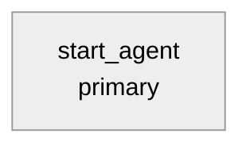

# Agent Spec: Agent_API_Name

## Purpose & Scope

Describe the agent's purpose in 1-2 sentences. What does it help users do?
What domain does it operate in?

## Behavioral Intent

Describe the key behavioral rules that govern the agent:
- What must the agent know before taking action?
- What action implementation types are used (Apex, Flow, Prompt Template)?
- What guardrails apply, if any (for example, off-topic handling or escalation)?
- Which exact values, if any, must deterministic runtime logic consume?
- Which conversational facts remain in surviving history and therefore need no
  variable?

## Subagent Posture

For each subagent, specify posture and why:

| Subagent | Posture (scripted/mixed/agentic) | Why this posture? | Deterministic controls (if any) |
|----------|-----------------------------------|-------------------|-----------------------------------|
| primary | agentic | one focused objective and action set | none |

Use [references/posture-and-determinism.md](../references/posture-and-determinism.md) for posture rules.

## Subagent Map

Add another node only when its boundary changes objective, instructions,
available actions, authority, or escalation behavior and that difference
cannot remain coherent in `primary`. A greeting, cancellation acknowledgment,
completion message, ambiguity question, or ordinary dialogue step is a branch
by default. Expand the diagram to show justified boundaries, actions, and
required deterministic controls. Show a variable state change only when a
named later runtime expression or action consumes it. See the Subagent Map
Diagrams reference for conventions.

## Variables (Optional)

Default: **None.** Surviving conversation history carries ordinary names,
preferences, prior answers, corrections, and current intent.

Add one row only for trusted action output, authorization/eligibility/
confirmation proof, exact later action data flow, required external ordering,
or persistence beyond the configured history window.

| Variable | Type / Default | Trusted Writer | Named Consumer | Cause | Reset / Expiry / Correction / Cancel |
|----------|----------------|----------------|----------------|-------|--------------------------------------|
| `verified_customer_id` | `mutable string = ""` | `verify_customer` output | protected action input and `available when` gate | authorization | reset on verification failure, expiry, logout, or user cancellation |

## Actions

### action_name (subagent_name subagent)

- **Target:** `apex://ClassName` or `flow://FlowName` or `prompt://PromptTemplateName`
- **Status:** EXISTS / NEEDS STUB / NEEDS CREATION

#### Inputs

| Name | Type | Required | Source |
|------|------|----------|--------|
| property_id | string | Yes | User input |
| max_results | integer | No | Defaults to 10 |

#### Outputs

| Name | Type | Visible to User? | Source | Notes |
|------|------|-------------------|--------|-------|
| property | object | Yes | `Property__c` | Complete property details |
| related_applications | list[object] | Yes | `Application__c` | Records for this property |
| active_listing | boolean | Yes | `Listing__c` | Listing status |
| hasData | boolean | No | Computed | Internal empty-result flag |

> **"Visible to User?"** maps to `filter_from_agent` in the `.agent` file: Yes → `filter_from_agent: False`, No → `filter_from_agent: True`.

#### Stubbing Requirement

If NEEDS STUB:

- Apex class name and inner class wrappers needed
- `complex_data_type_name` for each `object`/`list[object]` output
- Key queries or computation logic the stub must implement

Repeat for each action.

## Action Invocation Strategy

For each action, decide how it gets invoked:

| Action | Subagent | Invocation Mode | Why |
|--------|----------|-----------------|-----|
| action_name | subagent_name | `run` / planner slot-fill / `setVariables` | Rationale |

**Modes:**
- **`run @actions.X` in `instructions: ->`** — Deterministic. Fires every time the condition holds. Use only when regulation, authorization, confirmed consequence, external ordering, or a reproduced trace failure requires it.
- **Planner slot-fill (`with param = ...` in `reasoning.actions:`)** — LLM decides when to invoke. Use for user-initiated actions where the LLM should judge intent.
- **`@utils.setVariables`** — LLM captures a value through a model-selected
  tool call. The call updates state but does not itself define a turn boundary.
  Any later reasoning or response follows the runtime's normal tool-loop
  behavior; do not use this action to force either an end or another
  iteration. Prompt text asking for the call does not execute it. Use only when
  a named later deterministic consumer needs the exact value and it cannot
  remain action-local. Do not use it to mirror conversational history.

## Deterministic Controls (When Needed)

- `action_name` visibility: `available when @variables.variable_name != ""`
  — Named cause, trusted writer, and protected outcome.

Include only controls required by regulation, authorization, confirmed
consequence, external ordering, or observed failures.

## Architecture Pattern

Default to exactly one execution block: `start_agent <domain>:` with its
reasoning and actions, and zero `subagent` blocks. Do not create an
`agent_router` that only transitions to one domain. Add a boundary only when
objective, instructions, actions, authority, or escalation behavior changes
and cannot remain coherent in the current scope. Greeting, cancellation,
completion, ambiguity, and ordinary dialogue branches do not require their own
subagents. Use router-first only when multiple genuine domains require
current-intent classification.
State any externally ordered workflow-local flows inside the execution block
that owns them, including correction and cancellation paths.
Describe the routing strategy and how subagents relate to each other.

## Agent Configuration

- **developer_name:** `Agent_API_Name`
- **agent_label:** `Agent Display Name`
- **agent_type:** `AgentforceEmployeeAgent` or `AgentforceServiceAgent` — state the reasoning based on prompt signals (e.g., "accessible by employees" → Employee, "customer-facing channel" → Service)
- **access.default_agent_user:** Required for `AgentforceServiceAgent`. Normally omitted for `AgentforceEmployeeAgent`. If specified, MUST be a **user name**, never a **user ID**, and the user MUST have an `Einstein Agent` license.
