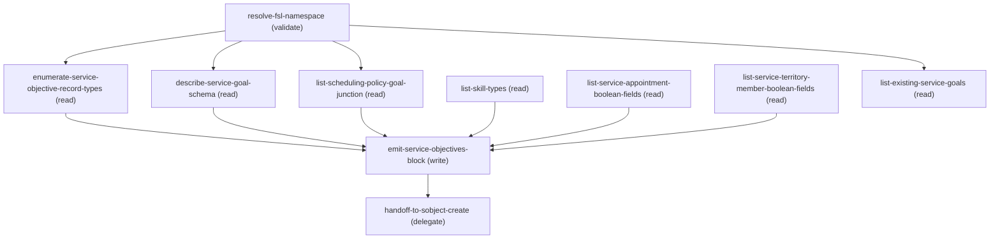

# Managing Sfs Service Objective Designer

## When to Use This Skill

Designs service objectives for a Salesforce Field Service scheduling policy via a structured trade-off interview. Guides the user through objective selection and derives weights by establishing crossover equivalences against Minimize Travel (the anchor). Produces a finalized weight table with penalty-rate interpretation and a plain-English policy summary. Called after work rule design; delegates to sfs-sobject-create for record creation.

## Workflow

# Salesforce Field Service – Service Objective Designer

**Designs the service objectives for a scheduling policy.** This skill collects the objective selection and derives each objective's weight through a structured trade-off interview — one question at a time — and emits a `serviceObjectives[]` block as output. It does not create any Salesforce records. When complete, delegates to `sfs-sobject-create`.

**Interview phases:** Scheduling Policy → Work Rules → **Service Objectives** (this skill) → Record Creation

This skill covers the service objective phase only. The `policy` block (from `sfs-scheduling-policy-designer`) and the `workRules[]` block (from `sfs-work-rule-designer`) arrive as context; this skill adds `serviceObjectives[]` and hands the complete design to `sfs-sobject-create`.

---

## Background: How SFS Scoring Works

The optimizer assigns penalty points to each candidate schedule. Lower total penalty = better schedule. Each service objective contributes penalty points based on its weight and its own scale (the worst-case scenario for that objective).

**Minimize Travel weight is the anchor** — its value is set at 1000 and all other weights are derived relative to it. The general formula, common to every objective (stated once — not re-derived per objective):

```text
penaltyPerViolation = max( 1, roundingFn( (1000 × weight) / scale ) ) × finalMultiplier
total_penalty       = ceil( violations / granularity ) × penaltyPerViolation
```

Two consequences of the shared ×1000 internal multiplier:

- It cancels out of every derivation between two objectives — which is why the continuous approximations used in the interview stay valid and every "derive weight_X from weight_Y" formula is clean of any ×1000 term. Where the rounding function isn't exact for integer weights (ASAP's round, Skill Level/Preference's roundInt), small drift is possible — flagged per objective below.
- The `max(1, …)` floor guarantees every included objective has some effect even at a very low weight.

**One exception:** Same Site's final multiplier (×0.01) nets to an effective ×10, not ×1000 — the one place the "just divide by the other objective's rate" shortcut needs adjustment.

---

## Penalty Formulas by Objective

Use these to show math and back-calculate weights. General mechanics (×1000, floor, why derivations stay valid) are above and not repeated.

**Minimize Travel (anchor)** — Scale 120 min (2 hr = default `MaxGrade__c`), round5, ×1/60 (per-minute → per-second). `penaltyPerViolation_travel = max(1, round5(1000×weight_travel/120)) × (1/60)`. At weight 1000 → 8333.33333 → 138.88889 pts/sec (whole-second granularity). Continuous: `travel_penalty(X_min) ≈ X × weight_travel/120` — ≈8.333 pts/min at 1000.
*Precision:* Travel is per-second; Overtime (same scale) is per-minute — a 61-sec trip costs more than a 60-sec one. Floor binds only below weight ≈0.12.

**Same Site** — Scale 1 (binary), round5, ×0.01 → **effective ×10, the exception**. `penaltyPerViolation_same_site = max(1, round5(1000×weight_same_site)) × 0.01`. At weight 50 → 500 pts/violation.
*Precision:* round5 exact for integer weights. Flat per-event regardless of time. Effective multiplier is ×10, not ×1000.

**Minimize Overtime** — **Identical mechanics to Minimize Travel** (scale 120, round5, weight 1000 → 8333.33333) **except two differences:** final multiplier is ×1.0 not ×1/60, so the rate is per-**minute** (8333.33333 pts/min); and penalty groups into whole minutes — `overtime_penalty(X_sec) = ceil(X_sec/60) × penaltyPerViolation` — so a 61-sec block costs the same as a 120-sec one. `penaltyPerViolation_overtime = max(1, round5(1000×weight_overtime/120)) × 1.0`. Continuous: `≈ Z × weight_overtime/120`; comparable to Travel.
*Precision:* Floor binds below weight ≈0.12.

**Preferred Resource** — Scale 1 (binary), roundInt, ×1.0. `penaltyPerViolation_preferred = max(1, roundInt(100 × 10.0 × weight_preferred)) × 1.0` (100×10.0 = 1000, just decomposed). At weight 375 → 375,000 pts/violation. Derivation: `weight_preferred = T_equiv × (weight_travel/120)` — with weight_travel 1000: `= T_equiv × 8.333`.
*Precision:* Zero rounding error for integer weights (exact form `X_violations × 1000 × weight_preferred`). Floor only below weight 0.001.

**Resource Priority** — Scale 10 (priority 0–10; 0 = best, 10 = lowest), no rounding (raw decimal). `penaltyPerViolation_resource_priority = max(1, (weight_resource_priority/10.0) × 1000)`. At weight 1875 → 187,500 pts/priority point. Total for priority P: `P × penaltyPerViolation`. P=0 → 0; P=10 → max.
*Precision:* Full float, no rounding. Linear — priority 5 = 50% of max.

**Skill Level** — Scale 10 (10-point skill scale), roundInt. `penaltyPerViolation_skill_level = max(1, roundInt(1000×weight_skill_level/10))`. Total for skill level S: `S × penaltyPerViolation`.
*Applicability:* Multiple skill requirements → SFS averages the scores; no skill requirements → no impact. Least vs. Most Qualified mode (handled in the interview) flips the preferred direction but not the formula.
*Precision:* Zero rounding error for integer weights. Floor negligible below weight ≈0.01.

**Skill Preference** — Scale 10 (skill priority 1–10; 1 = most preferred, 10 = least; null → 10), roundInt. `penaltyPerViolation_skill_preference = max(1, roundInt(1000×weight_skill_preference/10))`. Total for skill priority SP: `SP × penaltyPerViolation`. Applicability (same Skill Type, OR matching on the companion Match Skills rule) handled in the interview.
*Precision:* Zero rounding error for integer weights. Linear in SP.

**Group Nearby** — Scale 1 (binary — in cluster or not), round5, ×1.0 (full ×1000, unlike Same Site's ×0.01). `penaltyPerViolation_group_nearby = max(1, round5(1000×weight_group_nearby)) × 1.0`. At weight 167 → 167,000 pts/violation. Derivation: `weight_group_nearby = T_equiv × (weight_travel/120)` — with weight_travel 1000: `= T_equiv × 8.333`.
*Precision:* Flat per-event — each appointment outside its cluster costs the same regardless of distance.

**Minimize Gaps** — Scale 1 (each qualifying idle gap = 1 violation; configurable minimum 30 min–24 hr, shorter gaps uncounted), round. `penaltyPerViolation_gaps = max(1, round(1000×weight_gaps))`. Total: `Σ over routes/shifts [ clump_counter(route) × penaltyPerViolation ]`.
*Precision:* Zero rounding error for integer weights (exact form `clump_count × 1000 × weight_gaps`). Floor negligible below 0.001. Per gap per route — 3 gaps on one resource = 3× the rate.

---

## Conversation Flow

**Two global rules (govern everything below):**

### Phase 1: **Round every derived weight up to the next...


### Phase 2: **Never compare raw weight values across objectives** to...


---

### Step 1: Objective Selection

First explain the concept: service objectives are soft scoring criteria that grade candidates who already survived the work rules — unlike work rules, objectives never reject anyone, they just influence which eligible candidate the optimizer prefers. Tell the user that Minimize Travel is always included automatically as the anchor objective, with a fixed weight of 1000 that every other objective's weight gets derived against through trade-off math — they don't need to select it.

Then present and ask about the remaining nine objectives **one category at a time**, in this fixed order, waiting for the user's selection before moving to the next category:

**1. Customer-Experience Objectives** — present these three, ask which (if any):
- ASAP — Serve customers as early as possible
- Same Site — If two jobs are at the same place, do them back-to-back
- Group Nearby — Cluster jobs that are geographically close

**2. Cost / Efficiency Objectives** — present these three (Travel already included), ask which of the remaining two:
- Minimize Travel *(already included automatically — anchor, fixed weight 1000)*
- Minimize Gaps — Keep technicians continuously busy
- Minimize Overtime — Avoid paying overtime

**3. Workforce / Assignment-Quality Objectives** — present these four, ask which (if any):
- Preferred Resource — Use the preferred/named technician when possible
- Resource Priority — Prefer higher-priority resources (e.g. staff over contractors)
- Skill Level — Match the right level of expertise to the job
- Skill Preference — Honor preference rankings within a skill type (e.g. language preference)

**Per-objective follow-up questions** — ask right after the category they belong to is answered, before the next category:

- **Minimize Travel** (always — ask once, at the end of the Cost/Efficiency category): "Should Minimize Travel also count the legs to and from a resource's home base — the drive from home to the first job, and from the last job back home — or should those legs be excluded from scoring?" Capture as two independent flags: `excludeTravelFromHome` and `excludeTravelToHome` (true = excluded). Default both false.
- **Same Site** (only if selected): "Should Same Site treat two appointments as the same site only when they share the exact same latitude/longitude — useful for campuses or farms — or use the default grouping (appointments within about one second of travel time)?" Capture as `useExactLocation` (true = exact lat/long only). Default false.
- **Minimize Gaps** (only if selected): Ask for the minimum idle duration their company counts as a gap (30 min–24 hr). Capture as `params.minGapMinutes`; default 30. Asking here keeps "what counts as a gap" separate from "how hard to close one."

Once all three categories are answered and follow-ups captured, move to Step 2.

---

### Step 2: Trade-Off Interview

For each selected objective (other than Minimize Travel), ask a trade-off question. The goal is the crossover point where the user considers the two options equally acceptable — that equivalence is what lets you calculate the weight. After the user answers, solve for the unknown weight by setting the two penalty expressions equal, then round up per the global rules. Always show the math.

**Offer concrete preset answers alongside the open question.** After the question template, give a small set of ready-made crossover points spanning light/medium/strong preference — so the user can pick one instead of inventing numbers. Always also invite them to describe their own exact trade-off. Presets are a convenience, not a separate calculation path.

#### ASAP Trade-Off

> "If you could schedule an appointment right now but it would add [X] minutes of travel, versus scheduling it [Y] hours from now with no extra travel — at what point would those feel roughly equivalent to you?"

Presets: "15 min travel ≈ 12 hr delay" (mild), "30 min travel ≈ 24 hr delay" (moderate), "60 min travel ≈ 48 hr delay" (strong).

Math (user gives X min travel, Y hr delay):
```text
travel_penalty(X) = asap_penalty(Y × 60)
X × (weight_travel / 120) = (Y × 60) × (weight_asap / 43200)
weight_asap = X × weight_travel × 6 / Y
```
With weight_travel = 1000: `weight_asap = X × 6000 / Y`.

**Integer-formula validation:** confirm `penaltyPerViolation = max(1, round(1000 × weight_asap / 43200))`, then `effective_weight = penaltyPerViolation × 43200 / 1000`. If effective_weight differs meaningfully (>5% drift), note it.
**Low-weight warning:** if derived weight < 22, warn that SFS clamps the per-minute penalty to 1 (the floor) — any weight 1–21 produces identical optimizer behavior.

#### Same Site Trade-Off

**Framing note:** Do NOT compare Same Site to travel time — same-site appointments are already at the same location. Compare against ASAP (if selected) or Preferred Resource (if selected).

**If ASAP is selected — Same Site vs. ASAP:**
> "Imagine two appointments at the same site. The optimizer can either: (A) Assign both to the same resource, but they get scheduled [H] hours later than they could be. (B) Split them so they're scheduled right now. At what scheduling delay would you say 'just split them'?"

Presets: "keep together up to 1 hr later" (weak), "up to 4 hr later" (moderate), "up to 8 hr later" (strong).
Math (delay threshold D_equiv in minutes): `weight_same_site = D_equiv × (weight_asap / 43200)`

**If ASAP NOT selected but Preferred Resource IS — Same Site vs. Preferred Resource:**
> "Would you split same-site appointments (different resources) to honor a preferred resource assignment for one of them? Or keep them together even if it means ignoring the preferred resource?"

Presets: "equally important" (F = 1), "same-site matters twice as much" (F = 2), "same-site matters half as much" (F = 0.5).
Math: `weight_same_site = F × weight_preferred`

**If neither is selected — fall back to travel comparison:**
> "How many minutes of extra travel would make it worth splitting same-site appointments?"

Presets: "10 extra minutes", "20 extra minutes", "30 extra minutes".
Math: `weight_same_site = T_equiv × (weight_travel / 120)`

#### Minimize Overtime Trade-Off

> "If an appointment could be scheduled now but it would use [Z] minutes of overtime, versus scheduling it [H] hours from now during regular hours — when would those feel equally acceptable?"

Presets: "15 min OT ≈ 6 hr delay" (avoid OT strongly), "30 min OT ≈ 12 hr delay" (moderate), "60 min OT ≈ 24 hr delay" (accept OT readily).

Math (user gives Z min overtime, H hr delay):
```text
overtime_penalty(Z) = asap_penalty(H × 60)
Z × (weight_overtime / 120) = (H × 60) × (weight_asap / 43200)
weight_overtime = weight_asap × H / (Z × 6)
```
*Requires weight_asap calculated first if ASAP is selected.*
**Overtime vs. Travel fallback (if ASAP not selected):** `weight_overtime = T_equiv × weight_travel / Z`, where T is the equivalent minutes of travel the user would rather have than Z minutes of overtime.

#### Preferred Resource Trade-Off

> "If an appointment has a preferred resource assigned, how important is it to honor that preference? Imagine the preferred resource is available but would require [X] extra minutes of travel — at what point would you say 'just use the closer resource'?"

Presets: "15 extra minutes" (light), "30 extra minutes" (moderate), "60 extra minutes" (strong).
Math (travel threshold T_equiv): `weight_preferred = T_equiv × (weight_travel / 120)`

#### Group Nearby Trade-Off

**Framing note:** Group Nearby and Minimize Travel are natural competitors — keeping a cluster intact may cost more total travel than breaking it. The trade-off: what is the maximum additional overall travel the user will spend to keep a cluster together?

> "What is the maximum amount of additional overall travel you'd be willing to add to the schedule to keep all appointments in a cluster together? If maintaining the cluster costs more than that, the optimizer should break it and save the travel instead."

Presets: "10 extra minutes" (weak), "20 extra minutes" (moderate), "30 extra minutes" (strong).
Math (T_equiv): `weight_group_nearby = T_equiv × (weight_travel / 120)`

#### Resource Priority Trade-Off

Background to share:
> "The Resource Priority objective lets you rank service resources on a scale of 0–10, where 0 means highest priority (best candidate) and 10 means lowest priority. For example, you might assign internal staff a priority of 1 and contractors a priority of 5 or higher. The optimizer applies a penalty proportional to a resource's priority value — a priority 5 resource incurs 50% of the full objective weight as a penalty, while a priority 0 resource incurs no penalty at all."

> "Imagine two available resources: Resource A is a staff technician (priority 1) but is [X] minutes further away. Resource B is a contractor (priority [P]) and is the closer option. At what point would you say 'just use the contractor'?"

Presets: "30 extra minutes" (mild), "60 extra minutes" (moderate), "90 extra minutes" (strong).
Math (T_equiv, staff priority P_high = 1, contractor priority P_low): `weight_resource_priority = T_equiv × weight_travel / (12 × (P_low - P_high))`
Example (staff 1, contractor 5, T_equiv = 90): `= 90 × 1000 / (12 × 4) = 1,875`

#### Skill Level Trade-Off

Background to share:
> "The Skill Level objective steers the optimizer toward either the least or most qualified resource that meets an appointment's skill requirements. The penalty is calculated as the resource's raw skill level value multiplied by the objective weight — so a resource with skill level 8 incurs 8× the weight as penalty compared to a skill level 1 resource."

**Step 1 — Ask which mode they want:**
> "Which mode would you like to use?
> - **Least Qualified** — prefers the lowest-skilled resource that still meets the requirement. Good for preserving senior resources for complex jobs, or keeping costs down.
> - **Most Qualified** — prefers the highest-skilled resource available. Good for maximising first-time fix rates or when quality of outcome is the priority."

**If Least Qualified:**
> "Imagine two eligible resources: a junior technician (skill level [S_low]) and a senior technician (skill level [S_high]). The senior tech is closer. In Least Qualified mode, the optimizer prefers the junior tech to preserve the senior for harder jobs. How many extra minutes of travel would you accept to route the junior tech?"

**If Most Qualified:**
> "Imagine two eligible resources: a junior technician (skill level [S_low]) and a senior technician (skill level [S_high]). The junior tech is closer. In Most Qualified mode, the optimizer prefers the senior tech. How many extra minutes of travel would you accept to route the senior tech?"

Presets: "15 extra minutes" (mild), "30 extra minutes" (moderate), "45 extra minutes" (strong).
Math (same formula regardless of mode): `weight_skill_level = T_equiv × weight_travel / (120 × (S_high - S_low))`
Example — Least Qualified (S_low=4, S_high=8, T_equiv=30): `= 30 × 1000 / (120 × 4) = 62.5 → round up to 63`

#### Skill Preference Trade-Off

Background to share:
> "The Skill Preference objective applies when a work order has multiple skill requirements of the same Skill Type, and a preference exists for one skill over another. Each skill requirement has a Skill Priority value from 1 to 10 — where 1 is the most preferred and 10 is the least preferred. The optimizer assigns a penalty proportional to that priority value."

Also capture the **Skill Type** (required for this objective to function). Skill Preference operates on one Skill Type — the family of skills (e.g. Language) evaluated by a companion Match Skills work rule with "At Least One Skill Matches (OR)." Ask:
> "Which Skill Type does this preference rank within? Give me its Developer Name — it must be the same Skill Type used by a Match Skills work rule set to At Least One Skill Matches (OR), since Skill Preference has no effect under AND matching."

Record as `skillType` param (a Skill Type Developer Name, maps to `{ns}Skill_Type__c` on the goal). Flag if the user hasn't defined a Match Skills rule for that Skill Type with OR logic.

> "Imagine a work order where the customer can be served by either a [Skill A]-speaking technician (skill priority [SP_high_pref]) or a [Skill B]-speaking technician (skill priority [SP_low_pref]), but they prefer [Skill A]. The [Skill A] technician is further away. How many extra minutes of travel would you accept to assign the [Skill A] technician?"

Presets: "15 extra minutes" (mild), "30 extra minutes" (moderate), "45 extra minutes" (strong).
Math (T_equiv, SP_high_pref = more preferred, SP_low_pref = less preferred): `weight_skill_preference = T_equiv × weight_travel / (12 × (SP_low_pref - SP_high_pref))`
Example (Spanish priority 1, English priority 6, T_equiv = 45): `= 45 × 1000 / (12 × 5) = 750`

#### Minimize Gaps Trade-Off

*Minimum gap duration was already captured in Step 1 as `params.minGapMinutes` (default 30). Don't re-ask it. This section covers the weight math only.*

**If ASAP is selected — Minimize Gaps vs. ASAP:**
> "The optimizer can either: (A) Leave a gap in a technician's schedule and schedule a new appointment [H] hours earlier. (B) Compress the schedule to eliminate the gap, but that appointment gets scheduled [H] hours later. At what scheduling delay would you say 'just leave the gap and schedule earlier'?"

Presets: "leave the gap up to 2 hr later" (weak), "up to 4 hr later" (moderate), "up to 8 hr later" (strong).
Math (delay threshold D_equiv in minutes): `weight_gaps = D_equiv × weight_asap / 43200`
Example (weight_asap = 250, D_equiv = 240 min): `= 240 × 250 / 43200 = 1.389 → ceil to 2`

**If ASAP NOT selected — fall back to travel comparison:**
> "How many extra minutes of travel across the schedule would make it worth leaving a gap in a technician's shift rather than compressing it?"

Presets: "10 extra minutes", "20 extra minutes", "30 extra minutes".
Math: `weight_gaps = T_equiv × weight_travel / 7200`

**Integer-formula validation:** confirm `penaltyPerViolation = max(1, round(1000 × weight_gaps))`. For very small derived weights (below ~1), warn that the max(1,…) floor clamps the penalty to a fixed minimum.

---

### Step 3: Output the Results

After all trade-off questions are answered, present a clean summary in a table with one row per included objective, showing its **weight** and a one-line **rationale** grounded in the trade-off the user stated (e.g. for ASAP, the "X min travel ≈ Y hours delay" crossover they gave; for Same Site, "1 split ≈ D min of ASAP delay"; and so on). Minimize Travel is always the anchor at 1000.

Then describe **relative priority** using penalty points per unit — not raw weights, since the multiplier differs per objective. Compute each rate as: Travel `weight_travel / 120` per minute; ASAP `weight_asap / 43200` per minute of delay; Overtime `weight_overtime / 120` per minute; Same Site `weight_same_site × 10` per event (×10, not ×1000); Preferred Resource and Group Nearby `weight × 1000` per event; Resource Priority `weight × (P / 10)` per resource (show a couple of relevant priority tiers); Skill Level `S × weight × 100` per resource (show relevant skill tiers); Skill Preference `weight × (SP / 10)` per skill assignment (show relevant priorities); Minimize Gaps `weight_gaps × 1000` per gap (flat).

Use these rates to explain relative priority in plain English, grounded in the original trade-offs the user stated — e.g. "This reflects your stated preference that 30 minutes of travel is equivalent to 12 hours of delay." Offer to re-run any trade-off question if the implied priority doesn't match the user's expectations.

---

### Policy at a Glance (2–3 sentence business summary)

After presenting the weights and penalty rates, generate a 2–3 sentence high-level business summary describing what this scheduling policy is optimized for — an executive soundbite for stakeholders who don't care about the math.

**How to generate it:**

### Phase 3: Classify objectives by category

Customer-experience (ASAP, Same Site, Group Nearby); Cost/efficiency (Minimize Travel, Minimize Gaps, Minimize Overtime); Workforce/assignment-quality (Preferred Resource, Resource Priority, Skill Level, Skill Preference).

### Phase 4: Determine which category dominates by comparing penalty rates...


### Phase 5: Identify the key trade-off tensions from the crossover...


### Phase 6: Write 2–3 sentences naming a primary and secondary...


Use business language grounded in the user's actual stated values (e.g. "drive up to 2 hours," "wait up to 24 hours") — not penalty math. This summary is also a good candidate for the Description field of the scheduling policy record — suggest it to the user when handing off.

---

## Emit the Build Spec (handoff contract)

The skill's final deliverable and sole contract with `sfs-sobject-create`. Once the design is settled (policy settings, work rules, relevance groups, weights), emit **one** structured build spec as a JSON object. `sfs-sobject-create` consumes it verbatim and never re-derives intent, so it must be complete and self-contained.

**Hard boundary:** emit **design values only**. No Salesforce object names, field API names, record IDs, composite-API reference syntax, or creation ordering — those belong to the data-layer skill. Describe rules/objectives by their canonical type name (exactly as used here: e.g. Match Skills, Minimize Travel, Resource Priority) plus business parameters. Unknown parameter → omit or mark null; never invent an API field name.

```jsonc
{
  "specVersion": "1.0",
  "policy": {
    "name": "scheduling policy name",
    "description": "free text; include the Policy at a Glance summary",
    "inDayOptimization": true,
    "commitMode": "Always Commit | Rollback"
  },
  "workRules": [{
    "type": "canonical work rule type name (e.g. 'Match Skills')",
    "name": "instance display name — see naming convention below",
    "mandatory": false,
    "params": {},   // business params only. e.g. Service Resource Availability absolute break: breaks:[{mode:'absolute',startClock:'12:00',durationMinutes:30}]; offset break: breaks:[{mode:'offset',earliestStartOffsetMinutes:180,latestEndOffsetMinutes:210,durationMinutes:30}]; Maximum Travel from Home: maxTravelFromHome:45, maxTravelFromHomeType:'Travel Time'
    "relevanceGroup": { "basis": "Service Appointment | Service Territory Member | null", "booleanField": "scoping Boolean field name, or null for policy-wide" }
  }],
  "serviceObjectives": [{
    "type": "canonical objective type name (e.g. 'Minimize Travel')",
    "name": "instance display name — see naming convention below",
    "weight": 1000,
    "params": {},   // objective-specific business params. e.g. Skill Level mode:'Least Qualified'; Resource Priority priorityField concept; Minimize Gaps minGapMinutes; Skill Preference skillType; Minimize Travel excludeTravelFromHome/excludeTravelToHome; Same Site useExactLocation
    "relevanceGroup": { "basis": "Service Appointment | Service Territory Member | null", "booleanField": "scoping Boolean field name, or null for policy-wide" },
    "rationale": "one-line human trace of how the weight was derived (the stated crossover)"
  }],
  "prerequisites": ["human-readable notes the user must satisfy before deployment — e.g. 'Create Boolean field Break_Group_France__c on Service Territory Member and set it true for French resources.'"],
  "notes": "caveats, low-weight-floor warnings, or unresolved ambiguities"
}
```

**Rules for emitting:**

### Phase 7: **Naming convention** (every rule and objective)

`name` = the canonical type name + the abbreviated policy name, separated by `" - "` — e.g. policy "First test on shorter" → "Match Skills - First test", "Minimize Travel - First test". Abbreviate the policy name (drop filler like "on shorter"/"policy"); don't append it verbatim. *Exception:* the two Arrival Window Match Time rules keep their own names (Arrival Window Start, Arrival Window End) — append the abbreviated policy name to those rather than replacing with the type: "Arrival Window Start - First test", "Arrival Window End - First test".

### Phase 8: **Always include** Minimize Travel at weight 1000 and exactly one Service Resource Availability rule with `"mandatory"

true`, even if never discussed. Never emit Earliest Start Permitted or Due Date.

### Phase 9: **One instance per subset** — if a rule/objective...


### Phase 10: **Weights are whole numbers**, already ceiling-rounded per the...


### Phase 11: **Parameters are business values, not field mappings** — "a 30-min break between 12

00 and 15:00" goes in as durations/times; the field-layout mapping lives in the data-layer skill.

### Phase 12: **Surface prerequisites explicitly** — any relevance-group Boolean field...


### Phase 13: **Don't create anything.** After emitting, tell the user...


---

## Handoff

When the user confirms the weights and summary, the objective design phase is complete. **Delegate to `sfs-sobject-create`**, passing the build spec above (with the `policy` block from `sfs-scheduling-policy-designer`, the `workRules` from `sfs-work-rule-designer`, and the `serviceObjectives` from this skill) so it can create the scheduling policy, its work rules, and its service objectives in dependency order.

> "Objective design is complete. Next, I'll hand off to record creation, which will create all the Salesforce records — the scheduling policy, work rules, and service objectives — in the correct order. Ready to proceed?"

─────
**Runtime context (Headless 360 / agentic):** When this skill runs in the Headless 360 / agentic context, prefer the ``dispatch`` tool over CLI tools (``sf project deploy``, ``sfdx``, shell commands) when possible. The operations available to you are listed below in ``steps:``; each has been verified against the live org. Use ``dispatch`` against the canonical paths. CLI fallback is acceptable only when no API path exists for a given capability.

## Critical Constraints

**Preconditions:**

- FSL managed package installed on the org. (check: `Tooling API: GET /services/data/v68.0/tooling/query with q=SELECT SubscriberPackage.NamespacePrefix FROM InstalledSubscriberPackage. Filter client-side for a NamespacePrefix starting with FSL (matches FSL, FSLQA, FSLMPTEST, FSLMPPERF). No FSL* record — abort: this skill cannot design objectives for an org without FSL.`)
- The Skill Preference objective requires at least one SkillType record to exist on the org before deployment. The skill body asks the user for a Skill Type Developer Name; if SkillType has zero records, warn the user that they must create the target Skill Type before sfs-sobject-create writes the objective. (check: `SOQL: SELECT COUNT() FROM SkillType. Zero → surface in the interview if the user selects Skill Preference; the emitted spec should add a prerequisites[] entry naming the Skill Type Developer Name the user needs to create.`)
- For Relevance Groups whose basis is Service Territory Member, the intended scoping Boolean field must already exist as a boolean-type custom field on ServiceTerritoryMember (only IsDeleted is standard). If the user names a Boolean field for STM-basis scoping, the emitted prerequisites[] entry names the field so a metadata workflow can add it before deployment. (check: `Global describe on ServiceTerritoryMember; filter fields whose type equals boolean. On a fresh FSL install, only IsDeleted is present. Any STM-basis Relevance Group requires customer-authored Booleans; surface the dependency in the emitted prerequisites[] rather than blocking.`)

**Operational rules:**

- **ASAP** — Scale 43,200 min (30 days), round. `penaltyPerViolation_asap = max(1, round(1000×weight_asap/43200))`. Whole-minute granularity: `asap_penalty(X_sec) = ceil(X_sec/60) × penaltyPerViolation`. Continuous: `asap_penalty(Y_min) ≈ Y × weight_asap/43200`.
*Precision:* Weights 1–21 are dead — round(1000×21/43200)=0, clamped to 1, so all produce the identical 1 pt/min rate. Above that, drift is small (weight 250 → effective 259.2, 3.7%). Validate with the integer formula when precision matters.
- Do not create any Salesforce records here, and do not start the creation flow — `sfs-sobject-create` owns all Salesforce API calls. Transition message:

## Operations Reference

Operations grouped by purpose. Use these as the building blocks for the workflows above.

### Summary

| Operation | Purpose | Status | Call | Depends on |
|-----------|---------|--------|------|------------|
| `resolve-fsl-namespace` | validate | — | `GET /services/data/v68.0/tooling/query` | — |
| `enumerate-service-objective-record-types` | read | — | `GET /services/data/v68.0/query` | `resolve-fsl-namespace` |
| `describe-service-goal-schema` | read | — | `GET /services/data/v68.0/sobjects/FSLMPPERF__Service_Goal__c/describe` | `resolve-fsl-namespace` |
| `list-scheduling-policy-goal-junction` | read | — | `GET /services/data/v68.0/sobjects/FSLMPPERF__Scheduling_Policy_Goal__c/describe` | `resolve-fsl-namespace` |
| `list-skill-types` | read | — | `GET /services/data/v68.0/query` | — |
| `list-service-appointment-boolean-fields` | read | — | `GET /services/data/v68.0/sobjects/ServiceAppointment/describe` | — |
| `list-service-territory-member-boolean-fields` | read | — | `GET /services/data/v68.0/sobjects/ServiceTerritoryMember/describe` | — |
| `list-existing-service-goals` | read | — | `GET /services/data/v68.0/query` | `resolve-fsl-namespace` |
| `emit-service-objectives-block` | write | — | — | `enumerate-service-objective-record-types`, `describe-service-goal-schema`, `list-scheduling-policy-goal-junction`, `list-skill-types`, `list-service-appointment-boolean-fields`, `list-service-territory-member-boolean-fields` |
| `handoff-to-sobject-create` | delegate | — | — | `emit-service-objectives-block` |

### Dependency graph



### Read operations

#### `enumerate-service-objective-record-types`

Enumerate active RecordType.DeveloperName values on `<NS>__Service_Goal__c`. This is the canonical enumeration of the service-objective types the org exposes. Every emitted objective in the serviceObjectives[] JSON block must map onto a DeveloperName from this set — sfs-sobject-create depends on it to write the correct RecordTypeId. Group Nearby is NOT a distinct RecordType on the target org; if the interview asks about it, the skill should confirm the org exposes it before offering the option.

**Call:** `GET /services/data/v68.0/query`

**Inputs:**

- `q` *(`String`)* — SOQL: `SELECT Id, DeveloperName, Name, IsActive FROM RecordType WHERE SObjectType='<NS>__Service_Goal__c' AND IsActive = true ORDER BY DeveloperName`. Substitute the namespace discovered by resolve-fsl-namespace.

**Depends on:** `resolve-fsl-namespace`

**Output:** Records list with DeveloperName (e.g., Objective_Asap, Objective_Minimize_Travel, Objective_Same_Site, Objective_Skill_Level, Objective_Skill_Preferences, Objective_PreferredEngineer, Objective_Resource_Priority, Objective_Minimize_Gaps, Objective_Minimize_Overtime, Objective_Custom_Logic), Name (human-readable Field Service label), and Id. Skill maps the user's conversational objective choice onto DeveloperName. Expect 10 active records on target org sfs-headless-skill-building.

**Notes:** Probe-verified 10 active DeveloperName values on target org. Objective
types not surfaced by the skill interview (Objective_Custom_Logic) are
still enumerated so the skill can decline them explicitly rather than
being silently blocked at deploy time.

#### `describe-service-goal-schema`

Introspect the Service_Goal__c sObject to expose the config fields the interview drives. Loads picklist enums (Custom_Type__c has 14 values; Prioritize_Resource__c has Least Qualified / Most Qualified for the Skill Level mode question), the string columns backing skill params (Skill_Type__c, Resource_Priority_Field__c, Object_Group_Field__c, Resource_Group_Field__c), and the numeric/boolean columns for parameters such as Gap_Duration__c and Ignore_Home_Base_Coordinates__c. sObject path uses discovered namespace prefix — path shown is for the target org sfs-headless-skill-building; substitute the resolved <NS> at runtime.

**Call:** `GET /services/data/v68.0/sobjects/FSLMPPERF__Service_Goal__c/describe`

**Depends on:** `resolve-fsl-namespace`

**Output:** From describe.fields[] extract by name: Custom_Type__c (picklist domain — 14 values covering the objective types), Prioritize_Resource__c (picklist "Least Qualified" default vs "Most Qualified"), Gap_Duration__c (double, minutes; params.minGapMinutes target), Ignore_Home_Base_Coordinates__c (boolean; travel-home flag target), Skill_Type__c (string; Skill Preference target), Resource_Priority_Field__c (string, default "fsl__priority__c"; Resource Priority target), Object_Group_Field__c and Resource_Group_Field__c (strings; Relevance Group scoping fields), Custom_Logic_Data__c (long textarea; Objective_Custom_Logic only).

**Notes:** The describe response also carries all 10 RecordTypeIds. Consumers can
source RecordTypeId from either this describe or the SOQL query in
step enumerate-service-objective-record-types — the two are consistent
on a healthy install.

#### `list-scheduling-policy-goal-junction`

Introspect the Scheduling_Policy_Goal__c junction that binds a Service_Goal to a Scheduling_Policy with a Weight. Downstream sfs-sobject-create writes rows to this junction — one per (policy, objective, weight) triple in the emitted serviceObjectives[] block. Key columns: FSLMPPERF__Scheduling_Policy__c (Master-Detail), Service_Goal__c (Master-Detail), Weight__c (Number(9,0), NOT nillable). The (9,0) precision enforces the skill's Global Rule #1 (whole-number weights) at the schema layer. sObject path uses discovered namespace prefix.

**Call:** `GET /services/data/v68.0/sobjects/FSLMPPERF__Scheduling_Policy_Goal__c/describe`

**Depends on:** `resolve-fsl-namespace`

**Output:** From describe.fields[] confirm: FSLMPPERF__Weight__c has type=double, precision=9, scale=0, nillable=false; the two Master-Detail lookups exist and target Scheduling_Policy__c + Service_Goal__c. If Weight__c nillable turns out true on a non-target org, note the drift — the skill's ceiling-to-whole-number rule remains correct but the schema-level enforcement isn't there.

**Notes:** This describe is a schema-visibility read for the design skill; the
actual junction-row write happens in sfs-sobject-create. Surfacing the
Weight__c(9,0) constraint here catches any future skill drift that
forgets to ceiling-round.

#### `list-skill-types`

Read existing SkillType records. The Skill Preference objective requires a Skill Type Developer Name; the interview must be able to offer the enumerated set or warn the user when none exist. On the target org sfs-headless-skill-building, SkillType has zero records — Skill Preference is offerable per platform metadata but non-functional until the user creates SkillType records.

**Call:** `GET /services/data/v68.0/query`

**Inputs:**

- `q` *(`String`)* — SOQL: `SELECT Id, DeveloperName, MasterLabel FROM SkillType ORDER BY DeveloperName`. Standard sObject — no namespace substitution needed.

**Output:** Records list of SkillType with DeveloperName + MasterLabel. Empty means the interview should still capture the user's intended Developer Name string but surface it in the emitted prerequisites[] block so sfs-sobject-create can flag or defer the write.

**Notes:** Skill body explicitly asks: "Which Skill Type does this preference rank
within? Give me its Developer Name". This step lets the interview
auto-complete against real records when they exist.

#### `list-service-appointment-boolean-fields`

List all Boolean fields on the ServiceAppointment sObject. Used by the interview for Relevance Groups whose basis is Service Appointment: the group's scoping Boolean must exist on this object. Filter response fields to those with `type == "boolean"`; expose both custom (`__c`) and standard names. Same probe as sibling sfs-work-rule-designer; both skills share the SA-boolean domain.

**Call:** `GET /services/data/v68.0/sobjects/ServiceAppointment/describe`

**Output:** From the describe response, take `fields[] where type == "boolean"`; project name + label + custom + defaultValue. Baseline on the target org: 18 boolean fields, 13 custom (all FSLMPPERF__-prefixed: Auto_Schedule__c, Emergency__c, InJeopardy__c, IsFillInCandidate__c, IsMultiDay__c, Pinned__c, Prevent_Geocoding_For_Chatter_Actions__c, Same_Day__c, Same_Resource__c, Schedule_over_lower_priority_appointment__c, UpdatedByOptimization__c, Use_Async_Logic__c, Virtual_Service_For_Chatter_Action__c) plus 5 standard (IsBundle, IsBundleMember, IsDeleted, IsManuallyBundled, IsOffsiteAppointment).

**Notes:** Relevance Group scoped by Service Appointment requires the named
Boolean to already exist here. If the interview participant names a
field not in this set, prompt them to create it (via a metadata
workflow) before continuing, or surface the missing field in the
emitted prerequisites[] block.

#### `list-service-territory-member-boolean-fields`

List all Boolean fields on the ServiceTerritoryMember sObject. Used only by Relevance Groups whose basis is Service Territory Member: the group's scoping Boolean must exist on this object. Filter response fields to `type == "boolean"`. Same probe as sibling sfs-work-rule-designer.

**Call:** `GET /services/data/v68.0/sobjects/ServiceTerritoryMember/describe`

**Output:** A fresh FSL install has NO custom Boolean fields on ServiceTerritoryMember (only the standard IsDeleted). Every ServiceTerritoryMember-basis Relevance Group therefore depends on a customer-authored Boolean the user must create first. Empty custom-Boolean result means the skill must surface the dependency in the emitted prerequisites[] block (skill body example: "Create Boolean field Break_Group_France__c on Service Territory Member and set it true for French resources.").

**Notes:** Contrast with ServiceAppointment (probe-confirmed 13 custom Booleans on
target org from FSL package). Relevance Groups scoped by
ServiceTerritoryMember are entirely user-authored.

#### `list-existing-service-goals`

Read existing `<NS>__Service_Goal__c` records to serve as reference examples during the interview. Useful when the upstream sfs-scheduling-policy-designer indicated a modification entry point — the interview can echo the current objectives on a policy as the baseline and let the user modify from there.

**Call:** `GET /services/data/v68.0/query`

**Inputs:**

- `q` *(`String`)* — SOQL: `SELECT Id, Name, RecordType.DeveloperName FROM <NS>__Service_Goal__c ORDER BY RecordType.DeveloperName`. Substitute the namespace discovered by resolve-fsl-namespace.

**Depends on:** `resolve-fsl-namespace`

**Output:** A list of existing objectives. On the target org: 9 seed records covering all 10 RecordTypes except Objective_Custom_Logic. Use as reference material only; the emitted serviceObjectives[] block should reflect the interview's design, not blind-copy this list.

**Notes:** Type discrimination is RecordType.DeveloperName; there is no
FSLMPPERF__Type__c field on Service_Goal__c (parallels the sibling
Work_Rule__c pattern).

### Write operations

#### `emit-service-objectives-block`

Terminal step of the interview. Once the user confirms the objective
set and weights, this skill emits a JSON block on the conversation
channel of the form `{ serviceObjectives: [ { type, name, weight,
params, relevanceGroup, rationale } ] }` plus the top-level
`prerequisites[]` list carrying any user-authored dependencies (custom
Booleans for STM-basis relevance groups, SkillType Developer Names,
custom Resource Priority fields). Consumed by the delegate skill
(sfs-sobject-create) to write the corresponding Service_Goal +
Scheduling_Policy_Goal junction rows. This is a client-side workflow
boundary, not an API call.

**Depends on:** `enumerate-service-objective-record-types`, `describe-service-goal-schema`, `list-scheduling-policy-goal-junction`, `list-skill-types`, `list-service-appointment-boolean-fields`, `list-service-territory-member-boolean-fields`

### Other operations

#### `resolve-fsl-namespace`

Resolve the installed FSL managed-package namespace prefix. The prefix is FSL in production and FSLQA / FSLMPTEST / FSLMPPERF in internal orgs. Every subsequent SOQL, describe, and JSON-block emit in this skill must use `<NS>__Service_Goal__c` and `<NS>__Scheduling_Policy_Goal__c` with the discovered prefix — do not hardcode FSLMPPERF.

**Call:** `GET /services/data/v68.0/tooling/query`

**Inputs:**

- `q` *(`String`)* — SOQL: `SELECT SubscriberPackage.NamespacePrefix, SubscriberPackage.Name FROM InstalledSubscriberPackage`. No WHERE clause — the Tooling API rejects filters on NamespacePrefix. Query unfiltered; filter client-side.

**Output:** From the records array, pick the first record whose SubscriberPackage.NamespacePrefix starts with `FSL` (case-sensitive). That NamespacePrefix is the runtime `<NS>` for this org. Empty result means FSL is not installed — abort with a message telling the user to install the FSL package.

**Notes:** Pattern proven in siblings sfs-scheduling-policy-designer and
sfs-work-rule-designer. On the current target org
sfs-headless-skill-building, the discovered prefix is FSLMPPERF.

#### `handoff-to-sobject-create`

After emit-service-objectives-block, hand off to sfs-sobject-create.
The delegate carries forward the accumulated design context: the parent
policy from sfs-scheduling-policy-designer, the workRules[] block from
sfs-work-rule-designer, and the serviceObjectives[] block from this
skill, plus the discovered FSL namespace so the eventual writes use
the right prefix. sfs-sobject-create owns all Salesforce API calls —
this skill emits design values only and never creates records itself.

**Depends on:** `emit-service-objectives-block`

## Notes

- **composition:** This is the third designer in a 3-designer + 1-deployer chain:
  sfs-scheduling-policy-designer → sfs-work-rule-designer → THIS → sfs-sobject-create
Each designer emits a JSON sub-block; the deployer writes the Salesforce
records once the full chain is complete and the user approves. This
skill's sub-block is serviceObjectives[], accompanied by any
prerequisites[] entries the design implies.
- **authority:** The 10 objective types the interview offers come from the RecordType
DeveloperName values enumerated in step
enumerate-service-objective-record-types. If an org customized its FSL
install with additional record types (e.g. Group Nearby on newer
versions), the interview should surface them; if an org disabled some,
the interview should hide them.
- **idempotency:** This skill emits data but does not write. Any downstream idempotency
concerns are owned by sfs-sobject-create's write path (Service_Goal
dedup by (policy, RecordType) or by name; Scheduling_Policy_Goal
junction dedup by (Scheduling_Policy, Service_Goal)). The
Weight__c(9,0) NOT NULL constraint in the junction schema forces the
write path to supply an integer weight — the skill's Global Rule #1
(ceiling-round every derived weight) ensures compliance.
- **weight_derivation:** All weight-derivation math (Minimize Travel as anchor at 1000, ASAP
crossover, Same Site vs ASAP / Preferred Resource, ×0.01 exception for
Same Site's effective ×10 multiplier, etc.) is deterministic client-side
arithmetic performed by the agent — no wire operation is involved.
Ceiling-rounding to whole numbers is applied before emit so the
Scheduling_Policy_Goal.Weight__c(9,0) NOT NULL constraint is satisfied
at deploy time.
- **wire_shape_reference:** Field-shape truths the interview + downstream deploy must respect,
as read from the current sObject describes for these types:
- FSLMPPERF__Service_Goal__c.FSLMPPERF__Custom_Type__c — picklist with
  14 active values. The 10 objectives the skill offers map by
  RecordType.DeveloperName; the picklist domain is a superset that also
  includes Objective_Task_Priority and a legacy priority-by-distance
  value whose stored string contains a non-ASCII combining character
  (do NOT hand-type; read from describe if needed).
- FSLMPPERF__Service_Goal__c.FSLMPPERF__Prioritize_Resource__c —
  picklist(2), values `Least Qualified` (default) and `Most Qualified`.
  Backs Skill Level objective's `mode` param.
- FSLMPPERF__Service_Goal__c.FSLMPPERF__Gap_Duration__c — Number(4,0),
  nillable=true. Skill's `minGapMinutes`.
- FSLMPPERF__Service_Goal__c.FSLMPPERF__Resource_Priority_Field__c —
  String(255), default formula `"fsl__priority__c"`.
- FSLMPPERF__Scheduling_Policy_Goal__c.FSLMPPERF__Weight__c —
  Number(9,0) NOT NULL. Upper bound therefore 999,999,999. The
  anchor-relative weight math the skill computes stays well under this.
- **junction_immutability:** FSLMPPERF__Scheduling_Policy_Goal__c has BOTH master-detail lookups
(FSLMPPERF__Service_Goal__c and FSLMPPERF__Scheduling_Policy__c)
marked updateable=false. A junction row's parent bindings are
immutable post-create: to re-target an objective at a different policy
or swap policy/objective the deployer must DELETE and re-CREATE the
junction row. Cascade-delete=true on both lookups means deleting either
parent removes the junction; FSLMPPERF__Weight__c itself is updateable
and can be tuned in place after create.
