# Managing Fs Prework Brief Deployer

## When to Use This Skill

Deploy the deterministic half of Einstein Pre-Work Brief on Field Service Mobile to a target org via dispatch — prompt template, Lightning Data Service, licenses and permission sets, the Work Order layout field, and a scheduled test Work Order.

## Workflow

# Field Service Pre-Work Brief Deployer

**Deploy the deterministic half of Einstein Pre-Work Brief on Field Service Mobile via `dispatch`.**

This skill takes an org whose Einstein for Field Service add-on is already provisioned and performs every automatable step to stand up Pre-Work Brief: it deploys three metadata artifacts, assigns licenses and permission sets, exposes the Work Order field on the technician's layout, wires a test Work Order scheduled in today's window, and **activates the prompt template via the Connect API**. The workflow is fully automatable end-to-end — there are no irreducibly manual steps. On-device rendering verification (confirming grounding produces job-specific content) is owned by the coordinating Pre-Work Brief skill, not this deploy primitive.

This skill is the **judgment-free deploy primitive.** Org diagnosis / routing (STOP if unprovisioned), technician selection, and the fresh-vs-existing test-data decision are resolved by the coordinating skill and passed in as inputs / a choice point.

## What it does

- **Prompt template** — deploys the `einstein_gpt__fieldServicePreWorkBrief` GenAiPromptTemplate (`Pre_Work_Brief`) as Published.
- **Lightning Data Service** — enables Lightning Data Service on the Field Service settings (the `lsdkForFieldServiceMobilePref` org preference; without LDS the brief renders blank on mobile).
- **Licenses + permission sets** — assigns the Einstein for Field Service PSL + permission sets to an admin and a pilot technician.
- **Field-level access** — deploys `PreWorkBrief_Field_Access` and exposes `WorkOrder.PreWorkBriefPromptTemplate` on the technician's layout with FLS.
- **Test data** — creates a test Work Order + Service Appointment + Assigned Resource scheduled in today's window, pointed at the deployed template (or points an existing Work Order at it).

## Inputs

- **Target org** — an org whose Einstein for Field Service add-on is provisioned. If the add-on is absent the org is unprovisioned — **STOP**; the coordinating skill owns this routing.
- **Pilot technician** — username + user Id, selected by the coordinating skill, with an active `ServiceResource`.
- **Test-data mode** — `fresh` (create a clean test Work Order chain) or `existing` (point a supplied real Work Order at the template and move its Service Appointment into today's window). Default `fresh`.

## Preconditions

- The Einstein for Field Service add-on is provisioned (the Einstein for Field Service permission-set license is present).
- The admin holds Customize Application + Manage Profiles and Permission Sets.
- Einstein generative AI base setup (including Data 360 grounding) is complete on the org.
- A pilot technician has been selected and has an active `ServiceResource`.

## Happy path (fresh test data)

Verify provisioning → assign licenses and permission sets → verify permset assignments → detect existing template → deploy prompt template → verify template deployed → read Field Service settings → deploy LDS setting → verify LDS enabled → deploy field-access permset → read Work Order layout → add field to layout → verify field on layout → create test Work Order → create Service Appointment → assign resource → verify test Work Order scheduled → **resolve template version → activate prompt template (Connect API) → verify activation**.

**Existing-test-WO branch** — when test-data-mode is `existing`, skip create-test-workorder / create-service-appointment / assign-resource and run point-existing-workorder instead: update a real Work Order's `PreWorkBriefPromptTemplate` and move its Service Appointment into today's window.

Every step is idempotent — it checks org state before it writes, so re-running applies zero changes.

## Ordering is load-bearing

- **Assign the admin permission sets (including `EinsteinGPTPromptTemplateManager`) BEFORE deploying the prompt template.** If the admin lacks it, the Pre-Work Brief template type silently vanishes from Prompt Builder and the deploy fails with no error message — just a missing dropdown option.
- **Enable LDS (`lsdkForFieldServiceMobilePref`) before on-device use** or the brief renders blank on mobile.

## Gotchas

- **`GenAiPromptTemplate` is NOT SOQL/REST queryable.** Detect it and resolve its `0hf`-prefixed Id via the Metadata deep-read by name (`type=GenAiPromptTemplate`, `fullName=Pre_Work_Brief`), not a query.
- **Send the template deploy bodies as JSON objects, not serialized strings.**
- **Whole-record write footguns — two different mechanisms, neither a raw MDAPI deploy.** `deploy-lds-setting` and `add-field-to-layout` both write existing whole records, but differently. **LDS** goes through the Field Service settings controller (`saveFieldServiceSettingsConfig`): a per-field `isChanged<Field>` partial-patch whose body **must be wrapped under a top-level `userSettings` key** — `{"userSettings": {"lsdkForFieldServiceMobilePref": true, "isChangedLsdkForFieldServiceMobilePref": true}}`. A flat body (fields at the top level) returns **500 `CONTROLLER_ERROR` NullPointerException (`userSettings is null`)**. **The Work Order layout** is a **Tooling API `Layout.Metadata` round-trip** that IS full-replace: read the current Metadata first (a Tooling `Layout` GET — `read-workorder-layout`'s `describe/layouts` is only for checking placement), add only the new field, and PATCH the whole object back (omitted keys reset to default). On the write, null out `feedLayout` and drop the `ServiceReportRelatedList` related list or the PATCH 400s (see the layout step's notes). This is NOT SOAP MDAPI and NOT `/headless/metadata` (unrouted) — it's Tooling REST over dispatch passthrough.

## Activate the prompt template (Connect API)

The template deploys **Published, not Active** — until it is activated it does not appear in the runtime catalog and the mobile app fails with *"We hit a snag."* Activation IS programmatic via the Connect API (available since v65.0 / API 258):

```text
PUT /services/data/v67.0/einstein/prompt-templates/{devName}/versions/{versionId}/status?action=activate&ignoreWarnings=false
Body: {}
```

- **Resolve the `versionId` first.** GET `/services/data/v67.0/einstein/prompt-templates/{devName}` and read `childRelationships.GenAiPromptTemplateVersions[].fields.Id.value` (the `3vN`-prefixed version Id). This GET works even while the template is inactive/absent from the catalog.
- On success the response is `isSuccessful:true`, `statusCode:"200"`, with an `additionalData.wrappedMap.summary.overallSeverity` of `SAFE`. The template-level `IsActive` flips to `true` and `ActiveVersionId` is populated (the version's own `Status` stays `Published` — "Published" at the version level *is* "Active" at the template level).
- **Not callable from Apex.** The endpoint is `@ConnectHidden(from=Apex)`; call it through `dispatch` (or `sf api request rest --method PUT`), not `ConnectApi`. This is why the earlier Apex `ConnectApi.EinsteinLLM` and Tooling/metadata attempts failed — along with a wrong URL shape (`/activate` rather than `/versions/{id}/status?action=activate`) and too-early API versions (v62–v66).
- `verify-activation` — a runtime prompt-template-catalog read (`GET /einstein/prompt-templates?pageSize=200`, confirm `Pre_Work_Brief` now appears) — is chained immediately after to confirm activation landed.

*Live-verified against a non-prod org 2026-07-22: `IsActive` `False`→`True`, `ActiveVersionId` null→populated, and the template appeared in the runtime catalog on the same call.*

## Scope boundary — on-device rendering

On-device verification (the technician opening the Field Service mobile app and confirming the brief renders job-specific content in the Overview tab) is **out of scope for this deploy primitive** and owned by the coordinating Pre-Work Brief skill. Note that `verify-activation` confirms the template is Active, but only on-device rendering confirms Data 360 grounding is actually producing job-specific content — a distinct check the coordinating skill is responsible for. There is no headless surface that returns what the technician sees on the device.

## Source

Authored from the sf-skills-internal coordinating skill `field-service-prework-brief-configure` (+ its `references/` files) and Salesforce Help for Einstein Pre-Work Brief. Live-validated against a dispatcher org. The harness derives the ordered, typed SOR from this skill on each run.

─────
**Runtime context (Headless 360 / agentic):** When this skill runs in the Headless 360 / agentic context, prefer the ``dispatch`` tool over CLI tools (``sf project deploy``, ``sfdx``, shell commands) when possible. The operations available to you are listed below in ``steps:``; each has been verified against the live org. Use ``dispatch`` against the canonical paths. CLI fallback is acceptable only when no API path exists for a given capability.

## Critical Constraints

**Preconditions:**

- EinsteinFieldServicePsl provisioned (check: `GET /services/data/v67.0/query?q=SELECT Id FROM PermissionSetLicense WHERE DeveloperName='EinsteinFieldServicePsl' returns totalSize>=1`)
- Admin holds Customize Application + Manage Profiles and Permission Sets (check: `session user is a Setup admin`)
- Einstein generative AI base setup complete (incl. Data 360 grounding) (check: `org-level Einstein Pref enabled; grounding sources reachable`)
- Pilot technician selected with an active ServiceResource (check: `GET /services/data/v67.0/query?q=SELECT Id, RelatedRecordId FROM ServiceResource WHERE IsActive=true AND RelatedRecordId='<pilot-user-id>' returns totalSize=1`)

## Verification Checklist

After every write operation, confirm the effect by re-reading state:

- After (write): call `verify-provisioning` (`GET /services/data/v67.0/query`)
- After `assign-perms-admin`: call `verify-permset-admin` (`GET /services/data/v67.0/query`)
- After `verify-showpreworkbrief-perm`: call `detect-existing-template` (`GET /services/data/v67.0/einstein/prompt-templates/{promptTemplateDevName}`)
- After `deploy-prompt-template-header`: call `verify-template-deployed` (`GET /services/data/v67.0/einstein/prompt-templates/{promptTemplateDevName}`)
- After `deploy-lds-setting`: call `verify-lds-enabled` (`GET /headless/invoke/platform/document-builder`)
- After `add-field-to-layout`: call `verify-field-on-layout` (`GET /services/data/v67.0/sobjects/WorkOrder/describe/layouts`)
- After `assign-resource`: call `verify-workorder-scheduled` (`GET /services/data/v67.0/query`)
- After `activate-prompt-template`: call `verify-activation` (`GET /services/data/v67.0/einstein/prompt-templates/{promptTemplateDevName}`)
- After `assign-fs-einstein-user-admin`: call `verify-showpreworkbrief-perm` (`GET /services/data/v67.0/query`)

## Operations Reference

Operations grouped by purpose. Use these as the building blocks for the workflows above.

### Summary

| Operation | Purpose | Status | Call | Depends on |
|-----------|---------|--------|------|------------|
| `verify-provisioning` | verify | — | `GET /services/data/v67.0/query` | — |
| `assign-psl-admin` | write | — | `POST /services/data/v67.0/sobjects/PermissionSetLicenseAssign` | `verify-provisioning` |
| `assign-perms-admin` | write | — | `POST /services/data/v67.0/sobjects/PermissionSetAssignment` | `assign-psl-admin` |
| `verify-permset-admin` | verify | — | `GET /services/data/v67.0/query` | `assign-perms-admin` |
| `detect-existing-template` | verify | — | `GET /services/data/v67.0/einstein/prompt-templates/{promptTemplateDevName}` | `verify-showpreworkbrief-perm` |
| `deploy-prompt-template-header` | write | — | `PATCH /headless/invoke/platform/einstein-prompt-studio/insert-prompt-template` | `detect-existing-template` |
| `verify-template-deployed` | verify | — | `GET /services/data/v67.0/einstein/prompt-templates/{promptTemplateDevName}` | `deploy-prompt-template-header` |
| `read-fieldservice-settings` | read | — | `GET /headless/invoke/platform/document-builder` | `verify-template-deployed` |
| `deploy-lds-setting` | write | — | `PATCH /headless/invoke/platform/document-builder-rlm/save-field-service-settings-config` | `read-fieldservice-settings` |
| `verify-lds-enabled` | verify | — | `GET /headless/invoke/platform/document-builder` | `deploy-lds-setting` |
| `deploy-field-access-permset` | write | — | `POST /services/data/v67.0/sobjects/PermissionSet` | `verify-lds-enabled` |
| `assign-perms-technician` | write | — | `POST /services/data/v67.0/sobjects/PermissionSetAssignment` | `deploy-field-access-permset` |
| `read-workorder-layout` | read | — | `GET /services/data/v67.0/sobjects/WorkOrder/describe/layouts` | `assign-perms-technician` |
| `verify-field-on-layout` | verify | — | `GET /services/data/v67.0/sobjects/WorkOrder/describe/layouts` | `add-field-to-layout` |
| `create-test-workorder` | write | — | `POST /services/data/v67.0/sobjects/WorkOrder` | `verify-field-on-layout` |
| `create-service-appointment` | write | — | `POST /services/data/v67.0/sobjects/ServiceAppointment` | `create-test-workorder` |
| `assign-resource` | write | — | `POST /services/data/v67.0/sobjects/AssignedResource` | `create-service-appointment` |
| `verify-workorder-scheduled` | verify | — | `GET /services/data/v67.0/query` | `assign-resource` |
| `point-existing-workorder` | write | — | `PATCH /services/data/v67.0/sobjects/WorkOrder/{Id}` | `verify-field-on-layout` |
| `resolve-template-version` | read | — | `GET /services/data/v67.0/einstein/prompt-templates/{promptTemplateDevName}` | `verify-workorder-scheduled`, `point-existing-workorder` |
| `activate-prompt-template` | write | — | `PUT /services/data/v67.0/einstein/prompt-templates/{promptTemplateDevName}/versions/{versionId}/status?action=activate&ignoreWarnings=false` | `resolve-template-version` |
| `verify-activation` | verify | — | `GET /services/data/v67.0/einstein/prompt-templates/{promptTemplateDevName}` | `activate-prompt-template` |
| `assign-fs-einstein-psl-admin` | write | — | `POST /services/data/v67.0/sobjects/PermissionSetLicenseAssign` | `verify-permset-admin` |
| `assign-fs-einstein-user-admin` | write | — | `POST /services/data/v67.0/sobjects/PermissionSetAssignment` | `assign-fs-einstein-psl-admin` |
| `verify-showpreworkbrief-perm` | verify | — | `GET /services/data/v67.0/query` | `assign-fs-einstein-user-admin` |
| `add-field-to-layout` | write | — | `PATCH /services/data/v67.0/tooling/sobjects/Layout/{layoutId}` | `read-workorder-layout` |

### Dependency graph

```mermaid
graph TD
  verify_provisioning["verify-provisioning (verify)"]
  assign_psl_admin["assign-psl-admin (write)"]
  assign_perms_admin["assign-perms-admin (write)"]
  verify_permset_admin["verify-permset-admin (verify)"]
  detect_existing_template["detect-existing-template (verify)"]
  deploy_prompt_template_header["deploy-prompt-template-header (write)"]
  verify_template_deployed["verify-template-deployed (verify)"]
  read_fieldservice_settings["read-fieldservice-settings (read)"]
  deploy_lds_setting["deploy-lds-setting (write)"]
  verify_lds_enabled["verify-lds-enabled (verify)"]
  deploy_field_access_permset["deploy-field-access-permset (write)"]
  assign_perms_technician["assign-perms-technician (write)"]
  read_workorder_layout["read-workorder-layout (read)"]
  verify_field_on_layout["verify-field-on-layout (verify)"]
  create_test_workorder["create-test-workorder (write)"]
  create_service_appointment["create-service-appointment (write)"]
  assign_resource["assign-resource (write)"]
  verify_workorder_scheduled["verify-workorder-scheduled (verify)"]
  point_existing_workorder["point-existing-workorder (write)"]
  resolve_template_version["resolve-template-version (read)"]
  activate_prompt_template["activate-prompt-template (write)"]
  verify_activation["verify-activation (verify)"]
  assign_fs_einstein_psl_admin["assign-fs-einstein-psl-admin (write)"]
  assign_fs_einstein_user_admin["assign-fs-einstein-user-admin (write)"]
  verify_showpreworkbrief_perm["verify-showpreworkbrief-perm (verify)"]
  add_field_to_layout["add-field-to-layout (write)"]
  verify_provisioning --> assign_psl_admin
  assign_psl_admin --> assign_perms_admin
  assign_perms_admin --> verify_permset_admin
  verify_showpreworkbrief_perm --> detect_existing_template
  detect_existing_template --> deploy_prompt_template_header
  deploy_prompt_template_header --> verify_template_deployed
  verify_template_deployed --> read_fieldservice_settings
  read_fieldservice_settings --> deploy_lds_setting
  deploy_lds_setting --> verify_lds_enabled
  verify_lds_enabled --> deploy_field_access_permset
  deploy_field_access_permset --> assign_perms_technician
  assign_perms_technician --> read_workorder_layout
  add_field_to_layout --> verify_field_on_layout
  verify_field_on_layout --> create_test_workorder
  create_test_workorder --> create_service_appointment
  create_service_appointment --> assign_resource
  assign_resource --> verify_workorder_scheduled
  verify_field_on_layout --> point_existing_workorder
  verify_workorder_scheduled --> resolve_template_version
  point_existing_workorder --> resolve_template_version
  resolve_template_version --> activate_prompt_template
  activate_prompt_template --> verify_activation
  verify_permset_admin --> assign_fs_einstein_psl_admin
  assign_fs_einstein_psl_admin --> assign_fs_einstein_user_admin
  assign_fs_einstein_user_admin --> verify_showpreworkbrief_perm
  read_workorder_layout --> add_field_to_layout
```



### Read operations

#### `read-fieldservice-settings`

Read the Field Service settings singleton (userSettings map — lsdkForFieldServiceMobilePref for LDS on mobile, other prefs). Result is the pre-write snapshot for deploy-lds-setting's read-back contract in verify-lds-enabled. Reused from FieldServiceSettings SOR.

**Call:** `GET /headless/invoke/platform/document-builder`

**Depends on:** `verify-template-deployed`

**Output:** FieldServiceSettingsSerializer map at body.body. Load-bearing key: lsdkForFieldServiceMobilePref (Lightning Data Service for Field Service Mobile — without it, Pre-Work Brief renders blank on device). This step is a snapshot for verify-lds-enabled; deploy-lds-setting does NOT consume the full map (see its inputs — the controller uses isChanged<Field> partial-patch semantics).

#### `read-workorder-layout`

Enumerate WorkOrder page layouts + record types. Result feeds add-field-to-layout / verify-field-on-layout. Response is large (~200KB).

**Call:** `GET /services/data/v67.0/sobjects/WorkOrder/describe/layouts`

**Depends on:** `assign-perms-technician`

**Output:** layouts[] array with layoutSections/detailLayoutSections and buttonLayoutSection; recordTypeMappings[] mapping recordTypeId -> layoutId. Scan detailLayoutSections[].layoutRows[].layoutItems[].layoutComponents[].value for the technician's layout to check whether 'PreWorkBriefPromptTemplate' is present.

#### `resolve-template-version`

Extract the 3vN-prefix version Id from the deployed Pre_Work_Brief template. Same GET as detect-existing-template / verify-template-deployed — this step re-reads under a distinct id because activation consumes the version Id specifically. Read childRelationships.GenAiPromptTemplateVersions[].fields.Id.value; pick the entry whose fields.Status.value == 'Published' (the pre-active version).

**Call:** `GET /services/data/v67.0/einstein/prompt-templates/{promptTemplateDevName}`

**Inputs:**

- `promptTemplateDevName` *(`String`)* — Fixed 'Pre_Work_Brief' for this workflow.

**Depends on:** `verify-workorder-scheduled`, `point-existing-workorder`

**Output:** childRelationships.GenAiPromptTemplateVersions[].fields.Id.value — the 3vN-prefix version Id activate-prompt-template consumes. The GET works even while the template is inactive/absent from the runtime catalog.

**Notes:** branch_join: Join point for both test-data branches. verify-workorder-scheduled is the fresh-branch tail; point-existing-workorder is the existing-branch tail. The two are mutex, so exactly one predecessor runs — activation fires in either mode. Treat depends_on here as an OR-join, not a barrier.

### Write operations

#### `assign-psl-admin`

Grant the Einstein-for-Field-Service PSL to the admin user via PermissionSetLicenseAssign create. Idempotent: swallow DUPLICATE_VALUE (STATUSCODE) as already-assigned success.

**Call:** `POST /services/data/v67.0/sobjects/PermissionSetLicenseAssign`

**Inputs:**

- `AssigneeId` *(`String`)* — 18-char User Id (005-prefixed).
- `PermissionSetLicenseId` *(`String`)* — 0PL-prefixed PSL Id from verify-provisioning.
  - **Source:** output of `verify-provisioning`

**Depends on:** `verify-provisioning`

**Rollback:** DELETE /sobjects/PermissionSetLicenseAssign/{id}

**Notes:** idempotency: DUPLICATE_VALUE -> success (already assigned)

#### `assign-perms-admin`

Grant EinsteinGPTPromptTemplateManager to the admin — this provides Prompt Studio authoring access. NOTE (corrected 2026-08-25): this permset does NOT make the Pre-Work Brief template TYPE visible; the type is gated by UserPermission ShowPreWorkBriefGA (see assign-fs-einstein-user-admin). On a full FS eval org ShowPreWorkBriefGA is ambient so this permset alone appeared sufficient, but on a fresh org it is not. Idempotent: swallow DUPLICATE_VALUE as already-assigned.

**Call:** `POST /services/data/v67.0/sobjects/PermissionSetAssignment`

**Inputs:**

- `AssigneeId` *(`String`)*
- `PermissionSetId` *(`String`)* — 0PS-prefixed PermissionSet Id. Resolve via SELECT Id FROM PermissionSet WHERE Name='EinsteinGPTPromptTemplateManager'.

**Depends on:** `assign-psl-admin`

**Rollback:** DELETE /sobjects/PermissionSetAssignment/{id}

**Notes:** idempotency: DUPLICATE_VALUE -> success; skill_gotcha: Skipping this before deploy-prompt-template-header produces silent failure (missing dropdown option, no error).

#### `deploy-prompt-template-header`

Create the Pre_Work_Brief GenAiPromptTemplate (type einstein_gpt__fieldServicePreWorkBrief) in ONE insertPromptTemplate call that carries the version + WorkOrder input + Flow DataProvider inline via childRelationships. insertPromptTemplate rejects a bare header ("Prompt Template[null] has no versions"), and createPromptTemplateVersion only adds versions to an already-existing template, so header + version + input + provider are created together in a single transaction. Skipped when detect-existing-template returned 200. Adjusted-from the skill's MDAPI-deploy assumption: /headless/metadata is not routed on this dispatcher; einstein-prompt-studio is the canonical replacement.

**Call:** `PATCH /headless/invoke/platform/einstein-prompt-studio/insert-prompt-template`

**Inputs:**

- `promptTemplate` *(`object`)* — Complete GenAiPromptTemplate as a single-call insert, sent as a JSON object (NOT a
serialized string). Exact nested shape (each node uses the wrapper form
{apiName, id:null, isStandard:false, isOverridable:false, additionalFields:{}, fields:{...}, childRelationships:{...}}).
apiName MUST be the node's ENTITY TYPE NAME (NOT null): 'GenAiPromptTemplate' for the top
node, then 'GenAiPromptTemplateVersion', 'GenAiPromptTemplateInput',
'GenAiPromptTemplateDataProvider', 'GenAiPromptTemplateDataProviderParam' on the nested
nodes. A null apiName throws CONTROLLER_ERROR ("Cannot invoke String.equals ...
getApiName() is null"). The Flow reference (DataProvider Definition/ReferenceName and the
version Content merge field) MUST use the fully-qualified namespaced flow name
sfdc_fieldservice__ModifyPWB — the bare FlowDefinitionView.ApiName (ModifyPWB)
fails flow-accessibility ("ModifyPWB is not accessible"):

  promptTemplate.fields:
    DeveloperName='Pre_Work_Brief', MasterLabel='Pre-Work Brief',
    Type='einstein_gpt__fieldServicePreWorkBrief', Visibility='Global'

  promptTemplate.childRelationships.GenAiPromptTemplateVersions[0]:
    .fields: Content='{!$Flow:sfdc_fieldservice__ModifyPWB.Prompt}',
             PrimaryModel='sfdc_ai__DefaultOpenAIGPT4OmniMini'
    .childRelationships.GenAiPromptTemplateInputs[0].fields:
             ApiName='WorkOrder'  (MUST equal the template type's schema input name),
             ReferenceName='Input:WorkOrder', MasterLabel='Work Order',
             Definition='SOBJECT://WorkOrder', IsRequired=true
    .childRelationships.GenAiPromptTemplateDataProviders[0]:
             .fields: Definition='flow://sfdc_fieldservice__ModifyPWB',
                      ReferenceName='Flow:sfdc_fieldservice__ModifyPWB'
             .childRelationships.GenAiPromptTemplateDataProviderParams[0].fields:
                      Definition='SOBJECT://WorkOrder', ParameterName='WorkOrder',
                      IsRequired=true, ValueExpression='{!$Input:WorkOrder}'

The Flow DataProvider MUST be supplied explicitly: when the configured-action gate is
enabled only DataGraph providers auto-derive; Flow providers are client-managed. Prereq:
the target org must have the sfdc_fieldservice__ModifyPWB flow (ProcessType=PromptFlow,
active) with a WorkOrder input variable, else MissingTemplateInputs / provider validation
recurs.

**Depends on:** `detect-existing-template`

**Output:** Created template record with 0hf-prefixed Id, DeveloperName, MasterLabel, IsActive=false, plus the inline version (LastCreatedVersionId 3vN-prefixed, LastUsedVersionNumber=1).

#### `deploy-lds-setting`

Enable Lightning Data Service for Field Service Mobile via saveFieldServiceSettingsConfig. REQUEST SHAPE (load-bearing): the PATCH body MUST wrap the deltas under a top-level "userSettings" key — {"userSettings": {"lsdkForFieldServiceMobilePref": true, "isChangedLsdkForFieldServiceMobilePref": true}}. A flat body (fields at the top level) throws 500 CONTROLLER_ERROR NullPointerException ("userSettings is null"). Inside userSettings the controller uses isChanged<Field> partial-patch semantics: pass lsdkForFieldServiceMobilePref=true AND isChangedLsdkForFieldServiceMobilePref=true together — omitting the isChanged flag returns 200 with body:true but silently persists NOTHING. Send only the deltas plus their paired isChanged flags inside userSettings, NOT the whole read-back map. A 200 with body:true does NOT by itself prove persistence — always verify via read-back on getFieldServiceSettingsConfig.

**Call:** `PATCH /headless/invoke/platform/document-builder-rlm/save-field-service-settings-config`

**Inputs:**

- `lsdkForFieldServiceMobilePref` *(`boolean`)* — Target value for the Lightning-SDK-for-Field-Service-Mobile org preference (true to enable). Backed by ORG_PREFERENCE_LSDK_FOR_FIELD_SERVICE_MOBILE.
- `isChangedLsdkForFieldServiceMobilePref` *(`boolean`)* — MUST be true for lsdkForFieldServiceMobilePref to be persisted. The controller's per-field isChanged<Field> gate silently skips any field whose paired flag is absent or false — a 200 response body of {body:true} does NOT confirm the value landed. Always verify via read-back on getFieldServiceSettingsConfig.

**Depends on:** `read-fieldservice-settings`

**Rollback:** Re-PATCH with lsdkForFieldServiceMobilePref=<pre-write snapshot value> AND isChangedLsdkForFieldServiceMobilePref=true.

**Notes:** partial_patch_semantics: Per-field isChanged<Field> gate. 200 with body:true does not confirm the write; always read-back.

#### `deploy-field-access-permset`

Create PermissionSet 'PreWorkBrief_Field_Access' + FieldPermissions row for WorkOrder.PreWorkBriefPromptTemplate (grant Read). Native CRUD replaces the skill's assumed MDAPI-deploy path. Idempotent: DUPLICATE_DEVELOPER_NAME on the PermissionSet insert is swallowed and existing permset is reused.

**Call:** `POST /services/data/v67.0/sobjects/PermissionSet`

**Inputs:**

- `Name` *(`String`)* — 'PreWorkBrief_Field_Access'
- `Label` *(`String`)* — 'Pre-Work Brief Field Access'

**Depends on:** `verify-lds-enabled`

**Output:** Created PermissionSet Id (0PS-prefixed); use as ParentId for the follow-up POST /sobjects/FieldPermissions with SobjectType='WorkOrder', Field='WorkOrder.PreWorkBriefPromptTemplate', PermissionsRead=true.

**Rollback:** DELETE /sobjects/PermissionSet/{id}

**Notes:** composite: Follow-up: POST /sobjects/FieldPermissions with ParentId=<permset>, SobjectType='WorkOrder', Field='WorkOrder.PreWorkBriefPromptTemplate', PermissionsRead=true.

#### `assign-perms-technician`

Grant PSL + FieldServiceMobileStandardPermSet + PreWorkBrief_Field_Access to the pilot technician. Three writes (PermissionSetLicenseAssign + two PermissionSetAssignment). Idempotent: DUPLICATE_VALUE swallowed per row.

**Call:** `POST /services/data/v67.0/sobjects/PermissionSetAssignment`

**Inputs:**

- `AssigneeId` *(`String`)* — Pilot technician User Id.
- `PermissionSetId` *(`String`)* — Repeat call once per permset. PSL is granted via POST /sobjects/PermissionSetLicenseAssign with PermissionSetLicenseId.

**Depends on:** `deploy-field-access-permset`

**Rollback:** DELETE /sobjects/PermissionSetAssignment/{id} for each row (and DELETE /sobjects/PermissionSetLicenseAssign/{id} for the PSL).

**Notes:** idempotency: DUPLICATE_VALUE -> success per row

#### `create-test-workorder`

Create a test WorkOrder pointed at Pre_Work_Brief via PreWorkBriefPromptTemplate. Skipped in test-data-mode=existing (point-existing-workorder branch takes over). Idempotency tag Subject with 'B4Expertise_<run_id>_create-test-workorder' for post-run cleanup.

**Call:** `POST /services/data/v67.0/sobjects/WorkOrder`

**Inputs:**

- `Subject` *(`String`)* — Tag with 'B4Expertise_<run_id>_create-test-workorder' for post-run cleanup.
- `Status` *(`String`)* — e.g. 'New'
- `PreWorkBriefPromptTemplate` *(`String`)* — WorkOrder.PreWorkBriefPromptTemplate is a lookup to GenAiPromptTemplate — pass the 0hf-prefix template Id, NOT the DeveloperName. Resolve the Id from the verify-template-deployed response body (GET /einstein/prompt-templates/Pre_Work_Brief): read the top-level "id", or the "Id" value under the "fields" object. Passing DeveloperName 'Pre_Work_Brief' returns 400 INVALID_INPUT "Enter a valid Pre-Work Brief prompt template ID".

**Depends on:** `verify-field-on-layout`

**Rollback:** DELETE /sobjects/WorkOrder/{id}

#### `create-service-appointment`

Create the ServiceAppointment for the test WorkOrder with SchedStartTime/SchedEndTime inside today's window (so the technician can pull it up on device today).

**Call:** `POST /services/data/v67.0/sobjects/ServiceAppointment`

**Inputs:**

- `ParentRecordId` *(`String`)* — WorkOrder Id from create-test-workorder.
  - **Source:** output of `create-test-workorder`
- `SchedStartTime` *(`String`)* — ISO datetime inside today's window.
- `SchedEndTime` *(`String`)*

**Depends on:** `create-test-workorder`

**Rollback:** DELETE /sobjects/ServiceAppointment/{id}

#### `assign-resource`

Create AssignedResource linking the pilot technician's ServiceResource to the test ServiceAppointment. Resolve ServiceResource via SELECT Id FROM ServiceResource WHERE RelatedRecordId='<pilot-user-id>' AND IsActive=true.

**Call:** `POST /services/data/v67.0/sobjects/AssignedResource`

**Inputs:**

- `ServiceAppointmentId` *(`String`)*
- `ServiceResourceId` *(`String`)*

**Depends on:** `create-service-appointment`

**Rollback:** DELETE /sobjects/AssignedResource/{id}

#### `point-existing-workorder`

Existing-test-data branch: PATCH an EXISTING real WorkOrder's PreWorkBriefPromptTemplate to the Pre_Work_Brief template Id AND PATCH its ServiceAppointment's SchedStartTime/SchedEndTime into today's window. Replaces create-test-workorder -> create-service-appointment -> assign-resource when test-data-mode=existing.

**Call:** `PATCH /services/data/v67.0/sobjects/WorkOrder/{Id}`

**Inputs:**

- `Id` *(`String`)* — Path — WorkOrder Id supplied by coordinating skill.
- `PreWorkBriefPromptTemplate` *(`String`)* — 0hf-prefix GenAiPromptTemplate Id (NOT DeveloperName). Resolve via verify-template-deployed's response body. DeveloperName 'Pre_Work_Brief' returns 400 INVALID_INPUT on PATCH.

**Depends on:** `verify-field-on-layout`

**Rollback:** Snapshot prior PreWorkBriefPromptTemplate + SA SchedStart/End before PATCH; PATCH back on rollback.

**Notes:** composite: Follow-up: PATCH /sobjects/ServiceAppointment/{SA-Id} with SchedStartTime + SchedEndTime inside today's window.; branch: Executes only when test-data-mode=='existing'. Mutex with create-test-workorder / create-service-appointment / assign-resource.

#### `activate-prompt-template`

Flip Pre_Work_Brief from Published to Active via the einstein-gpt-connect-api version-status endpoint. Empty request body. On success the response is isSuccessful:true, statusCode:"200", additionalData.wrappedMap.summary.overallSeverity:"SAFE"; template-level IsActive flips to true and ActiveVersionId is populated (the version's own Status stays Published — "Published" at the version level *is* "Active" at the template level). Idempotent: re-activating an already-Active version returns 200 SAFE. Endpoint is @ConnectHidden(from=Apex) — call via dispatch / native REST, not ConnectApi.

**Call:** `PUT /services/data/v67.0/einstein/prompt-templates/{promptTemplateDevName}/versions/{versionId}/status?action=activate&ignoreWarnings=false`

**Inputs:**

- `promptTemplateDevName` *(`String`)* — Path parameter. Fixed 'Pre_Work_Brief' for this workflow.
- `versionId` *(`String`)* — Path parameter. 3vN-prefix version Id from resolve-template-version.
  - **Source:** output of `resolve-template-version`
- `action` *(`String`)* — Query parameter. 'activate' (this step) or 'deactivate' (rollback). No default.
- `ignoreWarnings` *(`boolean`)* — Query parameter. Default false. Set true to accept a WARNING-severity safe-change evaluation and force activation anyway; leave false when you want the platform's safe-change rules to block risky activations.

**Depends on:** `resolve-template-version`

**Output:** isSuccessful:true, statusCode:"200", errorMessages:[], hasWarning:false, warningMessages:[], templateId echoed, templateType:"einstein_gpt__fieldServicePreWorkBrief", versionId echoed, additionalData.wrappedMap.summary.overallSeverity:"SAFE" (or "WARNING"/"ERROR"). Post-write side-effects: fields.IsActive flips false→true; fields.ActiveVersionId populated with the passed versionId.

**Rollback:** PUT /services/data/v67.0/einstein/prompt-templates/{promptTemplateDevName}/versions/{versionId}/status?action=deactivate

**Notes:** empty_body: The request body is empty ({}). No fields.; apex_hidden: Endpoint is @ConnectHidden(from=Apex) — NOT callable from ConnectApi.EinsteinLLM. Call via dispatch / `sf api request rest --method PUT` / any native REST client.; access_check: x-sfdc.org-access-check: EinsteinGPT.orgHasEinsteinGPTEnabled — Einstein GPT must be enabled on the org.; idempotency: Re-activating an already-Active version returns 200 SAFE without error. Safe to re-run.; api_version: Available since v65.0 (API 258 onward). Earlier versions (v62-v66 partial) or the wrong URL shape (/activate rather than /versions/{id}/status?action=activate) return non-2xx.

#### `assign-fs-einstein-psl-admin`

Grant the EinsteinFieldServicePsl PSL ("Einstein for Field Service") to the admin. This PSL licenses UserPermission ShowPreWorkBriefGA, the gate for the fieldServicePreWorkBrief template type. Idempotent: swallow DUPLICATE_VALUE as already-assigned success.

**Call:** `POST /services/data/v67.0/sobjects/PermissionSetLicenseAssign`

**Inputs:**

- `AssigneeId` *(`String`)* — 18-char admin User Id (005-prefixed).
- `PermissionSetLicenseId` *(`String`)* — 0PL-prefixed PSL Id. Resolve via SELECT Id FROM PermissionSetLicense WHERE DeveloperName='EinsteinFieldServicePsl'.

**Depends on:** `verify-permset-admin`

**Rollback:** DELETE /sobjects/PermissionSetLicenseAssign/{id}

**Notes:** idempotency: DUPLICATE_VALUE -> success (already assigned)

#### `assign-fs-einstein-user-admin`

Grant the EinsteinFieldServiceUser permset (PermissionsShowPreWorkBriefGA=true) to the admin. This grants UserPermission ShowPreWorkBriefGA which makes the fieldServicePreWorkBrief template type valid in getPromptTemplateTypes / insertPromptTemplate. LOAD-BEARING: must land BEFORE deploy-prompt-template-header or the type is "not valid". Idempotent.

**Call:** `POST /services/data/v67.0/sobjects/PermissionSetAssignment`

**Inputs:**

- `AssigneeId` *(`String`)*
- `PermissionSetId` *(`String`)* — 0PS-prefixed PermissionSet Id. Resolve via SELECT Id FROM PermissionSet WHERE Name='EinsteinFieldServiceUser'.

**Depends on:** `assign-fs-einstein-psl-admin`

**Rollback:** DELETE /sobjects/PermissionSetAssignment/{id}

**Notes:** idempotency: DUPLICATE_VALUE -> success; skill_gotcha: Without this the deploy fails "Prompt Template Type is not valid" (silent on a full FS eval org where the perm is ambient).

#### `add-field-to-layout`

Add WorkOrder.PreWorkBriefPromptTemplate to the technician's Work Order page layout via a Tooling API Layout.Metadata round-trip (NOT a gap — the earlier "no whole-layout write API" note was wrong for the dispatch surface; /headless/metadata is unrouted but Tooling REST passes through, and this is NOT SOAP MDAPI). Round-trip: (1) resolve the layout Id — GET /tooling/query?q=SELECT Id, Name, TableEnumOrId FROM Layout WHERE TableEnumOrId='WorkOrder' (00h-prefixed Id); (2) read full metadata — GET /tooling/sobjects/Layout/{id}, keep the Metadata object; (3) insert a layoutItem {behavior:'Edit', field:'PreWorkBriefPromptTemplate'} into a layoutSections[].layoutColumns[].layoutItems[] (e.g. the "Information" section); (4) PATCH /tooling/sobjects/Layout/{id} with {"Metadata": <full round-tripped object>} — HTTP 204 = success. A Tooling Metadata write is FULL-REPLACE, so round-trip the ENTIRE Metadata object and change only the added item. TWO write-time footguns (each makes the PATCH 400): (a) feedLayout.rightComponents[].componentType reads back as a string but the writer rejects it ("Cannot deserialize instance of complexvalue from VALUE_STRING") — set feedLayout:null for the write (resets the Chatter feed VIEW layout to default); (b) the ServiceReportRelatedList related list fails write validation ("Mass quick actions don't support ServiceReport") — drop that one relatedLists entry. Both are full-replace side effects (feed view reset; Service Reports related list removed), acceptable for surfacing the field and reversible in the Layout Editor. Field-level security is granted separately by deploy-field-access-permset (FieldPermissions) — this step is layout placement only.

**Call:** `PATCH /services/data/v67.0/tooling/sobjects/Layout/{layoutId}`

**Inputs:**

- `layoutId` *(`String`)* — 00h-prefixed Layout Id. Resolve via GET /tooling/query?q=SELECT Id FROM Layout WHERE TableEnumOrId='WorkOrder'.
- `Metadata` *(`object`)* — Full Layout Metadata object round-tripped from GET /tooling/sobjects/Layout/{id}, with one added layoutItem {behavior:'Edit', field:'PreWorkBriefPromptTemplate'} in a layoutSections column. Set feedLayout:null and drop the ServiceReportRelatedList relatedLists entry (see description footguns). Full-replace semantics — omitted keys reset to default.

**Depends on:** `read-workorder-layout`

**Output:** HTTP 204 No Content = layout updated. Confirm via verify-field-on-layout (describe/layouts scan).

**Rollback:** Re-PATCH /tooling/sobjects/Layout/{id} with the pre-write Metadata snapshot captured in step (2).

**Notes:** transport: Tooling REST via native passthrough on dispatch — NOT Metadata API SOAP. /headless/metadata remains unrouted.; full_replace: A Tooling Metadata write replaces the whole layout; round-trip the entire Metadata object, changing only the added item.; write_footguns: feedLayout must be nulled (writer rejects the round-tripped componentType string); ServiceReportRelatedList must be dropped ("Mass quick actions don't support ServiceReport"). Both are full-replace side effects.

### Verify operations

#### `verify-provisioning`

Read PermissionSetLicense for EinsteinFieldServicePsl. Zero rows means the org is unprovisioned; coordinating skill routes to STOP. Idempotent read.

**Call:** `GET /services/data/v67.0/query`

**Inputs:**

- `q` *(`String`)* — SOQL: SELECT Id, DeveloperName FROM PermissionSetLicense WHERE DeveloperName='EinsteinFieldServicePsl'

**Output:** records[0].Id = the 0PL-prefixed PSL Id used by assign-psl-admin / assign-perms-technician.

#### `verify-permset-admin`

SOQL confirm the admin holds EinsteinGPTPromptTemplateManager before the prompt-template deploy. Guard against the silent-dropdown-missing failure mode.

**Call:** `GET /services/data/v67.0/query`

**Inputs:**

- `q` *(`String`)* — SELECT Id FROM PermissionSetAssignment WHERE AssigneeId='<admin>' AND PermissionSet.Name='EinsteinGPTPromptTemplateManager'

**Depends on:** `assign-perms-admin`

**Output:** totalSize>=1 -> gate cleared.

#### `detect-existing-template`

Read Pre_Work_Brief via the runtime catalog. Two roles: (1) idempotency gate — 200 with fields.DeveloperName='Pre_Work_Brief' -> skip deploy-prompt-template-header / -version; 404 -> proceed; (2) pre-activation pre-read — captures fields.IsActive + fields.ActiveVersionId. GenAiPromptTemplate is NOT SOQL/Tooling queryable; this Connect API is the canonical read path.

**Call:** `GET /services/data/v67.0/einstein/prompt-templates/{promptTemplateDevName}`

**Inputs:**

- `promptTemplateDevName` *(`String`)* — Fixed 'Pre_Work_Brief' for this workflow.

**Depends on:** `verify-showpreworkbrief-perm`

**Output:** fields.Id = 0hf-prefixed template Id; fields.IsActive boolean; fields.ActiveVersionId (populated when Active, else null); childRelationships.GenAiPromptTemplateVersions[].fields.Id.value = 3vN-prefix version Ids (Published even when template Inactive).

**Notes:** skill_gotcha: SOQL/Tooling on GenAiPromptTemplate returns INVALID_TYPE 400. This Connect API is the ONLY read path.

#### `verify-template-deployed`

Post-deploy read-back on Pre_Work_Brief. Confirm fields.Id populated and childRelationships.GenAiPromptTemplateVersions carries the deployed version with Status='Published'. Same endpoint as detect-existing-template — the pre/post-deploy contract. Emits the 0hf-prefix template Id downstream steps need (create-test-workorder / point-existing-workorder read fields.Id from this response).

**Call:** `GET /services/data/v67.0/einstein/prompt-templates/{promptTemplateDevName}`

**Inputs:**

- `promptTemplateDevName` *(`String`)*

**Depends on:** `deploy-prompt-template-header`

**Output:** fields.Id present (0hf-prefix — downstream WorkOrder.PreWorkBriefPromptTemplate lookup consumes this); childRelationships.GenAiPromptTemplateVersions[].fields.Status == 'Published'; fields.IsActive == false pre-activation (flip happens in activate-prompt-template).

#### `verify-lds-enabled`

Read-back on Field Service settings; confirm body.body.lsdkForFieldServiceMobilePref==true after the write. Same endpoint as read-fieldservice-settings — the pre/post-write contract. Required because deploy-lds-setting returns 200 whether or not its paired isChanged flag was set.

**Call:** `GET /headless/invoke/platform/document-builder`

**Depends on:** `deploy-lds-setting`

**Output:** body.body.lsdkForFieldServiceMobilePref == true after the write. Drift here proves deploy-lds-setting was missing the paired isChangedLsdkForFieldServiceMobilePref flag.

#### `verify-field-on-layout`

Scan WorkOrder layouts describe (GET /sobjects/WorkOrder/describe/layouts) for a layoutComponent with value='PreWorkBriefPromptTemplate' in the technician's layout sections. Present -> add-field-to-layout landed; absent -> the Tooling Metadata PATCH did not take (re-check the round-trip and the two write footguns).

**Call:** `GET /services/data/v67.0/sobjects/WorkOrder/describe/layouts`

**Depends on:** `add-field-to-layout`

**Output:** Boolean: is PreWorkBriefPromptTemplate present on the technician's layout? If false and add-field-to-layout is unresolved, surface the layout-editor deep-link to the human instead of hard-failing.

#### `verify-workorder-scheduled`

SOQL smoke: SELECT Id, SchedStartTime FROM ServiceAppointment WHERE WorkOrderId='<test-wo>' AND SchedStartTime = TODAY. Idempotency + landed-in-today's-window contract.

**Call:** `GET /services/data/v67.0/query`

**Inputs:**

- `q` *(`String`)*

**Depends on:** `assign-resource`

**Output:** totalSize==1 -> chain landed today. Zero -> SA outside today's window or missing.

#### `verify-activation`

Read the runtime prompt-template catalog to confirm activation landed. Two equivalent reads — pick either. (a) Detail read GET /einstein/prompt-templates/{devName}, confirm fields.IsActive.value==true AND fields.ActiveVersionId.value is populated. (b) Catalog list GET /einstein/prompt-templates?pageSize=200, confirm promptRecords[] contains an entry with fields.DeveloperName.value=='Pre_Work_Brief' AND fields.IsActive.value==true. The catalog-list variant proves the template appears in the runtime catalog (agents / mobile clients can now see it).

**Call:** `GET /services/data/v67.0/einstein/prompt-templates/{promptTemplateDevName}`

**Inputs:**

- `promptTemplateDevName` *(`String`)*

**Depends on:** `activate-prompt-template`

**Output:** fields.IsActive.value==true AND fields.ActiveVersionId.value populated -> activation landed. Optional catalog-list fallback GET /einstein/prompt-templates?pageSize=200 -> promptRecords[?fields.DeveloperName.value=='Pre_Work_Brief'].fields.IsActive.value==true confirms runtime-catalog visibility.

#### `verify-showpreworkbrief-perm`

Confirm the admin effectively holds UserPermission ShowPreWorkBriefGA before the prompt-template deploy — the true gate for the fieldServicePreWorkBrief type. Guards against the "Prompt Template Type is not valid" failure.

**Call:** `GET /services/data/v67.0/query`

**Inputs:**

- `q` *(`String`)* — SELECT Id FROM PermissionSetAssignment WHERE AssigneeId='<admin>' AND PermissionSet.Name='EinsteinFieldServiceUser'

**Depends on:** `assign-fs-einstein-user-admin`

**Output:** totalSize>=1 -> gate cleared (ShowPreWorkBriefGA granted).
