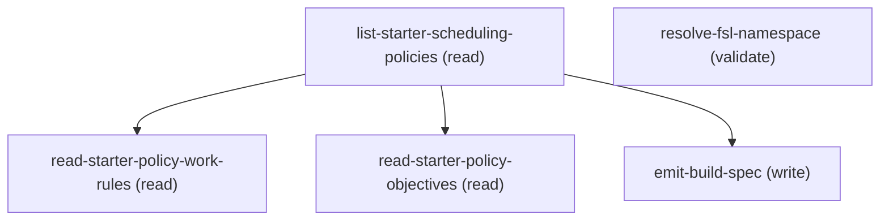

# Managing Sfs Scheduling Policy Designer

## When to Use This Skill

Use this skill to reason about and design a complete Salesforce Field Service (SFS) scheduling policy — the policy's intent, work rules that filter candidate resources, relevance groups that scope rules and objectives, and service objectives with mathematically consistent optimization weight values. Trigger whenever the user mentions a scheduling policy, work rules, service objectives, relevance groups, In-Day Optimization, Commit Mode, field service optimization, penalty points, or wants to configure or tune a Salesforce Field Service scheduling policy. Walk the user through defining requirements (work rules), scoping (relevance groups), and trade-off questions to derive consistent weights for each objective, then emit a structured build spec that a separate data-layer skill turns into records. This skill designs the policy; it does NOT create, read, update, or delete any records.

## Workflow

# Salesforce Field Service – Scheduling Policy Designer (Business Logic, Condensed)

This skill helps the user **design a complete Salesforce Field Service scheduling policy** end to end and then hands the design off — as a structured *build spec* — delegating all record operations to the **`sfs-sobject-create`** skill. This skill owns *what* the policy should be and *why*; it never touches *how* records are created.

**Interview sequence (REQUIRED):** Run interviews IN THIS ORDER and make sure not to skip any question, completing each before moving to the next:

### Phase 1: **Scheduling Policy Interview** — Collect policy settings (name...


### Phase 2: **Work Rule Design Interview** — Ask one question...


### Phase 3: **Service Objective Interview** — Group trade-off questions by...


### Phase 4: **The scheduling policy definition** — name, description, In-Day...


### Phase 5: **Work rules** — the hard filters that decide...


### Phase 6: **Relevance groups** — optionally scope a work rule...


### Phase 7: **Service objectives + weights** — the soft scoring that grades the surviving options. This is the deepest part of the skill

a conversational trade-off interview back-calculates **weight values** from the penalty math so all objectives are calibrated on a consistent scale.

### Phase 8: **The build spec** — a structured, machine-readable summary...


**Rules vs. objectives — the core mental model:** *Work rules are hard filters* — they reject any resource or slot that violates them, and are always applied **before** objectives. *Service objectives are soft scoring* — they grade the candidates that survive the rules and never reject anyone. If a user wants "must have X," that's a work rule. If they want "prefer X," that's an objective. Rules shrink the candidate list; objectives rank what's left.

**Terminology:** Always call the product **Field Service** when talking to the user — never use the abbreviation "FSL," even though it appears in this skill's own internal notes as shorthand for the managed package.

**Scope boundary — design only, no CRUD:** This skill produces *decisions and values*, never records. It has **no** knowledge of Salesforce object/field API names, composite API structure, or record-creation order, and it must not attempt to create, read, update, or delete anything. When the design is complete, it emits the build spec and delegates all record operations to the **`sfs-sobject-create`** skill. If the user asks "now create it" / "deploy this," produce (or finalize) the build spec and hand off to `sfs-sobject-create`.

**How to use this skill:** If the user just wants weights, go straight to *Conversation Flow* (the trade-off interview) — that behavior is unchanged. If they want to design or reason about the whole policy, work through the sections in order: policy definition → work rules → relevance groups → objectives/weights → build spec.

**Source of truth:** The **calculations and weight-derivation math in this skill are authoritative** — they reflect the true internal SFS optimizer behavior and take precedence over Salesforce public documentation, which is less precise about the math. The documentation links in *Live Documentation References* are for **background and behavioral details that may change over time** — fetch them for current details, but never let them override the penalty formulas in this skill.

---

## Defining a Scheduling Policy

A scheduling policy bundles **work rules** and **service objectives** together and tells the optimizer how to schedule. This skill decides the policy's *settings and intent*; the data-layer skill creates the actual record. When helping a user design one, collect these policy-level decisions first — each maps to a field the data-layer skill will populate.

**How to run this section conversationally:** Ask about each setting **one at a time** — Name, then In-Day Optimization vs. Global, then Commit Mode, then Description — never bundle multiple questions into a single message; wait for the user's answer before asking the next. Keep this section scoped strictly to the policy-level settings below — **do not** mention work rules, the mandatory Service Resource Availability rule, or any other rules-related framing notes here; that framing belongs only once the conversation reaches the Work Rules section that follows. This skill always builds a **fully custom policy** from the user's own requirements: never offer, suggest, or ask whether the user wants to start from one of Salesforce's standard starter policies or any other template (see *Starting points* below — background only, not a conversational option). Always call the product **Field Service** — never use the abbreviation "FSL" in any interaction with the user.

**Core settings:**

- **Scheduling Policy Name** — the display name for the policy. Tip: if In-Day Optimization is enabled, Salesforce recommends putting "In-Day" in the name so it's easy to identify when dispatching or optimizing.
- **Description** — a free-text description of the policy's intent. Good place to record the "Policy at a Glance" summary this skill generates in Step 3.
- **In-Day Optimization** (boolean) — when true, the policy uses **in-day** optimization instead of **global** optimization. Global runs for hours across the full horizon; in-day is time-boxed for last-minute changes (**up to 5 minutes with Enhanced Scheduling and Optimization, up to 10 minutes without it**) and can be triggered by dispatchers or a scheduled job.
- **Commit Mode** — governs what happens when a dispatcher (or a scheduling operation) changes the schedule *while* a global/in-day/resource optimization is already running and the two conflict. Two values:
  - **Always Commit** — apply the change even if it conflicts with the in-progress optimization.
  - **Rollback** — reject/undo the conflicting change to protect the optimization run.

Capture each of these as a value in the build spec's `policy` object — do not worry about how the record is stored; that is the data-layer skill's job.

**Mandatory rules (every policy) — this is the one canonical statement of this rule; every other mention in this skill just points back here:**
- **Service Resource Availability** — **always include exactly one** in the design and the build spec (`mandatory: true`), **regardless of what the user asks for**. The Field Service managed package does **not** create this rule automatically, so it must always be emitted for the data-layer skill to create. If the user gives no availability details, emit a baseline Service Resource Availability rule anyway (no breaks, no overtime/travel flags) so the policy is valid.
- **Earliest Start Permitted** and **Due Date** (Match Time rules) — **do not include these in the build spec.** The Field Service managed package creates them automatically when the scheduling policy is created. Do not design, emit, or ask about them; they are provisioned for you.

**Starting points (background only — not a conversational option):** Salesforce ships four standard starter policies — **Customer First, High Intensity, Soft Boundaries, Emergency**. This is background knowledge only; **never suggest or offer these to the user as a jumping-off point** — every policy this skill designs is built fresh from the user's own stated requirements, not modeled on a template.

> For behavioral background on these settings, fetch: `service.pfs_scheduling.htm` (see *Live Documentation References*).

---

## Work Rules

**Work rules are hard filters.** They refine the candidate list for a service appointment by **rejecting any service resource that violates a rule**. They are always applied **before** service objectives, and objectives only ever score the resources that survive the rules. If a requirement is "must," it's a work rule; if it's "prefer," it's an objective.

### Database rules vs. Apex rules (why it matters for performance)

- **Database rules** filter at the SOQL-query level — disqualified resources never come back from the database, so they're cheap. They're aggregated into one query and applied in no particular order.
- **Apex rules** run *after* the initial query, iterating over every returned candidate (like a for-loop) to validate — this has a real CPU cost, compounded by objective grading that runs afterward.
- **Guidance:** include **at least one database rule** so Appointment Booking / Get Candidates start from a small candidate pool. Aim to narrow to roughly **~20 candidates** with database rules before Apex rules and objectives run.

### The 16 work rule types

Each row: **name — engine (DB/Apex) — what it does.** "DB w/ ESO" means the rule runs at the database level *only when Enhanced Scheduling and Optimization is enabled*, and as Apex otherwise.

| Work Rule | Engine | What it does |
|---|---|---|
| **Service Resource Availability** | Apex — **MANDATORY** | Ensures a resource is actually available: respects operating hours, travel, breaks, absences, and existing assignments. Also enforces capacity for capacity-based resources. Configurable breaks, gaps, overtime, and travel-to/from-home. |
| **Match Time Rule** | Apex | Constrains the scheduling window from an appointment's date/time fields. Ships with standard rules **Earliest Start Permitted** and **Due Date** (both **mandatory**), plus Scheduled Start / Scheduled End (arrival-window based). |
| **Match Skills** | Apex | Matches an appointment's skill requirements to a resource's assigned skills; can enforce skill level. Skill Type Logic is **All Skills Match (AND)** (default) or **At Least One Skill Matches (OR)** (OR requires ESO). |
| **Match Fields** | DB w/ ESO | Matches one appointment field to one resource field (1:1). Use Extended Match instead when comparing one appointment field against multiple resource values. |
| **Match Boolean** | DB w/ ESO | Requires a checkbox field on the resource to be true (or false). **Max 5 per policy.** Ships with standard "Active Resources." |
| **Extended Match** | Database | Custom-criteria matching via a junction object linking an appointment field to a related list on the resource (e.g., serviceable postal codes, product lines). |
| **Match Territory** | Database | Restricts to resources who are **primary or relocation** members of the appointment's service territory. |
| **Working Territories** | Database | Enforces **primary and secondary** service territory memberships. |
| **Maximum Travel from Home** | Database | Caps distance/travel time between a resource's home base and any assigned appointment. |
| **Required Resources** | DB w/ ESO | Forces assignment to a resource marked **Required** (Resource Preference on the WO/WOLI). Very restrictive. |
| **Excluded Resources** | DB w/ ESO | Prevents assigning a resource marked **Excluded** on the WO/WOLI. |
| **Count Rule** | Apex | Caps assignments, hours, or a custom value per resource per day (e.g., ≤8 scheduled hours, ≤N items on a truck). Time Resolution is **Daily**. Up to 10 custom-field count rules per policy. |
| **Work Capacity** | Apex — **ESO only** | Enforces per-territory Work Capacity Limit records (e.g., cap install work at 80% of territory capacity). |
| **Service Appointment Visiting Hours** | Apex | Enforces customer operating hours / allowed visit windows (e.g., weekdays 8 AM–noon). All-or-nothing rule (no relevance groups). |
| **TimeSlot Designated Work** | Apex | Reserves a time slot/shift for a specific work type — only that type schedules in that window. All-or-nothing rule (no relevance groups). |
| **Service Crew Resources Availability** | Apex | Ensures a crew-type resource is only assigned when the crew meets the parent record's minimum crew size. |

> **Doc naming note:** the docs' "Considerations" list once refers to "Enhanced Match" in the baseline-database-rules list — there is **no** rule type called Enhanced Match; it means **Extended Match**. Treat as a documentation typo.

### Step 1 of building rules: define your requirements

| If the requirement is… | Use this work rule |
|---|---|
| Resources need specific skills / proficiency levels | **Match Skills**; **Extended Match** |
| Non-skill matching factors (e.g., serviceable postal codes) | **Match Boolean**; **Match Skills**; **Extended Match** |
| Breaks during the day / specific or multiple breaks | **Service Resource Availability** (+ work rule entries for multiple breaks, ESO) |
| Can work go into overtime? Can resources travel outside working hours? | **Service Resource Availability** |
| Max number / duration of appointments per resource per day | **Count Rule** |
| A specific resource **must** be assigned | **Required Resources** |
| A specific resource **must not** be assigned | **Excluded Resources** |
| Customer has specific service-call time windows | **Service Appointment Visiting Hours** |
| Ensure crew-type resources get scheduled | **Service Crew Resources Availability** |
| Appointments have arrival windows / required arrival times | **Match Time Rule** |
| Cap travel distance from home / control travel cost across large territories | **Maximum Travel from Home** — ask whether the cap is by **distance** or by **travel time** (see note below) |
| Assign specific work types to a resource for part/all of a day | **TimeSlot Designated Work** |
| Restrict work to the resource's **primary and secondary** service territory memberships | **Working Territories** |

**Arrival Window Match Time rules (opt-in default pair).** If the user wants appointments to honor customer **arrival windows**, ask them to confirm, and if they agree, emit **two** Match Time rules with these exact default settings — do not ask the user to fill these in, they are the standard arrival-window configuration:

| Setting | Rule A | Rule B |
|---|---|---|
| Name | `Arrival Window Start` | `Arrival Window End` |
| Service Schedule Time Property | `SchedStartTime` | `SchedStartTime` |
| Service Time Operator | `Later than or Equal to` | `Before or Equal to` |
| Service Time Property | `ArrivalWindowStartTime` | `ArrivalWindowEndTime` |
| Pass Empty Values | `true` | `true` |

Emit each as a Match Time work rule whose `params` carry those four values (keys `serviceScheduleTimeProperty`, `serviceTimeOperator`, `serviceTimeProperty`, `passEmptyValues`). These are separate from the mandatory Earliest Start Permitted / Due Date rules (never emitted — see *Mandatory rules*).

**Interpreting and emitting break times (clock time vs. shift-start offset):** A Service Resource Availability rule expresses breaks in one of two shapes, and **this skill decides the shape and emits the values the data-layer skill needs** — the data-layer skill never receives a clock time it has to convert. Choose the shape as follows:

- **One fixed daily break at an absolute clock time** (e.g. "30 minutes at 12:00 every day") → emit it as an **absolute** break: `{ "mode": "absolute", "startClock": "12:00", "durationMinutes": 30 }`. No offset math, no working-day start needed.
- **One or more breaks defined as an offset from the start of the working day** (e.g. "a 30-minute lunch starting 3 hours into the shift") → emit each as an **offset** break, in **minutes from the start of the working day**: `{ "mode": "offset", "earliestStartOffsetMinutes": 180, "latestEndOffsetMinutes": 240, "durationMinutes": 30 }`. All three of `earliestStartOffsetMinutes`, `latestEndOffsetMinutes`, and `durationMinutes` are **mandatory** for an offset break. **When the user states the break in offset terms already** (e.g. "3 hours after the start of day"), that offset *is* `earliestStartOffsetMinutes` (180) — **do not ask for the working-day start; you don't need it.**
- **Breaks given as clock times but there is more than one** (e.g. "15 minutes at 10:00 and 30 minutes at 12:00") → you must use the **offset** shape, which means **converting each clock time into an offset from the start of the working day**. You cannot do that without knowing when the day starts, so **ask the user for the shift / working-day start**, then compute `earliestStartOffsetMinutes = (break start clock − day start)` in minutes for each break. Never assume the day starts at midnight (that would turn "10:00" into a wrong 600-minute offset). *(Only ask for the day start in this clock-time case — never when the break is already expressed as an offset.)*

**Always emit `latestEndOffsetMinutes` for every offset break — ask for it directly, do not fabricate a window.** The earliest start comes from what the user stated (an offset, or a converted clock time) — **do not invent ± tolerance windows around it** (no "±1 hour" / "±2 hour" options). If the user only gave a break start (or a duration with no stated finish-by), **ask them plainly for the latest the break may end**, phrased in the *same terms they used*: if they gave an offset ("starts 3 hours after start of day"), ask "what is the latest it may end, as time after the start of the day?" and convert (e.g. "4 hours after start" → 240); if they gave a clock time, ask for a clock time and convert with the day start. If the user says the break is fixed/pinned with no flex, set `latestEndOffsetMinutes = earliestStartOffsetMinutes + durationMinutes`. Never emit an offset break missing any of the three fields, and never guess the latest-end. If a break requirement is too involved to convert reliably, ask clarifying questions or recommend the manual approach rather than guessing.

**Maximum Travel from Home — establish the cap type, not the unit.** When a requirement caps how far a resource may travel from home, **ask the user whether the cap is by distance or by travel time** — the two are configured differently and the data-layer skill needs to know which. Emit the value and the type in `params`: `{ "maxTravelFromHome": 50, "maxTravelFromHomeType": "Distance" | "Travel Time" }`. Interpret the user's phrasing to set the *type* — "50 miles"/"50 km" ⇒ `Distance`, "45 minutes" ⇒ `Travel Time` — but **do not ask for or emit a distance unit (miles vs km): it is not part of the work-rule config**; the unit is governed by the org's locale/distance settings elsewhere, so the rule stores only the number. For `Travel Time` the value is minutes. Never emit the cap value without its type.

### Step 2 of building rules: per-rule parameter questions

Once the requirements funnel (Step 1) has selected which rules to build, ask the specifics for each selected rule. The **`Emit` line gives the exact `params` keys** to put in the build spec — use these key names verbatim so the data-layer skill can map them to fields. Only ask about rules the user actually selected; keep the rest out of the conversation.

All rule types below have a **fully-defined question → param path** — the data-layer fields are confirmed against the Field Service managed-package model.

- **Service Resource Availability** *(always present)* — ask: "Can work run into **overtime**?" (yes/no) · "Can resources **travel outside working hours** to/from home?" — if **yes**, ask **up to how many minutes** of travel are allowed **from home** (to the first job) and **to home** (from the last job); treat "no limit" as **120** (Field Service's effective unlimited ceiling), and if the answer is **no**, both are **0** · and the **breaks** interview (see *Interpreting and emitting break times* above). Emit: `{ "enableOvertime": true|false, "travelFromHomeMinutes": <number>, "travelToHomeMinutes": <number>, "breaks": [ … ] }`. **`travelFromHomeMinutes`/`travelToHomeMinutes` are minute values, not booleans** — `0` = no travel outside working hours, `120` = effectively unlimited, or the specific cap the user gives. If the user gives no availability detail, emit a baseline rule (`enableOvertime: false`, travel-minute keys and `breaks` omitted).
- **Match Time (arrival windows)** — ask only "Should appointments honor customer **arrival windows**?" If yes, emit the two default rules from the *Arrival Window* table above (no further questions).
- **Match Skills** — **gate first, don't assume it's needed.** Ask: "**Do work orders require resources with relevant skills or specific proficiency levels?**" If **no**, do not emit a Match Skills rule at all. If **yes**, emit the rule and ask the follow-up: "Should the resource also **meet a minimum skill level** (proficiency), or is simply *having* the skill enough?" Emit: `{ "matchSkillLevel": true|false }`. **Do not ask about skill-type AND/OR logic** — this skill deliberately does not configure `skillTypeLogic`.
- **Match Fields** — ask: "Which **Service Appointment field** must match which **Service Resource field**, and with what **operator**?" Emit: `{ "serviceProperty": "<appointment field API name>", "resourceProperty": "<resource field API name>", "booleanOperator": "=" }`. The operator is one of the symbols **`=`, `>=`, `<=`, `>`, `<`** (default `=`). (These field names are the customer's own fields — pass them through as given.)
- **Match Boolean** — ask: "Which **checkbox field on the resource** must be true (or false)?" Emit: `{ "resourceProperty": "<resource field API name>", "value": true|false }`. Remind the user there is a **max of 5 Match Boolean rules per policy**.
- **Maximum Travel from Home** — see the cap-type note above. Emit: `{ "maxTravelFromHome": <number>, "maxTravelFromHomeType": "Distance"|"Travel Time" }`.
- **Working Territories** — ask: "Restrict resources to their **primary and secondary** service territory memberships?" This is the **only** territory-scoping rule the interview emits — there is **no separate Match Territory question** (by design, no interview path produces a standalone Match Territory rule). No user parameters — selecting the rule is enough. Emit: `{ "workingLocationEnablePrimary": true }` (the standard fixed value; the data-layer skill maps it to `{ns}Working_Location_Enable_Primary__c`). *(If a user explicitly needs primary/relocation-only scoping — the classic Match Territory behavior — advise them it must be configured manually; the interview does not emit it.)*
- **Service Crew Resources Availability** — first ask the **gating question**: "**Do you need to ensure crew-type resources get scheduled?**" If **no**, do **not** emit this rule at all — there is nothing to create. If **yes**, emit the rule and ask its two parameters:
  - **Consider Service Crew Membership** (yes/no) — "Should the rule evaluate **individual crew members'** availability and skills, not just the crew record?" → `considerCrewMembership`.
  - **Maximum Additional Service Resources** (optional number) — "What is the **maximum number of extra resources beyond the base crew** that can be pulled in to meet the minimum crew size?" → `maxAdditionalResources`.

Emit: `{ "considerCrewMembership": true|false, "maxAdditionalResources": <number> }` (omit `maxAdditionalResources` if the user leaves it blank).
- **Extended Match** *(advisory only — the data-layer skill will not build this)* — Extended Match needs a **custom junction object plus fields** that no skill in this pair creates (that is schema DDL the user must own). So **do not emit it as a normal work rule with mappable `params`.** Instead, when a requirement calls for custom-criteria matching (e.g. serviceable postal codes, product lines), **advise the user what to set up**, and record it under `prerequisites` — do not put it in `workRules[]` for the data layer to create. The setup guidance to give the user: (1) create a **junction object** linking **Service Resource** to the matched object, with **exactly two Master-Detail** relationships (one to Service Resource, one to the matched object) — the packaged trigger requires exactly two or the rule fails; (2) a **Service Appointment field of type Lookup** that drives the match; (3) a **reference field on the junction** matched against it. Tell the user that once those exist, the Extended Match work rule must be created and configured **manually in Setup** (Field Service Settings → Scheduling → Work Rules), because pointing a rule at objects/fields that are created outside this design is beyond what the data-layer skill does. Capture the intended objects/fields in `prerequisites` as advisory text; **do not** emit a `params` mapping.
- **Count Rule** — ask: "Is there a **maximum number or duration of appointments per resource per day**?" If yes, have the user describe the limit in plain terms, then classify it into three values:
  - **`countBy`** — one of `"Appointments"` (a count of jobs, e.g. "no more than 8 jobs per tech per day"), `"Hours"` (a duration cap, e.g. "≤ 6 working hours of appointments per day"), or `"Custom"` (sum of a custom numeric field on the Service Appointment, e.g. "≤ 100 units on a truck").
  - **`maxValue`** — the numeric cap (for `Hours`, convert the limit to **hours**).
  - **`fieldHint`** — **only for `Custom`** (and optionally `Hours`): the **Service Appointment field to sum**. Set `null` for a plain `Appointments` count.

Emit: `{ "countBy": "Appointments"|"Hours"|"Custom", "maxValue": <number>, "fieldHint": "<SA field API name>"|null }`. When `countBy` is `Custom` (or `Hours` against a specific field), add a **prerequisite** note: *"Confirm the summed field `<fieldHint>` exists on Service Appointment."* The Time Resolution is always **Daily** and the counted object is always **Service Appointment** — the data-layer skill sets both automatically, so do not ask about them. Reminder: up to **10 custom-field count rules** per policy.

**Selection-only rules** — the rule record itself has no config fields; the behavior comes from data on other objects. For each: ask a plain gate question, emit `{}` if yes (or skip entirely if no, where noted), and record the referenced data as a **prerequisite**.

- **Required Resources / Excluded Resources** — ask: "Should the policy **force** assignment to a resource marked *Required* (or **prevent** one marked *Excluded*) on the work order / WOLI?" Emit `{}`. These key off **Resource Preference** records on the work order — note that as a prerequisite (the data must exist).
- **Work Capacity** *(ESO only)* — ask: "Cap work at what limit (Hours or Percentage of capacity), for which **territory** and which **work-type/appointment attribute**?" The limits themselves live on standard **`WorkCapacityLimit`** records per territory (a prerequisite set up outside the policy); adding the rule to the policy just enables enforcement. Capture the intent and note the prerequisite; the rule record itself has no config fields.
- **Service Appointment Visiting Hours** — **gate only; do not ask for the windows.** Ask: "Should appointments be restricted to **customer visiting hours**?" (yes/no). The **windows are per-account data**, not a single policy-wide value: they live on an **`OperatingHours`** record referenced from the Work Order (populated from the Account), so there is nothing to collect at design time. If **yes**, emit `{}` and record a **generic prerequisite** ("each account must have its visiting/operating hours populated; the Work Order's Visiting Hours must resolve from the account"). **Never ask the user to state the allowed windows** — they differ per account. (No relevance-group scoping.)
- **TimeSlot Designated Work** — **gate only.** Ask: "Do you need to **reserve specific time slots / shifts for particular types of work**?" (yes/no). Phrase it as "types of work," **not** "Work Type" — *Work Type* is a specific Salesforce object, and saying it implies the reservation can only key off that object, when the designation is broader. The slot↔work reservation lives on standard **`TimeSlot`** data (a prerequisite), so there is nothing to collect at design time. If **yes**, emit `{}` and record a **generic prerequisite** ("time slots must be configured to designate the intended work"). (No relevance-group scoping.) **Do not ask the user to enumerate slot→work mappings** — that is data setup.

> For per-rule configuration fields and gotchas, fetch the specific rule sub-page under `service.pfs_optimization_theory_work_rules.htm` (see *Live Documentation References*).

---

## Relevance Groups

A **relevance group** scopes a single work rule or service objective so it applies **only to certain appointments or resources**, instead of the whole policy. This lets one policy hold different logic for different work or resource types — e.g., different break/travel limits for part-time vs. full-time employees, or expedited scheduling for high-value accounts.

### How it works, and the division of labor

A relevance group is driven by a **Boolean (true/false) field**. Every standard or custom Boolean field on the **Service Appointment** and **Service Territory Member** objects is selectable in the rule/objective's Relevance Group dropdown. On a work rule or objective, you pick the limiting Boolean field; the rule/objective then applies **only** to records where that field is true. The two bases are just the two objects the Boolean can live on:

- **Service Appointment basis** — scopes by the **appointment** being evaluated (e.g., a formula checkbox "Platinum Account" that's true when the related account tier is Platinum). Use to target appointment *types*.
- **Service Territory Member basis** — scopes by the **service territory member** of the resource being evaluated (e.g., "Part-Time" / "Full-Time" checkboxes). Use to target resource *populations*. Only **primary and relocation** memberships are supported — not secondary.

**In the design:** decide the *basis* (Service Appointment vs. Service Territory Member) and the *name of the Boolean field* that identifies the subset, then record both on the rule/objective in the build spec (`relevanceGroup: { basis, booleanField }`). This skill only decides which field scopes which rule/objective — wiring the group onto the record is the data-layer skill's concern.

**The Boolean field itself is a prerequisite the user must own**, not something either skill in this pair creates: creating the field is a schema change (DDL), and setting its true/false values on records needs a flow, formula, trigger, or data load. So **advise the user** to, before deploying: (1) create one custom Boolean field on the appropriate object (Service Territory Member for a resource subset, Service Appointment for a work subset) per subset; (2) populate it true for exactly the records in that subset (via flow/formula/import), keeping subsets mutually exclusive where the rule type requires it. Then reference that field by name in the build spec so the data-layer skill can attach it as the relevance group.

### Worked example (the canonical pattern)

To apply a **Match Boolean** rule (or any scoping) to only certain appointment types: identify (or have the user create) a Boolean field on the Service Appointment that is true for those appointments, and name it as the rule's relevance group in the build spec. The rule then applies **only** to appointments where the field is true. The same pattern with a Service Territory Member Boolean (e.g., Part-Time vs. Full-Time) lets you design two copies of the **Maximum Travel from Home** rule with different limits — one scoped to part-timers, one to full-timers.

For objectives, the classic example is combining **ASAP** with a relevance group: a formula checkbox "Platinum Account" on the appointment, an ASAP objective named "Expedite Platinum Accounts" scoped to it with a **high weight**, so platinum jobs schedule sooner (accepting more travel). Give scoped high-priority objectives a clearly higher weight, or the engine may prefer not to schedule the appointment at all because of its ASAP penalty.

### Scoping any rule or objective to a subset (the general rule)

**This applies to every work rule and every service objective — not just breaks or availability.** Whenever a request says a rule or objective should apply to **only certain resources** or **only certain work**, rather than the whole policy, the mechanism is a **relevance group**. Watch for this signal and reach for it every time:

- **"…applies to certain types of resources"** (e.g. "resources in France", "part-time techs", "senior engineers", "the install crew") → create a **Service Territory Member relevance group**: a Boolean field on Service Territory Member that is true for exactly those resources, selected as the rule/objective's relevance group.
- **"…applies to certain types of work"** (e.g. "installation jobs", "platinum-account appointments", "emergency work orders", "jobs over 2 hours") → create a **Service Appointment relevance group**: a Boolean field on Service Appointment that is true for exactly those appointments, selected as the rule/objective's relevance group.

**Always check whether the specific rule/objective supports the basis you need.** Not every rule/objective can be scoped by Service Territory Member, and not every one can be scoped by Service Appointment. Before recommending a relevance group, **consult the relevance-group documentation's support matrix** (`service.pfs_relevance_groups.htm`) for that exact rule or objective, and **consider only Enhanced Scheduling & Optimization (ES&O)** support — ignore the legacy/non-Enhanced columns. If the needed basis isn't supported for that rule/objective under ES&O, say so and suggest the closest supported alternative instead of inventing one.

**When two subsets each need a *different* configuration of the same rule/objective, design one instance per subset — never one merged instance.** A single rule/objective instance applies to every record it covers, so you cannot express "France gets pattern A, everyone else gets pattern B" in one instance. Instead specify **one instance per subset, each scoped by its own distinct Boolean field**, and keep the groups **mutually exclusive** (for single-coverage rule types like Service Resource Availability, an overlap throws an error — see *Key rules and gotchas*). Example: "Resources in France get a 15-minute break at 10 AM and a lunch between 12 and 2; all other resources get a 30-minute break between 12 and 3" needs two Service Resource Availability rules — "Availability – France" scoped to a `Break_Group_France__c` STM checkbox, "Availability – Standard" scoped to a `Break_Group_Standard__c` STM checkbox — each carrying only its own group's breaks, with every resource landing in exactly one group.

**When the scenario is genuinely too complex, recommend a manual design.** If a request combines multiple subsets, ambiguous values, and relevance-group fields that don't exist yet, don't force a single merged instance into the spec. Walk the user through the relevance-group design above and let them refine it (or spec only the parts that are unambiguous), rather than emitting a plausible-looking but wrong merged rule/objective. Prefer **asking clarifying questions** (which subset? resources or work? what Boolean field identifies each? is that basis supported for this rule/objective under ES&O?) over guessing.

### Key rules and gotchas

- **Relevance groups must be mutually exclusive.** If two rules with relevance groups overlap, the more restrictive one wins — and for **Service Resource Availability**, an overlap throws an **error**. Each resource must be covered by exactly one Service Resource Availability rule.
- **Additive rule types** — can appear multiple times and legitimately cover the same resources/appointments: **Count Rule, Extended Match, Match Boolean, Match Fields, Match Time**.
- **Single-coverage rule types** — a resource/appointment must be covered by at most one instance at a time: **Match Skills, Match Territory, Maximum Travel from Home, Required Resources, Service Crew Resource Availability, Service Resource Availability, Working Territories**. (Also: don't cover a resource by both Match Territory and Working Territories at once.)
- **All-or-nothing rules — no relevance groups:** **TimeSlot Designated Work** and **Service Appointment Visiting Hours**. Also **Work Capacity** doesn't support relevance groups.
- **Objectives** can be repeated with relevance groups too, but a record must not meet the criteria for two objectives of the same type at once — **except Resource Priority**, which can legitimately apply twice to the same appointments if each instance points to a **different** resource priority field (e.g., "Primary Priority" and "Secondary Priority"/"Tenure").
- Support for whether a rule/objective can be scoped by appointment vs. territory member **differs between the Enhanced and non-Enhanced engines** — verify the support tables when scoping. **Group Nearby** and **Same Site** objectives do **not** support relevance groups at all.

> For the full support matrices and setup steps, fetch: `service.pfs_relevance_groups.htm` (see *Live Documentation References*).

---

## Background: How SFS Scoring Works

The optimizer assigns **penalty points** to each candidate schedule. Lower total penalty = better schedule. Each service objective contributes penalty points based on its **weight** and its own **scale** (the worst-case scenario for that objective).

> **Minimize Travel weight is the anchor** — its value is set by the user and all other weights are derived relative to it.

**The general formula, common to every objective below** (stated once here so it isn't re-derived nine times):
```text
penaltyPerViolation = max( 1, roundingFn( (1000 × weight) / scale ) ) × finalMultiplier
total_penalty       = ceil( violations / granularity ) × penaltyPerViolation
```
Every objective applies the same **×1000 internal multiplier**, then its own scale, rounding function, and final multiplier. Two consequences follow, and are *not* repeated under each objective below:

- **The ×1000 multiplier is uniform**, so it cancels out of every crossover/derivation equation between two objectives — this is *why* the simple continuous approximations (`penalty ≈ units × weight/scale`) used throughout the trade-off interview stay valid, and why every "derive weight_X from weight_Y" formula below is clean of any ×1000 term. Where the rounding function is *not* exact for integer weights (ASAP's `round`, Skill Level/Preference's `roundInt` against a scale that doesn't divide evenly), a small amount of drift is possible — flagged per objective under *Precision notes* where it matters.
- **The `max(1, …)` floor** guarantees every included objective has *some* effect even at a very low weight. Each objective's Precision notes flag the specific weight range where this floor actually binds.

**The one exception to the uniform multiplier is Same Site**, whose final multiplier (`×0.01`) nets to an *effective* ×10 rather than ×1000 — called out explicitly under its formula below, because it's the one place the "just divide by the other objective's rate" shortcut doesn't apply without adjustment.

---

## Penalty Formulas by Objective

Use these formulas throughout the conversation to show math and back-calculate weights. Each objective states its scale, rounding function, and final multiplier, then its worked example and precision caveats — the general mechanics (×1000 multiplier, `max(1,…)` floor, why derivations stay valid) are covered once above and not repeated here.

### Minimize Travel (anchor)
- **Scale:** 120 minutes (2 hours = default `MaxGrade__c`). **Rounding:** `round5` (5 decimal places). **Final multiplier:** `× 1/60` (converts the per-minute rate to per-second).
  ```text
  penaltyPerViolation_travel = max( 1, round5( (1000 × weight_travel) / 120 ) ) × (1/60)
  ```
  With weight_travel = 1000: `round5(1000×1000/120) = 8333.33333` → `× 1/60 = 138.88889 pts/second`.

- **Penalty for X seconds of travel:** `travel_penalty(X_seconds) = ceil( X_seconds / 1 ) × penaltyPerViolation_travel` (whole-second granularity — unlike ASAP's whole-minute granularity).

Example — 30 minutes (1800 seconds) of travel: `1800 × 138.88889 = 250,000 pts`. At the scale boundary, 2 hours (7200 seconds) = `7200 × 138.88889 = 1,000,000 pts`.

- **Continuous approximation (for weight derivation):** `travel_penalty(X_minutes) ≈ X × (weight_travel / 120)` — with weight_travel = 1000, ≈ 8.333 pts/min.

- **Precision notes:** `round5` preserves much higher precision than ASAP's integer `round`. Travel is **per-second**; Overtime (same scale) is **per-minute** — a 61-second trip costs more than a 60-second one, unlike Overtime. The `max(1,…)` floor only binds below weight ≈0.12, irrelevant since Travel is fixed at 1000.

### ASAP
- **Scale:** 43,200 minutes (30 days = 2,592,000 seconds). **Rounding:** `round` (integer).
  ```text
  penaltyPerViolation_asap = max( 1, round( (1000 × weight_asap) / 43200 ) )
  ```
- **Penalty for X seconds in the future:** `asap_penalty(X_seconds) = ceil( X_seconds / 60 ) × penaltyPerViolation_asap` (whole-minute granularity).
- **Continuous approximation:** `asap_penalty(Y_minutes) ≈ Y × (weight_asap / 43200)`.
- **Precision notes:** weights **below ~22 are dead** — `round(1000×21/43200) = round(0.486) = 0`, clamped to 1 by the floor, so any weight 1–21 produces the identical 1 pt/min rate. Above that, drift is small: weight 250 → `round(250000/43200) = 6` → effective weight `6×43200/1000 = 259.2` (3.7% drift). Validate final weights with the integer formula when precision matters.

### Same Site
- **Scale:** 1 (binary — kept together or split). **Rounding:** `round5`. **Final multiplier:** `× 0.01` — this is the exception flagged above: it nets to an **effective ×10**, not ×1000.
  ```text
  penaltyPerViolation_same_site = max( 1, round5( (1000 × weight_same_site) / 1 ) ) × 0.01
  ```
  With weight_same_site = 50: `round5(50000) = 50000` → `× 0.01 = 500 pts/violation`.
- **Total penalty:** `same_site_penalty = ceil( X_violations / 1 ) × penaltyPerViolation_same_site`. Example — 1 split (w=50): `1 × 500 = 500 pts`.
- **Equivalence to the old conceptual formula:** `New: w × 10 × X` vs. `Old: w × X` — the new internal formula is **10× the old one** (not 1000×, because of the `×0.01` above). Compared internally against Travel (w=1000 → 138.89 pts/sec) or against ASAP, the crossover math still reduces to the same continuous form because both sides carry the same ×1000-then-scale pattern:
  ```text
  same_site_penalty = asap_penalty(D_equiv)  →  weight_same_site = D_equiv × (weight_asap / 43200)
  ```
- **Precision notes:** `round5` is exact for integer weights, so no meaningful precision loss. The effective multiplier is **×10** here — remember this is the one objective where it differs from the ×1000 baseline. Flat per-event penalty regardless of any time dimension.

### Minimize Overtime
- **Scale:** 120 minutes (same as Travel). **Rounding:** `round5`. **Final multiplier:** `× 1.0` (per-minute — no further division, unlike Travel's ÷60).
  ```text
  penaltyPerViolation_overtime = max( 1, round5( (1000 × weight_overtime) / 120 ) ) × 1.0
  ```
  With weight_overtime = 1000: `8333.33333 pts/minute`.
- **Penalty for X seconds of overtime:** `overtime_penalty(X_seconds) = ceil( X_seconds / 60 ) × penaltyPerViolation_overtime`. Example — 30 minutes (1800 seconds): `ceil(1800/60) × 8333.33333 = 30 × 8333.33333 = 250,000 pts`.
- **Continuous approximation:** `overtime_penalty(Z_minutes) ≈ Z × (weight_overtime / 120)`.
- **Precision notes:** shares Travel's scale and `round5` precision — the rates are directly comparable — but Overtime groups into **whole minutes** (`ceil(seconds/60)`) rather than Travel's whole seconds, so a 61-second block costs the same as a 120-second block (both = 2 minutes). Floor binds below weight ≈0.12, unlikely in practice.

### Preferred Resource
- **Scale:** 1 (binary — honored or violated, no partial credit). **Rounding:** `roundInt`. **Final multiplier:** `× 1.0`.
  ```text
  penaltyPerViolation_preferred = max( 1, roundInt( 100 × 10.0 × weight_preferred ) ) × 1.0
  ```
  (`100 × 10.0 = 1000` — the same internal multiplier, just decomposed.) With weight_preferred = 375: `roundInt(375000) = 375,000 pts/violation`.
- **Total penalty:** `preferred_penalty = ceil( X_violations / 1 ) × penaltyPerViolation_preferred`. Example — 1 violation (w=375): `375,000 pts`.
- **Continuous approximation:** exact for integer weights (`roundInt(1000×w) = 1000×w`, zero rounding error): `preferred_resource_penalty = X_violations × 1000 × weight_preferred`.
- **Precision notes:** zero rounding error for integer weights. Floor only matters below weight 0.001, irrelevant in practice. Flat per-event penalty — no time-based granularity.

### Resource Priority
- **Scale:** 10 (priority values 0–10; 0 = best candidate, 10 = lowest priority, null = lowest). **No rounding function** — raw decimal.
  ```text
  penaltyPerViolation_resource_priority = max( 1, (weight_resource_priority / 10.0) × 1000 )
  ```
  With weight_resource_priority = 1875: `(1875/10.0) × 1000 = 187,500 pts per priority point`.
- **Total penalty for a resource with priority P:** `resource_priority_penalty = ceil( P / 1 ) × penaltyPerViolation_resource_priority` — P is used directly as the violation count (the ÷10 scale division is already baked into the rate). Example — P=5 (w=1875): `5 × 187,500 = 937,500 pts`. P=0 (best): `0 pts`. P=10 (worst): `10 × 187,500 = 1,875,000 pts`.
- **Equivalence to old formula:** `New: P × (w/10) × 1000` = `Old: w × (P/10)`, identical up to the uniform ×1000 — the ÷10 is just applied at rate-building time instead of per-resource at evaluation time.
- **Derivation formula:** `weight_resource_priority = T_equiv × weight_travel / (12 × (P_low - P_high))`.
- **Precision notes:** full floating-point precision, no rounding. Floor only matters below weight 0.01, irrelevant. Penalty scales linearly — priority 5 incurs 50% of the maximum penalty.

### Skill Level
- **Scale:** 10 (skill level values on a 10-point scale). **Rounding:** `roundInt`.
  ```text
  penaltyPerViolation_skill_level = max( 1, roundInt( (1000 × weight_skill_level) / 10 ) )
  ```
  With weight_skill_level = 63: `roundInt(63000/10) = 6300 pts per skill-level point`.
- **Total penalty for skill level S:** `skill_level_penalty = ceil( S / 1 ) × penaltyPerViolation_skill_level` — S is used directly as the violation count. Example — S=4 (w=63): `4 × 6300 = 25,200 pts`. S=8 (w=63): `8 × 6300 = 50,400 pts`.
- **Relationship to conceptual formula:** `S × weight` becomes `S × (1000 × weight)/10` internally; for integer weights `(1000×w)/10` is exact, so `roundInt` introduces zero error.
- **Derivation formula:** `weight_skill_level = T_equiv × weight_travel / (120 × (S_high - S_low))`.
- **Mode changes interpretation, not the formula:** the formula is identical regardless of mode. **Least Qualified** — normal logic, lower penalty = preferred (S=4's 25,200 beats S=8's 50,400). **Most Qualified** — SFS **inverts the preference for this objective only**, so higher penalty = preferred (S=8's 50,400 beats S=4's 25,200 despite the higher score). If multiple skill requirements exist, SFS averages the skill level scores across them. If the appointment has no skill requirements, Skill Level has no impact. **Ask the user which mode they're using before deriving the weight** — the trade-off framing differs.
- **Precision notes:** zero rounding error for integer weights (exact division by 10 into 1000×w). Floor negligible below weight ≈0.01. Scales linearly with S.

### Skill Preference
- **Scale:** 10 (skill priority values 1–10; 1 = highest preference, 10 = lowest; null defaults to 10). **Rounding:** `roundInt`.
  ```text
  penaltyPerViolation_skill_preference = max( 1, roundInt( (1000 × weight_skill_preference) / 10 ) )
  ```
  With weight_skill_preference = 750: `roundInt(750000/10) = 75,000 pts per skill-priority point`.
- **Total penalty for skill priority SP:** `skill_preference_penalty = ceil( SP / 1 ) × penaltyPerViolation_skill_preference`. Example — SP=1 (w=750): `75,000 pts`. SP=6: `450,000 pts`. SP=10: `750,000 pts`.
- **Relationship to conceptual formula:** `weight × (SP/10)` becomes `SP × (1000×weight)/10` internally — the ÷10 that was per-skill (`SP/10`) at evaluation time is now baked into the rate, with SP used undivided as the violation count. Algebraically equivalent.
- **Derivation formula:** `weight_skill_preference = T_equiv × weight_travel / (12 × (SP_low_pref - SP_high_pref))`.
- Only applies when skills share the same Skill Type and the Match Skills work rule uses **"At Least One Skill Matches (OR)"** — no effect under AND matching. A blank Skill Priority defaults to 10.
- **Precision notes:** zero rounding error for integer weights. Floor negligible. Scales linearly with SP.

### Group Nearby
- **Scale:** 1 (binary — in cluster or not). **Rounding:** `round5`. **Final multiplier:** `× 1.0` — the full ×1000 internal space is preserved here (unlike Same Site's `×0.01`).
  ```text
  penaltyPerViolation_group_nearby = max( 1, round5( (1000 × weight_group_nearby) / 1 ) ) × 1.0
  ```
  With weight_group_nearby = 167: `round5(167000) = 167,000 pts/violation`.
- **Total penalty:** `group_nearby_penalty = ceil( X_violations / 1 ) × penaltyPerViolation_group_nearby`. Example — 1 violation (w=167): `167,000 pts`.
- **Equivalence to old formula:** `New: w × 1000 × X` vs. `Old: w × X` — exactly **1000× the old formula** (contrast with Same Site's 10×, since Group Nearby applies no `×0.01` adjustment).
- **Derivation formula:** `weight_group_nearby = T_equiv × (weight_travel / 120)`.
- **Precision notes:** negligible precision loss. Flat per-event penalty — each appointment outside its cluster costs the same regardless of how far outside.

### Minimize Gaps
- **Purpose:** Reduces idle time between a resource's consecutive appointments within a shift — a soft objective that's penalized for idle stretches but won't reject an otherwise-good schedule outright.
- **Scale:** 1 (each qualifying idle gap = 1 violation, counted per route/shift). **Configurable minimum gap duration:** between 30 minutes and 24 hours — gaps shorter than the minimum aren't counted. **Rounding:** `round` (no scale divisor — effective scale = 1).
  ```text
  penaltyPerViolation_gaps = max( 1, round( 1000 × weight_gaps ) )
  ```
  With weight_gaps = 50: `round(50000) = 50,000 pts per gap violation`.
- **Total penalty:** `gaps_penalty = Σ over all routes/shifts [ clump_counter(route) × penaltyPerViolation_gaps ]` — `clump_counter(route)` counts idle gaps exceeding the configured minimum for that resource's shift, summed across all routes. Example — one resource with 2 qualifying gaps (w=50): `2 × 50,000 = 100,000 pts`. Across a schedule, 3 resources with 1/2/1 gaps: `(1+2+1) × 50,000 = 200,000 pts`.
- **Continuous approximation:** exact for integer weights (`round(1000×w) = 1000×w`): `gaps_penalty = clump_count × 1000 × weight_gaps`.
- **Precision notes:** zero rounding error for integer weights. Floor negligible below weight 0.001. Penalty is **per gap per route** — 3 qualifying gaps on one resource contribute 3× the rate. The minimum-gap-duration threshold is a config parameter, not part of the weight calculation.

---

## Conversation Flow

### Two global rules (stated once, govern everything below)

- **Round every derived weight up to the next whole number** — ceiling, not nearest. Salesforce Field Service scheduling policies do not accept decimal weight values. This isn't repeated after each formula below; exceptions (low-weight floor warnings for ASAP and Minimize Gaps) are called out explicitly where they apply.
- **Never compare raw weight values across objectives to infer priority** — always compute and compare **penalty rates per unit** instead (see Step 3), since each objective has its own scale.

### Step 1: Objective Selection

First explain the concept to the user: service objectives are *soft scoring* criteria that grade candidates who already survived the work rules — unlike work rules, objectives never reject anyone, they just influence which eligible candidate the optimizer prefers. As part of this same explanation, tell the user that **Minimize Travel is always included automatically as the anchor objective, with a fixed weight of 1000** that every other objective's weight gets derived against through trade-off math — they don't need to select it.

Then present and ask about the remaining nine objectives **one category at a time**, in this fixed order, waiting for the user's selection before moving to the next category — never present all nine at once:

**1. Customer-Experience Objectives** — present these three and ask which (if any) the user wants:
- **ASAP** — Serve customers as early as possible
- **Same Site** — If two jobs are at the same place, do them back-to-back
- **Group Nearby** — Cluster jobs that are geographically close

**2. Cost / Efficiency Objectives** — present these three (note that Minimize Travel is already included automatically) and ask which of the remaining two the user wants:
- *Minimize Travel (already included automatically — anchor, fixed weight 1000)*
- **Minimize Gaps** — Keep technicians continuously busy
- **Minimize Overtime** — Avoid paying overtime

**3. Workforce / Assignment-Quality Objectives** — present these four and ask which (if any) the user wants:
- **Preferred Resource** — Use the preferred/named technician when possible
- **Resource Priority** — Prefer higher-priority resources (e.g. staff over contractors)
- **Skill Level** — Match the right level of expertise to the job
- **Skill Preference** — Honor preference rankings within a skill type (e.g. language preference)

**Per-objective follow-up questions — ask these right after the category they belong to is answered, before moving to the next category.** These capture configuration facts (not weight math), so they belong at selection time rather than being deferred to Step 2:

- **Minimize Travel** *(always — ask once, at the end of the Cost/Efficiency category question since that's where Travel is called out as already included)*: "Should Minimize Travel also count the legs to and from a resource's home base — the drive from home to the first job, and from the last job back home — or should those legs be excluded from scoring?" Capture as two independent flags, `excludeTravelFromHome` and `excludeTravelToHome` (true = that leg is excluded). Default both to `false` (both legs included) if the user has no preference.
- **Same Site** *(only if selected, ask at the end of the Customer-Experience category question)*: "Should Same Site treat two appointments as the same site only when they share the exact same latitude/longitude — useful for campuses or farms with no connecting roads between buildings — or use the default grouping (appointments within about one second of travel time of each other)?" Capture as `useExactLocation` (true = exact lat/long only). Default `false` (standard proximity grouping) if the user has no preference.
- **Minimize Gaps** *(only if selected, ask at the end of the Cost/Efficiency category question)*: ask the user for the minimum idle duration their company counts as a gap (between 30 minutes and 24 hours; anything shorter isn't penalized) — see *Minimize Gaps Trade-Off* below for the full framing/example. Capture as `params.minGapMinutes`; default to **30** if the user gives no value. Asking it here, before the trade-off question, keeps "what counts as a gap" separate from "how hard should the optimizer work to close one."

Once all three categories have been asked and their follow-ups captured, move to Step 2 for the weight-deriving trade-off questions.

---

### Step 2: Trade-Off Interview

For each selected objective (other than Minimize Travel), ask a trade-off question. The goal is to find the crossover point where the user considers the two options **equally acceptable** — that equivalence is what lets you calculate the weight.

After the user answers, solve for the unknown weight by setting the two penalty expressions equal, then round up per the *global rules* above. Always show the math.

Use the question templates below. Adapt the specific numbers in the questions to feel natural — you can adjust the example values if the user seems confused, but keep the math consistent.

**Offer concrete preset answers alongside the open question.** After asking the question template, give the user a small set of ready-made crossover points to choose from — plain numeric examples spanning a light/medium/strong preference — so they can just pick one instead of having to invent numbers from scratch. Always also invite them to describe their own exact trade-off in their own words if none of the presets fit; either path feeds the same math below. Presets are a convenience for answering, not a separate calculation path.

**The sanity check, once:** after deriving each weight, the trivial verification is to plug it back into both sides of the equality you just solved — they should match. That check is implied throughout and is *not* re-shown per objective below unless it surfaces something non-obvious, like SFS's integer-rounding drift (flagged explicitly for ASAP and Minimize Gaps) or a low-weight floor warning.

---

#### ASAP Trade-Off

**Question template:**
> "If you could schedule an appointment **right now** but it would add **[X] minutes of travel**, versus scheduling it **[Y] hours from now** with **no extra travel** — at what point would those feel roughly equivalent to you?"
>
> Example: "Would you prefer scheduling now with 30 extra minutes of travel, or scheduling 24 hours from now with no extra travel?"

**Preset options to offer** (pick the crossover that feels closest, or describe your own): "15 min travel ≈ 12 hr delay" (mild preference for promptness), "30 min travel ≈ 24 hr delay" (moderate — the example above), "60 min travel ≈ 48 hr delay" (strong preference for promptness).

**Math (once user gives their crossover X minutes travel, Y hours delay):**
```text
travel_penalty(X) = asap_penalty(Y × 60)

X × (weight_travel / 120) = (Y × 60) × (weight_asap / 43200)

Solve for weight_asap:
weight_asap = X × (weight_travel / 120) × (43200 / (Y × 60))
            = X × weight_travel × 6 / Y
```

Note: with weight_travel = 1000 this simplifies to `weight_asap = X × 6000 / Y`.

**Integer-formula validation (verify after deriving):**

After calculating weight_asap, confirm the actual integer penalty rate SFS will use:
```text
penaltyPerViolation = max( 1, round( 1000 × weight_asap / 43200 ) )
effective_weight    = penaltyPerViolation × 43200 / 1000
```

If `effective_weight` differs meaningfully from the derived weight_asap (typically >5% drift), note the discrepancy to the user and explain that SFS's internal rounding shifts the true crossover slightly.

**Low-weight warning:** If the derived weight is below 22, warn the user that SFS clamps the per-minute penalty to 1 (the `max(1,…)` floor), meaning any weight in the range 1–21 produces identical optimizer behavior. Recommend either accepting the floor or increasing the weight to at least 22 for the objective to have proportional effect.

---

#### Same Site Trade-Off

**Important framing note:** Do NOT compare Same Site to travel time — same-site appointments are already at the same location, so travel is not the meaningful trade-off. Instead, compare Same Site against **ASAP** (if selected) or against **Preferred Resource** (if selected). The key question is: would you split same-site appointments to schedule them sooner, or to honor a resource preference?

**If ASAP is selected — compare Same Site vs. ASAP:**

**Question template:**
> "Imagine two appointments at the same site. The optimizer can either:
> (A) Assign both to the same resource, but they get scheduled **[H] hours later** than they could be.
> (B) Split them — different resources or times — so they're scheduled **right now**.
> At what scheduling delay would you say 'just split them'?"
>
> Example: "Would you keep same-site appointments together if it means scheduling them 8 hours later? What about 4 hours later? 1 hour later?"

**Preset options to offer** (or describe your own delay threshold): "keep together up to 1 hr later" (weak preference for keeping together), "keep together up to 4 hr later" (moderate), "keep together up to 8 hr later" (strong preference — the example above).

The key equivalence to establish is: **one same-site split = how many minutes of ASAP delay?** Let the user give a delay threshold D_equiv (in minutes) where splitting becomes acceptable:

**Math:**
```text
same_site_penalty = asap_penalty(D_equiv)

weight_same_site = D_equiv × (weight_asap / 43200)
```

**If ASAP is NOT selected but Preferred Resource IS selected — compare Same Site vs. Preferred Resource:**

**Question template:**
> "Imagine two appointments at the same site. Would you split them (different resources) to honor a preferred resource assignment for one of them? Or would you keep them together even if it means ignoring the preferred resource?"

**Preset options to offer** (or describe your own): "equally important" (same-site = preferred resource), "same-site matters twice as much" (F = 2), "same-site matters half as much" (F = 0.5).

The key equivalence: **one same-site split = one preferred resource violation?** If the user considers them equally bad: `weight_same_site = weight_preferred`. If the user says same-site is MORE important than preferred resource by a factor F: `weight_same_site = F × weight_preferred`.

**If neither ASAP nor Preferred Resource is selected — fall back to travel comparison:**

Use the travel comparison as a last resort only:
> "How many minutes of extra travel would make it worth splitting same-site appointments?"

**Preset options to offer** (or describe your own): "10 extra minutes", "20 extra minutes", "30 extra minutes".

```text
weight_same_site = T_equiv × (weight_travel / 120)

With weight_travel = 1000:
weight_same_site = T_equiv × 8.333
```

---

#### Minimize Overtime Trade-Off

**Question template:**
> "If an appointment could be scheduled **now** but it would use **[Z] minutes of overtime/extended time**, versus scheduling it **[H] hours from now** during regular hours — when would those feel equally acceptable to you?"
>
> Example: "Would you accept 30 minutes of overtime to schedule something now instead of 12 hours from now?"

**Preset options to offer** (or describe your own): "15 min OT ≈ 6 hr delay" (avoid overtime strongly), "30 min OT ≈ 12 hr delay" (moderate — the example above), "60 min OT ≈ 24 hr delay" (accept overtime readily to stay prompt).

**Math (user gives Z minutes overtime, H hours delay):**
```text
overtime_penalty(Z) = asap_penalty(H × 60)

Z × (weight_overtime / 120) = (H × 60) × (weight_asap / 43200)

weight_overtime = weight_asap × H / (Z × 6)
```

*(Note: this requires weight_asap to be calculated first if ASAP is selected. If ASAP is not selected, ask the overtime vs. travel trade-off instead and solve against travel.)*

**Overtime vs. Travel fallback (if ASAP not selected):**
```text
Z × (weight_overtime / 120) = T × (weight_travel / 120)

weight_overtime = T × weight_travel / Z

With weight_travel = 1000:
weight_overtime = T × 1000 / Z
```
Where T is the equivalent minutes of travel the user would rather have than Z minutes of overtime.

---

#### Preferred Resource Trade-Off

**Question template:**
> "If an appointment has a preferred resource assigned, how important is it to honor that preference? Imagine the preferred resource is available but would require **[X] extra minutes of travel** compared to another resource — at what point would you say 'just use the closer resource'?"

**Preset options to offer** (or describe your own): "15 extra minutes" (light preference), "30 extra minutes" (moderate), "60 extra minutes" (strong preference for the named resource).

Let the user give a travel threshold T_equiv (minutes of travel where they'd override the preference):

```text
preferred_resource_penalty = travel_penalty(T_equiv)

weight_preferred = T_equiv × (weight_travel / 120)

With weight_travel = 1000:
weight_preferred = T_equiv × 8.333
```

---

#### Group Nearby Trade-Off

**Framing note:** Group Nearby and Minimize Travel are natural competitors. The Group Nearby objective tries to cluster appointments geographically. However, keeping all appointments within a cluster may cost more total travel across the schedule than breaking the cluster would. The trade-off is: what is the maximum additional overall travel in the schedule the user is willing to spend to keep all appointments in a cluster together? If the travel cost of maintaining the cluster exceeds that threshold, it's better to break the cluster and save the travel.

**Question template:**
> "The Group Nearby objective clusters geographically close appointments together. Sometimes keeping all appointments in a cluster together adds overall travel to the schedule — because a different grouping would be more efficient.
>
> What is the maximum amount of **additional overall travel** you'd be willing to add to the schedule to keep all appointments in a cluster together? If maintaining the cluster costs more than that, the optimizer should break it and save the travel instead."
>
> Example: "Would you accept 10 extra minutes of total schedule travel to keep a cluster intact? What about 20 or 30 minutes?"

**Preset options to offer** (or describe your own): "10 extra minutes" (weak clustering preference), "20 extra minutes" (moderate), "30 extra minutes" (strong clustering preference).

Let the user give T_equiv (the maximum extra minutes of total schedule travel they'd spend to preserve a cluster — beyond this, breaking the cluster is preferred):

```text
group_nearby_penalty = travel_penalty(T_equiv)

weight_group_nearby = T_equiv × (weight_travel / 120)

With weight_travel = 1000:
weight_group_nearby = T_equiv × 8.333
```

---

#### Resource Priority Trade-Off

**Background to share with the user:**
> "The Resource Priority objective lets you rank service resources on a scale of 0–10, where 0 means the highest priority (best candidate) and 10 means the lowest priority. For example, you might assign internal staff a priority of 1 and contractors a priority of 5 or higher. The optimizer applies a penalty proportional to a resource's priority value — a priority 5 resource incurs 50% of the full objective weight as a penalty, while a priority 0 resource incurs no penalty at all."

**The trade-off question is: how much extra travel are you willing to accept to use a higher-priority resource over a lower-priority one?**

**Question template:**
> "Imagine you have two available resources for an appointment:
> - Resource A is a **staff technician** (priority 1) but is **[X] minutes further away**
> - Resource B is a **contractor** (priority [P]) and is the closer option
>
> At what point would you say 'just use the contractor'? In other words, how many extra minutes of travel would make you willing to skip the higher-priority resource?"

Use concrete priority values that match the user's scenario. The example above uses staff (priority 1) vs contractor (priority 5), but adjust as needed.

**Preset options to offer** (or describe your own): "30 extra minutes" (mild priority preference), "60 extra minutes" (moderate), "90 extra minutes" (strong priority preference — the example below).

Let the user give a travel threshold T_equiv (minutes of extra travel where they'd use the lower-priority resource instead):

**Math:** the penalty difference between the two resources must equal the travel penalty at the crossover point:

```text
penalty_difference = resource_priority_penalty(P_low) - resource_priority_penalty(P_high)
                   = weight_resource_priority × ((P_low - P_high) / 10)

travel_penalty(T_equiv) = T_equiv × (weight_travel / 120)

Solve for weight_resource_priority:
weight_resource_priority = T_equiv × weight_travel / (12 × (P_low - P_high))
```

**Example** (staff priority 1, contractor priority 5, T_equiv = 90 minutes):
```text
weight_resource_priority = 90 × 1000 / (12 × (5 - 1))
                         = 90,000 / 48
                         = 1,875
```

---

#### Skill Level Trade-Off

**Background to share with the user:**
> "The Skill Level objective steers the optimizer toward either the least or most qualified resource that meets an appointment's skill requirements — you configure this via the Least Qualified / Most Qualified setting. The penalty is calculated as the resource's raw skill level value multiplied by the objective weight. A resource with skill level 8 incurs 8× the weight as penalty; a resource with skill level 3 incurs 3× the weight."

**Step 1 — Ask the user which mode they want:**

> "Before we work out the weight, I need to know which mode you want to use:
> - **Least Qualified** — prefers the lowest-skilled resource that still meets the requirement. Good for preserving senior resources for complex jobs, or keeping costs down by using less expensive junior staff where possible.
> - **Most Qualified** — prefers the highest-skilled resource available. Good for maximising first-time fix rates or when quality of outcome is the priority.
>
> Which would you like to use?"

**If Least Qualified — Question template:**
> "Imagine two resources are both eligible for an appointment — they both meet the minimum skill requirement. One is a **junior technician** (skill level [S_low]) and one is a **senior technician** (skill level [S_high]). The senior tech is closer.
>
> In Least Qualified mode, the optimizer prefers the junior tech to preserve the senior for harder jobs. How many extra minutes of travel would you accept to route the junior tech instead of just using the nearby senior?"

**If Most Qualified — Question template:**
> "Imagine two resources are both eligible for an appointment — they both meet the minimum skill requirement. One is a **junior technician** (skill level [S_low]) and one is a **senior technician** (skill level [S_high]). The junior tech is closer.
>
> In Most Qualified mode, the optimizer prefers the senior tech to maximise the chance of a first-time fix. How many extra minutes of travel would you accept to route the senior tech instead of just using the nearby junior?"

Use concrete skill level values that match the user's org (the examples below use 4 for junior, 8 for senior).

**Preset options to offer for T_equiv** (or describe your own): "15 extra minutes" (mild), "30 extra minutes" (moderate — near the example below), "45 extra minutes" (strong preference for the targeted skill level).

**Step 2 — Collect the two skill level values (S_low, S_high) and T_equiv** — the maximum extra minutes of travel where they'd still route the preferred resource.

**Math (same formula regardless of mode)** — the penalty difference between the two resources must equal the travel penalty at the crossover point:

```text
penalty_difference = (S_high - S_low) × weight_skill_level

travel_penalty(T_equiv) = T_equiv × (weight_travel / 120)

Solve for weight_skill_level:
weight_skill_level = T_equiv × weight_travel / (120 × (S_high - S_low))
```

**Why the formula is the same for both modes:** the penalty difference represents the gap the optimizer is trying to overcome with travel savings in both cases — it just pulls in opposite directions. In Least Qualified mode, the optimizer is willing to spend up to T_equiv minutes of extra travel to reach the *lower*-skilled resource; in Most Qualified, SFS inverts the preference internally for this objective only, so it spends up to T_equiv minutes to reach the *higher*-skilled resource. The weight controls the size of the gap either way.

**Example — Least Qualified** (junior skill level 4, senior skill level 8, T_equiv = 30 minutes):
```text
weight_skill_level = 30 × 1000 / (120 × (8 - 4)) = 30,000 / 480 = 62.5 → round up to 63
```
Interpretation: the optimizer will route a skill level 4 tech up to 30 extra minutes away before it gives up and assigns the nearby skill level 8 tech.

**Example — Most Qualified** (same skill levels, T_equiv = 45 minutes):
```text
weight_skill_level = 45 × 1000 / 480 = 93.75 → round up to 94
```
Interpretation: the optimizer will route a skill level 8 tech up to 45 extra minutes away before it gives up and assigns the nearby skill level 4 tech.

---

#### Skill Preference Trade-Off

**Background to share with the user:**
> "The Skill Preference objective applies when a work order has multiple skill requirements of the same Skill Type, and a preference exists for one skill over another. Each skill requirement has a Skill Priority value from 1 to 10 — where 1 is the most preferred and 10 is the least preferred. The optimizer assigns a penalty proportional to that priority value: a skill with priority 1 incurs 10% of the full objective weight as penalty, while a skill with priority 10 incurs the full weight. If a resource has the more preferred skill, it gets a lower penalty and is favoured by the optimizer."

**The trade-off question is: how much extra travel are you willing to accept to assign a resource with the higher-priority skill over one with a lower-priority skill?**

**Question template:**
> "Imagine a work order where the customer can be served by either a **[Skill A]**-speaking technician (skill priority [SP_high_pref]) or a **[Skill B]**-speaking technician (skill priority [SP_low_pref]), but they prefer [Skill A]. The [Skill A] technician is further away.
>
> How many extra minutes of travel would you accept to assign the [Skill A] technician over the [Skill B] technician?"

Use concrete skill names and priority values that match the user's scenario. The example below uses Spanish (priority 1) vs English (priority 6) within a Language skill type.

**Also capture the Skill Type (required for this objective to function).** Skill Preference operates on **one Skill Type** — the family of skills (e.g. `Language`) that a companion **Match Skills** work rule evaluates with **"At Least One Skill Matches (OR)"**. Ask the user:
> "Which **Skill Type** does this preference rank within? Give me its **Developer Name** — it must be the same Skill Type used by a Match Skills work rule set to *At Least One Skill Matches (OR)*, since Skill Preference has no effect under AND matching."

Record the answer as the `skillType` param (a Skill Type **Developer Name**, passed through verbatim). Add a **prerequisite** note that the policy must also contain a Match Skills rule for that Skill Type configured with OR logic; if the user hasn't defined one, flag it. (The data-layer skill maps `skillType` → `{ns}Skill_Type__c` on the goal.)

**Preset options to offer for T_equiv** (or describe your own): "15 extra minutes" (mild preference), "30 extra minutes" (moderate), "45 extra minutes" (strong preference — the example below).

Ask the user for: the two skill priority values being compared (SP_high_pref = more preferred, SP_low_pref = less preferred), T_equiv (max extra minutes of travel where they'd still assign the more preferred skill resource), and `skillType`.

**Math:** the penalty difference between the two skill options must equal the travel penalty at the crossover point:

```text
penalty_difference = weight_skill_preference × ((SP_low_pref - SP_high_pref) / 10)

travel_penalty(T_equiv) = T_equiv × (weight_travel / 120)

Solve for weight_skill_preference:
weight_skill_preference = T_equiv × weight_travel / (12 × (SP_low_pref - SP_high_pref))
```

**Example** (Spanish priority 1, English priority 6, T_equiv = 45 minutes):
```text
weight_skill_preference = 45 × 1000 / (12 × (6 - 1)) = 45,000 / 60 = 750
```
Interpretation: the optimizer will route the Spanish-speaking technician up to 45 extra minutes away before falling back to the English-speaking technician.

---

#### Minimize Gaps Trade-Off

**Background to share with the user:**
> "The Minimize Gaps objective reduces idle time between a resource's consecutive appointments within a shift. It packs a technician's jobs together so they're not sitting idle between visits. It's a soft objective — the optimizer tries to compress gaps, but won't reject an otherwise-good schedule outright. You can configure a minimum gap duration (between 30 minutes and 24 hours) — only gaps exceeding that threshold count as violations."

**The minimum gap duration was already captured in Step 1** as `params.minGapMinutes` (default **30** if not given; maps to `{ns}Gap_Duration__c`) — don't re-ask it here unless the user changed their objective selection mid-conversation. This section covers only the weight math, which is separate: the weight sets *how hard* the optimizer works to close a gap; `minGapMinutes` sets *what even counts* as one.

**The natural trade-off is between Minimize Gaps and ASAP** — would you compress a schedule (fewer gaps) even if it means scheduling an appointment later?

**If ASAP is selected — compare Minimize Gaps vs. ASAP (recommended):**

**Question template:**
> "Imagine a technician has a gap in their schedule. The optimizer can either:
> (A) Leave the gap and schedule a new appointment **[H] hours earlier** (filling it from a different resource or time slot).
> (B) Compress the schedule to eliminate the gap, but that appointment gets scheduled **[H] hours later** than it could be.
>
> At what scheduling delay would you say 'just leave the gap and schedule earlier'?"
>
> Example: "Would you keep gaps minimized if it means scheduling appointments 4 hours later? What about 2 hours? 8 hours?"

**Preset options to offer** (or describe your own): "leave the gap up to 2 hr later" (weak gap-minimizing preference), "leave the gap up to 4 hr later" (moderate — the example above), "leave the gap up to 8 hr later" (strong preference for compressing gaps).

Let the user give a delay threshold D_equiv (in minutes) where they'd accept the gap to schedule sooner:

**Math:**
```text
gaps_penalty(1 gap) = asap_penalty(D_equiv)

Using the continuous approximation:
1000 × weight_gaps = D_equiv × (1000 × weight_asap / 43200)

Solve for weight_gaps:
weight_gaps = D_equiv × weight_asap / 43200
```

Note: with weight_asap = 250 and D_equiv = 240 (4 hours): `weight_gaps = 240 × 250 / 43200 = 1.389 → ceil to 2`.

**If ASAP is NOT selected — fall back to travel comparison:**

**Question template:**
> "How many extra minutes of travel across the schedule would make it worth leaving a gap in a technician's shift rather than compressing it?"

**Preset options to offer** (or describe your own): "10 extra minutes", "20 extra minutes", "30 extra minutes".

Let the user give T_equiv (minutes of total schedule travel they'd spend to eliminate one gap):

```text
gaps_penalty(1 gap) = travel_penalty(T_equiv)

1000 × weight_gaps = T_equiv × (1000 × weight_travel / 120) × (1/60)

Solve for weight_gaps:
weight_gaps = T_equiv × weight_travel / 7200

With weight_travel = 1000:
weight_gaps = T_equiv / 7.2
```

**Integer-formula validation (verify after deriving):** confirm the actual integer rate SFS will use, `penaltyPerViolation = max( 1, round( 1000 × weight_gaps ) )`. For very small derived weights (below ~1), warn the user that the `max(1,…)` floor clamps the penalty to a fixed minimum effect regardless of the weight value.

---

### Step 3: Output the Results

After all trade-off questions are answered, present a clean summary table:

```text
| Service Objective     | Weight | Rationale                                                           |
|-----------------------|--------|---------------------------------------------------------------------|
| Minimize Travel       | 1000   | Anchor (fixed)                                                      |
| ASAP                  | <weight> | [X min travel ≈ Y hours delay]                                      |
| Same Site             | <weight> | [1 split ≈ D min of ASAP delay]                                     |
| Minimize Overtime     | <weight> | [Z min OT ≈ H hours delay / T min travel]                           |
| Preferred Resource    | <weight> | [1 override ≈ T min travel]                                         |
| Group Nearby          | <weight> | [1 cluster break ≈ T min extra travel]                              |
| Resource Priority     | <weight> | [priority P_low vs P_high crossover ≈ T min extra travel]           |
| Skill Level           | <weight> | [skill S_low vs S_high crossover ≈ T min extra travel]              |
| Skill Preference      | <weight> | [skill priority SP_high_pref vs SP_low_pref ≈ T min extra travel]   |
| Minimize Gaps         | <weight> | [1 gap ≈ D min of ASAP delay / T min extra travel]                  |
```

Then show a **priority interpretation** using **penalty points per unit** — not raw weight values (per the global rules above, raw weights aren't comparable across objectives since each has a different scale). Calculate and show the penalty rate for each selected objective:

```text
Travel:              penalty per minute             = weight_travel / 120
ASAP:                penalty per minute of delay    = weight_asap / 43200
Overtime:            penalty per minute             = weight_overtime / 120
Same Site:           penalty per event              = weight_same_site × (1 / 1)
Preferred Res.:      penalty per event              = weight_preferred × (1 / 1)
Group Nearby:        penalty per event              = weight_group_nearby × (1 / 1)
Resource Priority:   penalty per resource           = weight_resource_priority × (P / 10)
                     (show for each relevant priority tier, e.g. P=1 and P=5)
Skill Level:         penalty per resource           = S × weight_skill_level
                     (show for each relevant skill level tier, e.g. S=4 and S=8)
Skill Preference:    penalty per skill assignment   = weight_skill_preference × (SP / 10)
                     (show for each relevant skill priority, e.g. SP=1 and SP=6)
Minimize Gaps:       penalty per gap                = weight_gaps × 1 (flat per-gap)
```

Use these rates to describe relative priority in plain English. For example:
> "Travel accrues [X] penalty points per minute, while ASAP accrues [Y] penalty points per minute of delay. So the optimizer treats 1 minute of travel as [X/Y]× more costly than 1 minute of scheduling delay — meaning travel is actually the stronger per-minute driver even though the ASAP weight is numerically larger."

> "A contractor (priority 5) incurs [Z] penalty points, equivalent to [T] minutes of extra travel. So the optimizer will use the contractor only when the staff technician's route would add more than [T] minutes of travel."

> "A senior technician (skill level 8) incurs [Z] penalty points versus [Y] for a junior (skill level 4) — a difference of [Z-Y] points, equivalent to [T] minutes of extra travel. So in Least Qualified mode, the optimizer will route the junior tech up to [T] extra minutes before falling back to the nearby senior."

> "A resource with the preferred skill (priority 1) incurs [Y] penalty points versus [Z] for a resource with the less preferred skill (priority 6) — a difference of [Z-Y] points, equivalent to [T] minutes of extra travel. So the optimizer will route the preferred-skill resource up to [T] extra minutes before assigning the less preferred one."

> "Each idle gap in a technician's shift incurs [Z] penalty points, equivalent to [D] minutes of ASAP delay. So the optimizer will leave a gap in the schedule only when compressing it would push an appointment [D] minutes (or more) further into the future. This reflects your stated preference that you'd accept gaps if it means scheduling [D] minutes earlier."

#### Policy at a Glance (2–3 sentence business summary)

After presenting the weights and penalty rates, generate a **2–3 sentence high-level business summary** describing what this scheduling policy is optimized for — an executive soundbite for stakeholders who don't care about the math.

**How to generate it:**

### Phase 9: **Classify the objectives by category

** Customer-experience (ASAP, Same Site, Group Nearby); Cost/efficiency (Minimize Travel, Minimize Gaps, Minimize Overtime); Workforce/assignment-quality (Preferred Resource, Resource Priority, Skill Level, Skill Preference).

### Phase 10: **Determine which category dominates** by comparing the per-event...


### Phase 11: **Identify the key trade-off tensions** from the crossover...


### Phase 12: **Write 2–3 sentences** naming a **primary focus** and...


**Example summaries:**

> *Primary: workforce assignment-quality / Secondary: cost-efficiency:* "This policy is primarily **workforce assignment-quality focused** — the optimizer will drive up to 2 hours out of its way to send the preferred technician, prioritizing continuity and the right person for the job. Its secondary focus is **cost efficiency**: among equally-qualified candidates, it minimizes travel aggressively and will delay scheduling by up to 24 hours to avoid 30 minutes of extra driving."

> *Primary: cost-efficiency / Secondary: customer-experience:* "This policy is primarily **cost/efficiency focused** — short routes and no overtime are the top priorities, and the optimizer will skip preferred resources if it saves significant drive time. Its secondary focus is **customer experience**: when travel costs are comparable, it pushes appointments earlier and keeps same-site visits grouped rather than letting customers wait."

> *Primary: customer-experience / Secondary: workforce assignment-quality:* "This policy is primarily **customer-experience focused** — the optimizer aggressively schedules appointments at the earliest possible time and clusters same-site visits together, even at the cost of longer drives. Its secondary focus is **workforce assignment quality**: when timing is equal, it favors the preferred technician and higher-priority resources over generic candidates."

> *Balanced:* "This policy is **balanced** across all three dimensions — no single category dominates. It won't sacrifice the preferred technician for a small scheduling gain, will accept moderate delays to keep routes efficient, and treats same-site grouping as a gentle tiebreaker. The optimizer makes pragmatic trade-offs rather than optimizing for one goal at all costs."

Present the summary at the end of Step 3 output, labeled **"Policy at a Glance."**

---

## Emitting the Build Spec (Handoff to the Data-Layer Skill)

This is the skill's **final deliverable** and the **sole contract** with the `sfs-sobject-create` skill. Once the design is settled — policy settings chosen, work rules selected, relevance groups decided, weights derived — emit a single structured **build spec** as a JSON object. `sfs-sobject-create` consumes this verbatim to create records; it never re-derives intent, so the spec must be complete and self-contained.

**Hard boundary:** This skill emits *design values only*. It must **not** include Salesforce object names, field API names, record IDs, composite-API reference syntax, or creation ordering — those are entirely the data-layer skill's responsibility. Describe rules and objectives by their **canonical type name** (exactly as used in this skill: e.g. `Match Skills`, `Minimize Travel`, `Resource Priority`) plus their business parameters. If you don't know a parameter, omit it or mark it `null` — never invent an API field name.

### Build-spec schema

```json
{
  "specVersion": "1.0",
  "policy": {
    "name": "string — the scheduling policy name",
    "description": "string — free text; include the Policy at a Glance summary",
    "inDayOptimization": true,
    "commitMode": "Always Commit | Rollback"
  },
  "workRules": [
    {
      "type": "canonical work rule type name (e.g. 'Match Skills')",
      "name": "instance display name — see the naming convention below (e.g. 'Match Skills - First test')",
      "mandatory": false,
      "params": {
        "// business parameters for this rule — see the per-type param conventions below": "",
        "// example (Service Resource Availability, absolute break)": "breaks: [{ mode: 'absolute', startClock: '12:00', durationMinutes: 30 }]",
        "// example (Service Resource Availability, offset break)": "breaks: [{ mode: 'offset', earliestStartOffsetMinutes: 180, latestEndOffsetMinutes: 210, durationMinutes: 30 }]",
        "// example (Maximum Travel from Home)": "maxTravelFromHome: 45, maxTravelFromHomeType: 'Travel Time'"
      },
      "relevanceGroup": {
        "basis": "Service Appointment | Service Territory Member | null",
        "booleanField": "the name of the scoping Boolean field, or null for policy-wide"
      }
    }
  ],
  "serviceObjectives": [
    {
      "type": "canonical objective type name (e.g. 'Minimize Travel')",
      "name": "instance display name — see the naming convention below (e.g. 'Minimize Travel - First test')",
      "weight": 1000,
      "params": {
        "// objective-specific business parameters": "e.g. mode: 'Least Qualified' for Skill Level; priorityField concept for Resource Priority; minGapMinutes for Minimize Gaps; skillType for Skill Preference; excludeTravelFromHome/excludeTravelToHome for Minimize Travel; useExactLocation for Same Site"
      },
      "relevanceGroup": {
        "basis": "Service Appointment | Service Territory Member | null",
        "booleanField": "the name of the scoping Boolean field, or null for policy-wide"
      },
      "rationale": "one-line human trace of how the weight was derived (the stated crossover)"
    }
  ],
  "prerequisites": [
    "human-readable notes the user must satisfy before/around deployment — e.g. 'Create Boolean field Break_Group_France__c on Service Territory Member and set it true for French resources.'"
  ],
  "notes": "any caveats, low-weight-floor warnings, or unresolved ambiguities"
}
```

### Rules for emitting the spec

- **Naming convention for `name` (every work rule and every service objective):** the `name` is the rule/objective's canonical type name (the same string as its `type`) with the **abbreviated scheduling policy name appended**, separated by " - " — e.g. policy "First test on shorter" → `"Service Resource Availability - First test"`, `"Match Skills - First test"`, `"Minimize Travel - First test"`. Abbreviate the policy name to something short and recognizable (drop filler words like "on shorter"/"policy") rather than appending the full policy name verbatim. **Exception:** the two Arrival Window Match Time rules already have their own descriptive names (`Arrival Window Start`, `Arrival Window End`) — for those, just append the abbreviated policy name the same way rather than replacing the name with the type: e.g. `"Arrival Window Start - First test"`, `"Arrival Window End - First test"`.
- **Always include `Minimize Travel` at weight 1000** and **exactly one `Service Resource Availability` work rule** with `"mandatory": true`, even if the user never discussed them. **Never emit `Earliest Start Permitted` or `Due Date`** (see *Mandatory rules*).
- **One instance per subset.** If a rule/objective was split across relevance groups, emit a separate array entry for each, each with its own `relevanceGroup`.
- **Weights are whole numbers**, already ceiling-rounded per the *global rules* in Conversation Flow.
- **Parameters are business values, not field mappings.** Put "a 30-minute break sometime between 12:00 and 15:00" into `params` as durations/times; do not translate it into a break-record field layout — that mapping lives in the data-layer skill.
- **Surface prerequisites explicitly.** Any relevance-group Boolean field, custom priority field, or skill-type dependency the design assumes goes into `prerequisites` so the user (and the data-layer skill) knows it must pre-exist.
- **Do not attempt to create anything.** After emitting the spec, tell the user it's ready to hand to `sfs-sobject-create` for record creation. If asked to "build/deploy/create it," your job is to finalize this spec, not to perform CRUD.

---

## Plain-English Business Intent by Objective

Use these descriptions to help users understand what each objective actually does in business terms — before diving into the math.

### Customer-Experience Objectives

**Same Site (Visit Same Location)** — "If two jobs are at the same place, do them back-to-back." When multiple appointments share a physical location (same building, same address), keep them consecutive on one technician's route so the tech doesn't leave and return. Reduces wasted re-visits and improves on-site efficiency.

**Group Nearby Appointments (Same Site Radius)** — "Cluster jobs that are geographically close." A broader version of Same Site — instead of requiring the exact same location, it groups appointments that fall within a dynamically calculated radius of each other onto the same route. Cuts down on crisscrossing a territory and keeps a tech working a local pocket before moving on.

### Cost / Efficiency Objectives

**Minimize Travel** — "Drive less." Reduces total travel time across routes — fewer and shorter trips between jobs. Directly lowers fuel, vehicle wear, and unproductive windshield time. Configurable to include or exclude the first leg (home → first job) and last leg (last job → home).

**Minimize Gaps** — "Keep technicians continuously busy." Penalizes idle blocks in a tech's day, pushing the schedule toward contiguous work with no dead time between jobs. Note the mechanic: it counts the number of separate work-clusters per shift (gaps bigger than your configured minimum), not the length of idle time — so the business intent is "don't fracture a tech's day into disconnected chunks," not "shave every spare minute."

**Overtime** — "Avoid paying overtime." Discourages schedules that push technicians past their standard shift hours, keeping labor cost down and respecting normal working limits.

### Workforce / Assignment-Quality Objectives

**Skill Level** — "Match the right level of expertise to the job." Steers assignments based on how qualified a resource is. Configurable to prefer the least-qualified capable tech (don't waste your experts on simple jobs — reserve them) or the most-qualified tech (put your best people on it). Operates on a defined skill type.

**Skill Preference (Attribute Ranking)** — "Honor preference rankings, e.g., patient/customer preferences." Beyond pass/fail skill matching, this ranks resources by a preference attribute and favors higher-ranked matches. The canonical use case in the code is home-health patient preferences — sending the caregiver a patient prefers, ranked above merely-qualified alternatives.

**Preferred Resource (Required Resource)** — "Use the preferred/named technician when possible." Favors assigning the resource that's been marked as preferred for a job (e.g., the tech who installed the equipment, or an account's usual rep), improving continuity and customer familiarity.

**Resource Priority** — "Prefer your higher-priority resources." Biases work toward resources ranked higher in priority (e.g., in-house staff over contractors, or top-rated performers first).

---

## Documentation Background: Behavior & Configuration by Objective

These notes add **behavioral and configuration background** from Salesforce documentation to help explain *why* each objective behaves as it does. They are **not** calculation references — the authoritative penalty math lives in *Penalty Formulas by Objective* above and always takes precedence (per *Source of truth* at the top of this skill).

**General scoring mechanism (docs):** The optimizer scores every candidate schedule using the policy's objectives; each objective's **weight** sets how much it influences the final score. Each objective has a **scale** defining best/worst case (e.g., Minimize Travel's scale is 120 minutes, so 1 hour of travel = 50% of the scale). The graded value × the weight = that objective's contribution; summed across objectives = the schedule's score. **Enhanced Scheduling and Optimization (ESO)** scores via **penalties** (lowest total penalty wins). The legacy (non-ESO) engine scores via **rewards/bonuses** (highest total wins) — the same objectives, inverted. This skill's formulas model the ESO penalty behavior.

- **ASAP** — "Earliest possible time" is precisely the **latest** of: the current time, the appointment's Earliest Start Permitted, the arrival-window start, or the optimization-horizon start. Delay is measured from that anchor on the 30-day scale. Docs recommend including ASAP in **every** policy with a weight of **at least 1** so ties break toward scheduling sooner.
- **Minimize Travel** — Scores **added** travel: the *difference* in total travel between the old and new schedule, not absolute travel. Configurable to exclude home-base legs (`Exclude Travel To/From Home Base` under ESO). **Capacity-based resources are assumed to have zero travel** (best possible travel grade) — use Resource Priority to steer them instead.
- **Minimize Overtime** — Scores **added** overtime (difference vs. the prior schedule). Overtime = time in an **Extended** slot/shift that comes *immediately after* a normal slot/shift; Extended time before or between normal hours doesn't count. Includes travel and break time that fall in Extended time.
- **Same Site** — Configurable grouping precision via **Use Exact Location**: default groups appointments within **up to one second of travel time**; checking it requires **identical latitude/longitude** (for campuses/farms with no connecting roads). ESO-only; **no relevance-group support**. Distinct from Appointment Bundling (a rigid same-trip guarantee); Same Site is a soft preference.
- **Group Nearby Appointments** — Dynamically clusters appointments by proximity so one worker "owns" an area for the day. Competes directly with Minimize Travel and must be balanced against it. ESO-only; **no relevance-group support**.
- **Minimize Gaps** — You must configure a **minimum gap duration** (your company's definition of a gap). **Travel time is not counted as idle time**, so a 25-minute true gap with 35 minutes of travel between jobs won't be minimized if your minimum is 30 minutes. ESO-only; supported only for schedule/bulk-schedule/in-day/global optimization (not Book Appointment, Get Candidates, drag-and-drop, RSO); no multiday, no multiple flexible breaks.
- **Preferred Resource** — "Preferred" is a Resource Preference of type **Preferred** on the account, asset, location, work order, or WOLI. Binary (preferred or not — no scale). If several resources are listed as preferred, they're all treated as **equally** preferred.
- **Resource Priority** — Set priority via the standard **Priority** field or a custom numeric field, then point the objective's **Resource Priority Field** at it. Conventions: **lower value = higher business priority**; **0 = best candidate**; **null = lowest priority / least preferred**; **negative = treated as null**. Docs recommend a **1–10** whole-number scale. Supports relevance groups, and can be used **twice** on the same appointments if each instance points to a different priority field.
- **Skill Level** — `Prioritize Resource` picklist selects **Least Qualified** (favor lowest sufficient skill — preserve experts) or **Most Qualified** (favor highest skill — first-time-fix). If an appointment has **multiple** skill requirements, the objective **averages** across them. If the appointment has **no** skill requirements, this objective has **no effect**. The Match Skills work rule is **not** required for it to work.
- **Skill Preference** — Skill Priority ranges **1–10** (1 = highest preference, 10 = lowest); out-of-range clamps to 1 or 10, and a blank defaults to **10**. Only relevant when skills share a Skill Type evaluated with the Match Skills **"At Least One Skill Matches (OR)"** logic — it has no effect under AND matching.

---

## Live Documentation References

Per the design of this skill, only **summaries** are stored here — fetch the live Salesforce documentation when you need current **behavioral or conceptual** details that may change over time. All are `help.salesforce.com` article IDs (open as `https://help.salesforce.com/s/articleView?id=<ID>&type=5`). **Do not let documentation override the calculations in this skill** — the math here is authoritative. Note: record-level field API names, composite-API structure, and creation steps are **out of scope for this skill** and live in the data-layer skill — fetch these docs for *intent and behavior*, not for how to build records.

**Policy concepts**
- `service.pfs_scheduling.htm` — Scheduling-policy concepts and settings (Name, Description, In-Day Optimization, Commit Mode); standard policies; how policies are applied.
- `service.pfs_scheduling_policy_guidelines.htm` — Guidelines for designing a policy, including the requirement→work-rule mapping and objective ranking/weighting guidance.

**Work rules**
- `service.pfs_optimization_theory_work_rules.htm` — Work rules overview, DB-vs-Apex performance considerations, and the index of all 16 rule-type sub-pages. Individual sub-pages (append the rule slug) carry per-rule behavior and gotchas — e.g. `..._match_fields`, `..._match_skills`, `..._match_time`, `..._service_resource_availability`, `..._capacity_limit` (Work Capacity), `..._count`, `..._match_boolean`, `..._required_resources`.

**Relevance groups**
- `service.pfs_relevance_groups.htm` — What relevance groups are, the Boolean-field mechanic, worked examples, mutual-exclusivity rules, and the full per-rule / per-objective support matrices (which basis is allowed under ESO vs. legacy).

**Service objectives (background only — calculations here are authoritative)**
- `service.pfs_optimization_theory_service_objectives.htm` — Objectives overview and the general scale/weight/penalty-vs-reward scoring mechanism. Per-objective sub-pages (append the slug) hold behavior/config background: `..._asap`, `..._min_travel`, `..._min_overtime`, `..._pref_resource`, `..._resource_priority`, `..._skill_level`, `..._skill_preference`, `..._same_site`, `..._group_nearby`, `..._min_gaps`, and the worked example `..._asap_example` (ASAP + relevance groups).

---

## Tone & Style Guidelines

The global rounding and priority-comparison rules live at the top of *Conversation Flow* and aren't repeated here. The rest of the conversational tone:

- Be conversational and concrete. Use specific numbers in examples, not abstract formulas.
- Always show the math after each answer — it builds trust and lets the user verify.
- If the user seems uncertain, offer anchor comparisons grounded in penalty rates, not raw weights.
- Keep non-selected objectives out of the conversation — don't ask about them.

─────
**Runtime context (Headless 360 / agentic):** When this skill runs in the Headless 360 / agentic context, prefer the platform dispatch tool (``dispatch`` in the hosted Headless 360 MCP; ``dispatch`` in the local-dev MCP) over CLI tools (``sf project deploy``, ``sfdx``, shell commands) when possible. The operations available to you are listed below in ``steps:``; each has been verified against the live org. Call the dispatch tool against the canonical paths. CLI fallback is acceptable only when no API path exists for a given capability.

## Critical Constraints

**Preconditions:**

- FSL managed package (FSLMPPERF namespace) is installed OR the org has Enhanced Scheduling & Optimization (ESO) enabled with the InBusinessSchedulingUiApiFamily feature gate on. (check: `Global describe: expect Scheduling_Policy__c with FSL namespace prefix. Resolve namespace via Tooling API query: GET /services/data/v67.0/tooling/query?q=SELECT SubscriberPackage.NamespacePrefix FROM InstalledSubscriberPackage. Filter client-side for NamespacePrefix starting with FSL (matches FSL, FSLQA, FSLMPTEST, FSLMPPERF). Use discovered prefix (e.g., FSL__Scheduling_Policy__c).`)
- Running user holds a permission set granting read on Scheduling Policy records (e.g., FSL Admin permission set for managed-package orgs; SchedulingPolicy read for ESO orgs). (check: `Attempt the list-starter-scheduling-policies step; a permission failure returns INSUFFICIENT_ACCESS_OR_READONLY.`)
- For scoped work rules / objectives referenced in the build spec, the caller must ensure required custom Boolean fields exist on Service Appointment and/or Service Territory Member as noted in the skill body ("Relevance Groups"). This skill records the intent in the build-spec `prerequisites[]` array; sfs-sobject-create validates and creates records but does NOT create custom fields. (check: `Populate build-spec prerequisites[] with any Boolean field names referenced by relevanceGroup entries; admin creates DDL out-of-band.`)

**Operational rules:**

- Don't start from the rule list — start from **what the business needs**, then map each requirement to the rule(s) that satisfy it. Walk the user through this mapping:
- Always include exactly one **Service Resource Availability** rule — the only mandatory rule this skill emits (see *Mandatory rules* above). Never emit Earliest Start Permitted or Due Date — provisioned automatically.
- Always ground the interpretation in the **original trade-offs the user stated**, not just the weight numbers — e.g. "This reflects your stated preference that 30 minutes of travel is equivalent to 12 hours of delay." Offer to re-run any trade-off question if the implied priority doesn't match the user's expectations.
- **ASAP (Promptness)** — "Serve customers as early as possible." Pushes every appointment toward the earliest legal start within its window, minimizing how long customers wait. Penalty grows per minute of delay, so the longer an appointment is pushed late, the more it costs.

## Operations Reference

Operations grouped by purpose. Use these as the building blocks for the workflows above.

### Summary

| Operation | Purpose | Status | Call | Depends on |
|-----------|---------|--------|------|------------|
| `list-starter-scheduling-policies` | read | — | `GET /services/data/vXX.0/query` | — |
| `read-starter-policy-work-rules` | read | — | `GET /services/data/vXX.0/query` | `list-starter-scheduling-policies` |
| `read-starter-policy-objectives` | read | — | `GET /services/data/vXX.0/query` | `list-starter-scheduling-policies` |
| `emit-build-spec` | write | — | — | `list-starter-scheduling-policies` |
| `resolve-fsl-namespace` | validate | — | `GET /services/data/v67.0/tooling/query` | — |

### Dependency graph



### Read operations

#### `list-starter-scheduling-policies`

Read the shipped starter scheduling policies (Customer First, High Intensity, Soft Boundaries, Emergency) plus any custom policies already in the org. Use before Step 1 of the trade-off interview to help the admin pick which starter to model on.

**Call:** `GET /services/data/vXX.0/query`

**Inputs:**

- `q` *(`string`)* — SOQL query. Managed-pkg orgs: SELECT Id, Name, FSLMPPERF__Description__c FROM FSLMPPERF__Scheduling_Policy__c ORDER BY Name.
ESO-enabled orgs: SELECT Id, MasterLabel, DeveloperName, SchedulingCategory FROM SchedulingPolicy ORDER BY MasterLabel. Try FSL first; fall back to native on INVALID_TYPE.

**Output:** REST query response. `records[]` carries Id + display name + description per policy. The 4 shipped starters have the display names quoted in the skill body verbatim.

#### `read-starter-policy-work-rules`

Read the work-rule entries attached to a chosen starter policy so the admin can see which rule types + parameters ship with a template before customizing.

**Call:** `GET /services/data/vXX.0/query`

**Inputs:**

- `q` *(`string`)* — SOQL. Managed-pkg: SELECT Id, Name, FSLMPPERF__Work_Rule__r.Name, FSLMPPERF__Work_Rule__r.RecordType.DeveloperName FROM FSLMPPERF__Scheduling_Policy_Work_Rule__c WHERE FSLMPPERF__Scheduling_Policy__c = '<policyId>'. ESO: query SchedulingConstraint / SchedulingRule child records referencing the SchedulingPolicy Id. Filter Time_Rule_Service rows named 'Earliest Start Permitted' and 'Due Date' before presenting to the admin — those are auto-created by the managed package and must never be re-emitted.

**Depends on:** `list-starter-scheduling-policies`

**Output:** REST query response. Each row is a policy-to-work-rule junction with the concrete rule type name and description.

#### `read-starter-policy-objectives`

Read the service-objective entries attached to a chosen starter policy. Shows which objectives are on/off and their weights in the shipped starter — useful anchor for the trade-off interview.

**Call:** `GET /services/data/vXX.0/query`

**Inputs:**

- `q` *(`string`)* — SOQL. Managed-pkg: SELECT Id, Name, FSLMPPERF__Weight__c, FSLMPPERF__Service_Goal__r.Name FROM FSLMPPERF__Scheduling_Policy_Goal__c WHERE FSLMPPERF__Scheduling_Policy__c = '<policyId>'. ESO: SchedulingObjective + SchedulingPolicyObjective junction under the native surface.

**Depends on:** `list-starter-scheduling-policies`

**Output:** REST query response. Each row: objective name + weight. The 10 objectives named in the skill body map 1:1 to FSL Service Goal records.

### Write operations

#### `emit-build-spec`

Terminal action: emit the completed JSON build spec (schema documented in agent_guidance under "Emitting the Build Spec") and hand it off to the sfs-sobject-create skill for record creation.

**Depends on:** `list-starter-scheduling-policies`

### Other operations

#### `resolve-fsl-namespace`

Resolve the installed FSL managed-package namespace prefix dynamically. The prefix is FSL in production, FSLQA/FSLMPTEST/FSLMPPERF in internal orgs. All subsequent queries must use <NS>__Scheduling_Policy__c with discovered prefix.

**Call:** `GET /services/data/v67.0/tooling/query`

**Inputs:**

- `q` *(`String`)* — SOQL: SELECT SubscriberPackage.NamespacePrefix FROM InstalledSubscriberPackage. No WHERE clause (Tooling API rejects filter on NamespacePrefix). Query all packages, filter client-side for first record whose NamespacePrefix starts with FSL.

**Output:** From unfiltered result, select first record whose SubscriberPackage.NamespacePrefix starts with FSL. That NamespacePrefix value is the runtime <NS> to use (e.g., FSL, FSLMPPERF). Empty result after filter means FSL not installed - abort.

**Notes:** Pattern from fs-worktypes-deployer. All SOQL queries in this skill must use discovered namespace: <NS>__Scheduling_Policy__c, <NS>__Work_Rule__c, etc. Do not hardcode FSLMPPERF.

## Notes

- **composition:** Terminal step is a hand-off to sibling skill sfs-sobject-create — that skill accepts the emitted build-spec JSON and performs the CRUD (SchedulingPolicy + Rule + Objective + junction records) using either the managed-pkg (FSLMPPERF__) or ESO (native) surface as appropriate for the org.
- **authority:** Skill body's penalty formulas (Types 1-5) override public documentation where they differ. Do not "correct" the formulas from help.salesforce.com — treat them as the source of truth for weight derivation.
