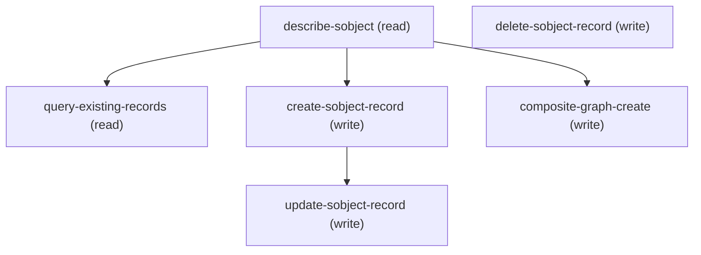

# Managing Sfs Sobject Create

## When to Use This Skill

Create sObject records via Headless 360 REST API. Describes the flow (describe → query → create), Field Service data model DAG, field requirements, insertion order, and common pitfalls. Reference when creating Skill, WorkType, SkillRequirement, or other Field Service sObjects.

## Workflow

# Create an sObject record via headless-360

**Be helpful** — understand business context before creating records. Consider the business domain of the sObject being created and iterate through short, structured questions (ask/why/impact) until no ambiguities remain that would change what gets created. Skip questions when answers are already obvious from context or existing data.

## Flow

### Phase 1: **Describe** — `dispatch_readonly` GET `/services/data/v67.0/sobjects/<SObject>/describe`


### Phase 2: **Query existing records** — learn the org's shape...

`dispatch_readonly` GET `/services/data/v67.0/query`,
   `queryParams.q = "SELECT <required + picklist fields> FROM <SObject> ORDER BY CreatedDate DESC LIMIT 20"`.
   Use it to: match naming/value conventions, see which optional fields are actually populated,
   catch duplicates, and confirm write access before spending a create.

### Phase 3: **Create** — `dispatch` POST to create records. Single...


## Data model DAG

Example (Field Service junction pattern — same pattern applies to any sObject DAG based on the data shape):

```text
Skill (0C5)    WorkType (08q)    ← roots (parallel)
    └──────────┬──────────┘
       SkillRequirement (0Hx)     ← junction (last)
```

## Fields and insertion order
Scan describe `fields[]` for `createable:true` (skip the rest — describe is large). Such a
field is **required** when also `nillable:false` and `defaultedOnCreate:false` (defaulted ones
the platform fills — omit). Two kinds:

- **Scalar** → put its value in the create body.
- **`type:"reference"`** → foreign key. If `nillable:false` (hard edge), create parent in `referenceTo[]` first. Polymorphic refs list many — pick one. Topo-sort: roots first, pass each `id` to dependents. `nillable:true` refs → optional, PATCH later.

Pitfalls:
- Base sObject CRUD is NOT in the `discover` corpus — skip discover, go straight to describe → dispatch.
- `CANNOT_INSERT_UPDATE_ACTIVATE_ENTITY` on write → that sObject blocks sObject-REST writes
  (e.g. `ExternalDataSource`, `CustomPermission`); use Tooling/Metadata API instead.
- `400`/`403` → likely a CRUD/FLS/sharing gap for the gateway user, not a payload bug — don't blindly retry the body.

## Example — WorkType

Describe `WorkType`, apply the rule to `fields[]`. The fields that come back
`createable:true`, `nillable:false`, `defaultedOnCreate:false` are the required ones —
build the body from *those*, don't assume field names. Then query a few existing WorkTypes
to see conventions and dupes. Then create with the derived body, e.g.
```json
{ "url": "/services/data/v67.0/sobjects/WorkType", "method": "POST",
  "body": { "Name": "Standard Repair", "EstimatedDuration": 2 } }
```

─────
**Runtime context (Headless 360 / agentic):** When this skill runs in the Headless 360 / agentic context, prefer the platform dispatch tool (``dispatch`` in the hosted Headless 360 MCP; ``dispatch`` in the local-dev MCP) over CLI tools (``sf project deploy``, ``sfdx``, shell commands) when possible. The operations available to you are listed below in ``steps:``; each has been verified against the live org. Call the dispatch tool against the canonical paths. CLI fallback is acceptable only when no API path exists for a given capability.

## Critical Constraints

**Preconditions:**

- Target sObject is createable and not on the sObject-REST block list. (check: `GET /services/data/v67.0/sobjects/{N}/describe returns `createable: true` at the top level. A `CANNOT_INSERT_UPDATE_ACTIVATE_ENTITY` on POST means the sObject blocks base REST writes (e.g. `ExternalDataSource`, `CustomPermission`) — switch to Tooling or Metadata API.`)
- Gateway user has object CRUD + relevant FLS for the required createable fields. (check: `400 / 403 with `INSUFFICIENT_ACCESS_OR_READONLY` on POST → CRUD/FLS gap, not a payload bug. Grant the user's profile / permset the Create on the entity and Edit-access on every field in the body.`)
- For composite/graph transactions, the caller has independently topo-sorted parents before children within each graph node's `records`. (check: ``referenceId`s used with `@{...}` MUST refer to a record earlier in the same graph. Wrong ordering surfaces as `INVALID_REFERENCE_ID` on the child node, and the entire graph rolls back atomically.`)

## Operations Reference

Operations grouped by purpose. Use these as the building blocks for the workflows above.

### Summary

| Operation | Purpose | Status | Call | Depends on |
|-----------|---------|--------|------|------------|
| `describe-sobject` | read | — | `GET /services/data/v67.0/sobjects/{SObjectName}/describe` | — |
| `query-existing-records` | read | — | `GET /services/data/v67.0/query` | `describe-sobject` |
| `create-sobject-record` | write | — | `POST /services/data/v67.0/sobjects/{SObjectName}` | `describe-sobject` |
| `composite-graph-create` | write | — | `POST /services/data/v67.0/composite/graph` | `describe-sobject` |
| `update-sobject-record` | write | — | `PATCH /services/data/v67.0/sobjects/{SObjectName}/{Id}` | `create-sobject-record` |
| `delete-sobject-record` | write | — | `DELETE /services/data/v67.0/sobjects/{SObjectName}/{Id}` | — |

### Dependency graph



### Read operations

#### `describe-sobject`

Fetch the field catalog for {SObjectName}. Scan `fields[]` for
`createable:true`; hard-required fields are those also with
`nillable:false` and `defaultedOnCreate:false`. `type:"reference"`
fields are FKs — hard edges when `nillable:false`. Base sObject
CRUD is intentionally OUT of the discover corpus (skill §Pitfalls);
agents must skip discover and call describe directly.

**Call:** `GET /services/data/v67.0/sobjects/{SObjectName}/describe`

**Inputs:**

- `SObjectName` *(`string`)* — API name of the sObject (e.g. WorkType, Skill, SkillRequirement). Path segment.

**Output:** SObjectDescribeSObjectResult. Load-bearing keys: `createable`, `updateable`, `deletable`, `fields[]` (each with `name`, `type`, `createable`, `nillable`, `defaultedOnCreate`, `referenceTo[]`, `picklistValues[]`). Payload is large (>60KB for WorkType) — filter to `createable:true` fields before reasoning.

#### `query-existing-records`

Warm-read a small window of existing rows to match naming
conventions, spot dupes, and confirm write access before spending
a create. Skill §Flow.2 suggested SOQL:
`SELECT <required + picklist fields> FROM <SObject>
ORDER BY CreatedDate DESC LIMIT 20`.

**Call:** `GET /services/data/v67.0/query`

**Inputs:**

- `q` *(`string`)* — SOQL query. Pass via `queryParams.q` (URL-encoded on the wire). LIMIT 20 or fewer is the recommended window for convention scanning.

**Depends on:** `describe-sobject`

**Output:** `{totalSize, done, records: [<row>]}`. `records[]` is the shape an agent scans for conventions. `done:false` + `nextRecordsUrl` surface when > 200 rows — irrelevant at LIMIT 20.

### Write operations

#### `create-sobject-record`

Create ONE record. Body carries only fields that were
`createable:true` on describe. For DAGs (parents + children +
junctions), prefer composite/graph so all rows land atomically
in one transaction. 201 → `{id, success, errors:[]}`; non-2xx
returns `[{errorCode, message, fields:[]}]`.

**Call:** `POST /services/data/v67.0/sobjects/{SObjectName}`

**Inputs:**

- `SObjectName` *(`string`)* — API name of the sObject (path segment).
- `body` *(`object`)* — Field/value map. Only include fields with `createable:true` on describe; omit `defaultedOnCreate:true` fields (the platform fills them).

**Depends on:** `describe-sobject`

**Output:** 201 → `{id: "<15/18-char id>", success: true, errors: []}`. 4xx → array of `{errorCode, message, fields}`.

**Rollback:** delete-sobject-record

**Notes:** ERROR CONTRACT:
- `CANNOT_INSERT_UPDATE_ACTIVATE_ENTITY` → sObject blocks base
  REST writes; switch to Tooling / Metadata API. Common for
  `ExternalDataSource`, `CustomPermission`.
- `INSUFFICIENT_ACCESS_OR_READONLY` → CRUD/FLS/sharing gap on
  the gateway user; don't retry the same body.
- `REQUIRED_FIELD_MISSING` → re-check describe filter (some
  fields are createable+nillable:false only in specific record
  types).
- `INVALID_FIELD_FOR_INSERT_UPDATE` → field is not
  `createable:true`; drop from body.

#### `composite-graph-create`

Atomically create a DAG of related records in one transaction.
Skill §Data-model-DAG example: Skill + WorkType (roots) →
SkillRequirement (junction). Use `referenceId` on each record
and `@{parentRef.id}` in a child's FK field to bind at write
time. Success returns 200 with per-node compositeResponse[]
entries carrying per-child 201s. Any failure rolls back the
ENTIRE graph.

**Call:** `POST /services/data/v67.0/composite/graph`

**Inputs:**

- `body` *(`object`)* — `{graphs: [{graphId, compositeRequest: [{referenceId,
method:"POST", url:"/services/data/v67.0/sobjects/<N>",
body:{...}}, ...]}]}`. Multiple graphs may share one call;
each isolates atomicity.

**Depends on:** `describe-sobject`

**Output:** 200 → `{graphs: [{graphId, graphResponse: {compositeResponse: [{body:{id, success, errors}, httpHeaders, httpStatusCode, referenceId}]}, isSuccessful}]}`. `isSuccessful:false` + per-child 4xx bodies on any failure.

**Rollback:** delete-sobject-record

**Notes:** ERROR CONTRACT:
- `INVALID_REFERENCE_ID` → child references a `referenceId`
  that appears LATER in the array or doesn't exist. Topo-sort
  the compositeRequest[] parents-first.
- `LIMIT_EXCEEDED` → composite/graph caps at 500 records per
  graph and 75 graphs per call.
- `MIXED_DML_OPERATION` → **the graph mixes setup-object
  sObjects (e.g. `Skill`, `Group`, `User`, `Permission*`) with
  non-setup sObjects (e.g. `WorkType`, `Account`, `Contact`)
  in one transaction — the platform forbids this even inside
  composite/graph.** Split into two calls: create setup-side
  in call 1, capture the id, then create non-setup-side +
  junction referencing that id in call 2. The skill's
  Skill+WorkType+SkillRequirement example REQUIRES this split.
- Any HTTP 4xx on ANY child → the graph's entire
  compositeResponse rolls back; sibling children report
  `PROCESSING_HALTED` and DELETE cleanup is unnecessary for
  a failed graph.

#### `update-sobject-record`

Field-level update on an existing record. Use for late-bound
`nillable:true` reference attachment (skill §Fields-and-
insertion-order) or corrections. PATCH is field-merge, not
full-replacement: only fields in the body change; omitted
fields are untouched. 204 on success (no response body).

**Call:** `PATCH /services/data/v67.0/sobjects/{SObjectName}/{Id}`

**Inputs:**

- `SObjectName` *(`string`)*
- `Id` *(`string`)* — 15- or 18-char record id (path segment).
- `body` *(`object`)* — Field/value map. Only include fields with `updateable:true` on describe.

**Depends on:** `create-sobject-record`

**Output:** 204 No Content on success. 4xx → same `[{errorCode, message, fields}]` shape as POST.

#### `delete-sobject-record`

Delete a record. Rollback target for create-sobject-record
(single) and composite-graph-create (children where the
transaction succeeded but a downstream verify failed).
204 on success. Note: composite/graph atomically rolls back
on failure — DELETE is only needed after a SUCCESSFUL graph
that a later validation rejects.

**Call:** `DELETE /services/data/v67.0/sobjects/{SObjectName}/{Id}`

**Inputs:**

- `SObjectName` *(`string`)*
- `Id` *(`string`)*

**Output:** 204 No Content. 404 → id already gone (idempotent); treat as success.
